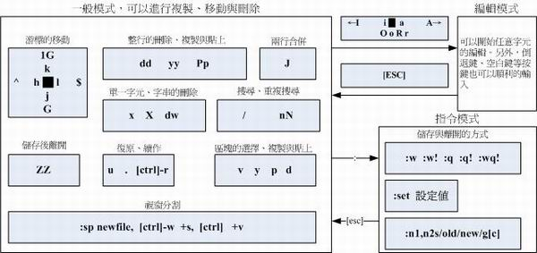
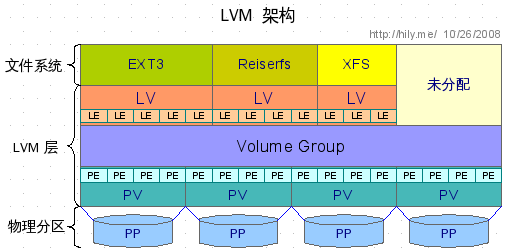
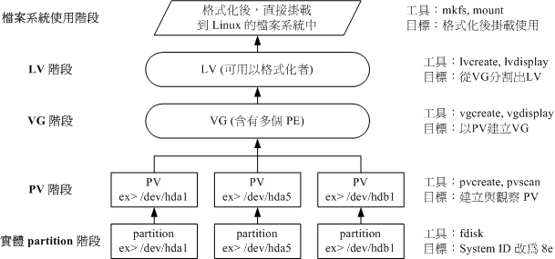
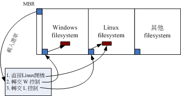
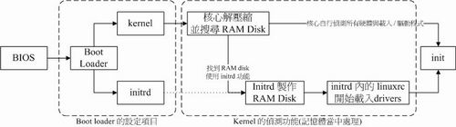
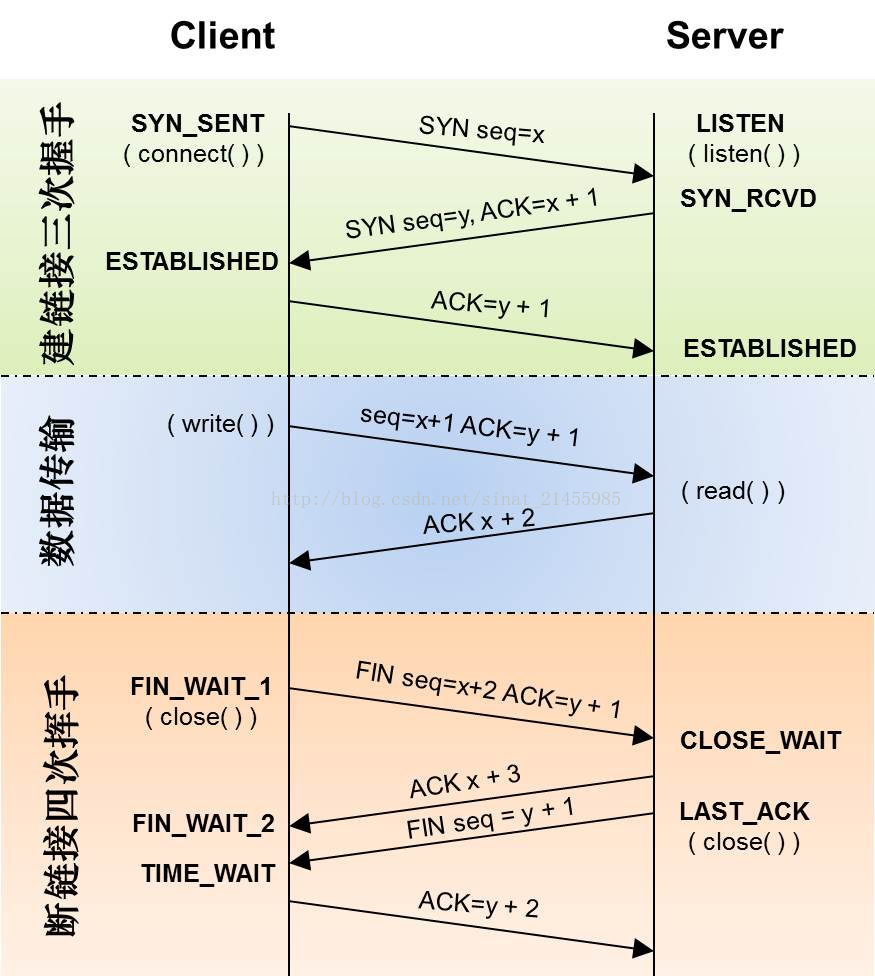

# linux 学习

- [linux 学习](#linux-%E5%AD%A6%E4%B9%A0)
    - [经典语句](#%E7%BB%8F%E5%85%B8%E8%AF%AD%E5%8F%A5)
    - [硬盘](#%E7%A1%AC%E7%9B%98)
        - [Linux中的档名](#linux%E4%B8%AD%E7%9A%84%E6%A1%A3%E5%90%8D)
    - [常用命令](#%E5%B8%B8%E7%94%A8%E5%91%BD%E4%BB%A4)
    - [常见问题](#%E5%B8%B8%E8%A7%81%E9%97%AE%E9%A2%98)
        - [Determining IP information for eth0...failed 错误解决](#determining-ip-information-for-eth0failed-%E9%94%99%E8%AF%AF%E8%A7%A3%E5%86%B3)
    - [linux 安装](#linux-%E5%AE%89%E8%A3%85)
    - [linux 文件](#linux-%E6%96%87%E4%BB%B6)
        - [文件权限 -rwxr-xr-x](#%E6%96%87%E4%BB%B6%E6%9D%83%E9%99%90--rwxr-xr-x)
        - [切换文件用户和用户组](#%E5%88%87%E6%8D%A2%E6%96%87%E4%BB%B6%E7%94%A8%E6%88%B7%E5%92%8C%E7%94%A8%E6%88%B7%E7%BB%84)
        - [`[root@www tmp]#`](#rootwww-tmp)
        - [Filesystem Hierarchy Standard(FHS)标准](#filesystem-hierarchy-standardfhs%E6%A0%87%E5%87%86)
    - [目录](#%E7%9B%AE%E5%BD%95)
        - [文件管理](#%E6%96%87%E4%BB%B6%E7%AE%A1%E7%90%86)
        - [文件内容查阅](#%E6%96%87%E4%BB%B6%E5%86%85%E5%AE%B9%E6%9F%A5%E9%98%85)
        - [隐藏属性](#%E9%9A%90%E8%97%8F%E5%B1%9E%E6%80%A7)
        - [特殊权限](#%E7%89%B9%E6%AE%8A%E6%9D%83%E9%99%90)
        - [搜索](#%E6%90%9C%E7%B4%A2)
    - [硬盘与文件系统](#%E7%A1%AC%E7%9B%98%E4%B8%8E%E6%96%87%E4%BB%B6%E7%B3%BB%E7%BB%9F)
        - [硬连接与软连接](#%E7%A1%AC%E8%BF%9E%E6%8E%A5%E4%B8%8E%E8%BD%AF%E8%BF%9E%E6%8E%A5)
        - [硬盘分区相关命令](#%E7%A1%AC%E7%9B%98%E5%88%86%E5%8C%BA%E7%9B%B8%E5%85%B3%E5%91%BD%E4%BB%A4)
        - [磁盘检验](#%E7%A3%81%E7%9B%98%E6%A3%80%E9%AA%8C)
        - [挂载](#%E6%8C%82%E8%BD%BD)
    - [压缩](#%E5%8E%8B%E7%BC%A9)
        - [dump完整备份](#dump%E5%AE%8C%E6%95%B4%E5%A4%87%E4%BB%BD)
        - [restore 还原备份](#restore-%E8%BF%98%E5%8E%9F%E5%A4%87%E4%BB%BD)
    - [vim编辑器](#vim%E7%BC%96%E8%BE%91%E5%99%A8)
        - [指令图片](#%E6%8C%87%E4%BB%A4%E5%9B%BE%E7%89%87)
        - [特殊](#%E7%89%B9%E6%AE%8A)
    - [shell脚本](#shell%E8%84%9A%E6%9C%AC)
        - [bash优点](#bash%E4%BC%98%E7%82%B9)
        - [内建命令](#%E5%86%85%E5%BB%BA%E5%91%BD%E4%BB%A4)
        - [变量](#%E5%8F%98%E9%87%8F)
        - [变量内容修改](#%E5%8F%98%E9%87%8F%E5%86%85%E5%AE%B9%E4%BF%AE%E6%94%B9)
        - [判断是否当前有值,然后赋值](#%E5%88%A4%E6%96%AD%E6%98%AF%E5%90%A6%E5%BD%93%E5%89%8D%E6%9C%89%E5%80%BC%E7%84%B6%E5%90%8E%E8%B5%8B%E5%80%BC)
        - [别名](#%E5%88%AB%E5%90%8D)
        - [历史命令 history](#%E5%8E%86%E5%8F%B2%E5%91%BD%E4%BB%A4-history)
        - [命令搜索顺序](#%E5%91%BD%E4%BB%A4%E6%90%9C%E7%B4%A2%E9%A1%BA%E5%BA%8F)
        - [进站信息](#%E8%BF%9B%E7%AB%99%E4%BF%A1%E6%81%AF)
        - [环境配置文件](#%E7%8E%AF%E5%A2%83%E9%85%8D%E7%BD%AE%E6%96%87%E4%BB%B6)
        - [其他配置文件](#%E5%85%B6%E4%BB%96%E9%85%8D%E7%BD%AE%E6%96%87%E4%BB%B6)
        - [shell常用快捷键](#shell%E5%B8%B8%E7%94%A8%E5%BF%AB%E6%8D%B7%E9%94%AE)
        - [通配符](#%E9%80%9A%E9%85%8D%E7%AC%A6)
    - [正则表达式](#%E6%AD%A3%E5%88%99%E8%A1%A8%E8%BE%BE%E5%BC%8F)
        - [grep过滤字符串 以行为单位](#grep%E8%BF%87%E6%BB%A4%E5%AD%97%E7%AC%A6%E4%B8%B2-%E4%BB%A5%E8%A1%8C%E4%B8%BA%E5%8D%95%E4%BD%8D)
        - [sed 比grep增加替换功能 stream editor](#sed-%E6%AF%94grep%E5%A2%9E%E5%8A%A0%E6%9B%BF%E6%8D%A2%E5%8A%9F%E8%83%BD-stream-editor)
        - [egrep 或 grep -E](#egrep-%E6%88%96-grep--e)
        - [文件格式化与数据处理](#%E6%96%87%E4%BB%B6%E6%A0%BC%E5%BC%8F%E5%8C%96%E4%B8%8E%E6%95%B0%E6%8D%AE%E5%A4%84%E7%90%86)
    - [shell 脚本](#shell-%E8%84%9A%E6%9C%AC)
        - [Hello World程序](#hello-world%E7%A8%8B%E5%BA%8F)
        - [务必加注释](#%E5%8A%A1%E5%BF%85%E5%8A%A0%E6%B3%A8%E9%87%8A)
        - [对谈式脚本](#%E5%AF%B9%E8%B0%88%E5%BC%8F%E8%84%9A%E6%9C%AC)
        - [数值加减](#%E6%95%B0%E5%80%BC%E5%8A%A0%E5%87%8F)
        - [运行方式差异](#%E8%BF%90%E8%A1%8C%E6%96%B9%E5%BC%8F%E5%B7%AE%E5%BC%82)
        - [test 条件判断](#test-%E6%9D%A1%E4%BB%B6%E5%88%A4%E6%96%AD)
        - [判断符号[] 常常用在if判断中](#%E5%88%A4%E6%96%AD%E7%AC%A6%E5%8F%B7-%E5%B8%B8%E5%B8%B8%E7%94%A8%E5%9C%A8if%E5%88%A4%E6%96%AD%E4%B8%AD)
        - [if语句](#if%E8%AF%AD%E5%8F%A5)
        - [case语句](#case%E8%AF%AD%E5%8F%A5)
        - [function函数](#function%E5%87%BD%E6%95%B0)
        - [while循环 条件不成立终止 unitl条件成立终止](#while%E5%BE%AA%E7%8E%AF-%E6%9D%A1%E4%BB%B6%E4%B8%8D%E6%88%90%E7%AB%8B%E7%BB%88%E6%AD%A2-unitl%E6%9D%A1%E4%BB%B6%E6%88%90%E7%AB%8B%E7%BB%88%E6%AD%A2)
        - [for循环](#for%E5%BE%AA%E7%8E%AF)
        - [bug调试](#bug%E8%B0%83%E8%AF%95)
    - [账号管理](#%E8%B4%A6%E5%8F%B7%E7%AE%A1%E7%90%86)
        - [帐号管理](#%E5%B8%90%E5%8F%B7%E7%AE%A1%E7%90%86)
    - [文件系统管理](#%E6%96%87%E4%BB%B6%E7%B3%BB%E7%BB%9F%E7%AE%A1%E7%90%86)
    - [定时任务](#%E5%AE%9A%E6%97%B6%E4%BB%BB%E5%8A%A1)
    - [程序管理与SElinux](#%E7%A8%8B%E5%BA%8F%E7%AE%A1%E7%90%86%E4%B8%8Eselinux)
        - [process程序](#process%E7%A8%8B%E5%BA%8F)
        - [子程序与父程序](#%E5%AD%90%E7%A8%8B%E5%BA%8F%E4%B8%8E%E7%88%B6%E7%A8%8B%E5%BA%8F)
        - [程序呼叫流程](#%E7%A8%8B%E5%BA%8F%E5%91%BC%E5%8F%AB%E6%B5%81%E7%A8%8B)
        - [SELinux用法](#selinux%E7%94%A8%E6%B3%95)
    - [系统服务](#%E7%B3%BB%E7%BB%9F%E6%9C%8D%E5%8A%A1)
        - [详解xinet程序](#%E8%AF%A6%E8%A7%A3xinet%E7%A8%8B%E5%BA%8F)
    - [日志文件](#%E6%97%A5%E5%BF%97%E6%96%87%E4%BB%B6)
    - [启动流程](#%E5%90%AF%E5%8A%A8%E6%B5%81%E7%A8%8B)
    - [系统配置工具](#%E7%B3%BB%E7%BB%9F%E9%85%8D%E7%BD%AE%E5%B7%A5%E5%85%B7)
    - [软件源码安装](#%E8%BD%AF%E4%BB%B6%E6%BA%90%E7%A0%81%E5%AE%89%E8%A3%85)
    - [软件RPM安装](#%E8%BD%AF%E4%BB%B6rpm%E5%AE%89%E8%A3%85)
    - [X window配置](#x-window%E9%85%8D%E7%BD%AE)
    - [Linux备份策略](#linux%E5%A4%87%E4%BB%BD%E7%AD%96%E7%95%A5)
    - [核心编译与管理](#%E6%A0%B8%E5%BF%83%E7%BC%96%E8%AF%91%E4%B8%8E%E7%AE%A1%E7%90%86)
    - [CentOS7区别](#centos7%E5%8C%BA%E5%88%AB)
    - [网络](#%E7%BD%91%E7%BB%9C)
    - [网络常用命令](#%E7%BD%91%E7%BB%9C%E5%B8%B8%E7%94%A8%E5%91%BD%E4%BB%A4)
    - [maven仓库镜像](#maven%E4%BB%93%E5%BA%93%E9%95%9C%E5%83%8F)
    - [常用缩写](#%E5%B8%B8%E7%94%A8%E7%BC%A9%E5%86%99)
        - [1. 目录缩写](#1-%E7%9B%AE%E5%BD%95%E7%BC%A9%E5%86%99)
        - [2. 命令缩写](#2-%E5%91%BD%E4%BB%A4%E7%BC%A9%E5%86%99)
        - [3. 编程相关缩写](#3-%E7%BC%96%E7%A8%8B%E7%9B%B8%E5%85%B3%E7%BC%A9%E5%86%99)
        - [4. 递归缩写](#4-%E9%80%92%E5%BD%92%E7%BC%A9%E5%86%99)
        - [5. 其他缩写](#5-%E5%85%B6%E4%BB%96%E7%BC%A9%E5%86%99)
        - [6. 参考资料](#6-%E5%8F%82%E8%80%83%E8%B5%84%E6%96%99)
    - [linux操作](#linux%E6%93%8D%E4%BD%9C)
        - [shell获取ip地址](#shell%E8%8E%B7%E5%8F%96ip%E5%9C%B0%E5%9D%80)

## 经典语句

> 在Windows里面,设定不好设备,您可以骂它;在Linux里面,如果设定好设备了,您得要感激它!  
> 没有安装过Linux十次以上,不要说你学会了Linux了啦!慢慢体会这句话吧! ^_^  
> 没有信息就是『好信息』!  

## 硬盘

### Linux中的档名

| 装置                | 装置在Linux内的档名                      |
| ------------------- | ---------------------------------------- |
| IDE硬盘机           | /dev/hd[a-d]                             |
| SCSI/SATA/U盘硬盘机 | /dev/sd[a-p]                             |
| U盘快闪碟           | /dev/sd[a-p](与SATA相同)                 |
| 软盘机              | /dev/fd[0-1]                             |
| 打印机              | 25针: /dev/lp[0-2]U盘: /dev/usb/lp[0-15] |
| 鼠标                 | U盘: /dev/usb/mouse[0-15]PS2: /dev/psaux |
| 当前CDROM/DVDROM    | /dev/cdrom                               |
| 当前的鼠标           | /dev/mouse                               |
| 磁带机              | IDE: /dev/ht0SCSI: /dev/st0              |

## 常用命令

`uname -sr` 系统核心版本

`date` 当前日期 date  
`cal` 日历  
`bc` 计算器 默认整数 scale=3 保留三位有效数字 quit退出  
`exit` 退出 ctrl+d  
`man [command]` 查找命令用法/ [command] --help 相似

**关机**  
`sync`>`shutdown` or `reboot` 注意 shutdown 加时间只会结束服务,加上-h会在结束服务后立刻关机 shutdown会发提示关机命令给所有在线用户  

`cat` << EOF(定义结束符)  
first  
second  
EOF

`useradd [username]` 增加用户  
`passwd [username]` 修改口令/不加口令则该自己  
`chage -d 0 [username]` 强制用户登陆一次之后改密码  
`echo "password" | passwd --stdin [username]` 用命令给用户改密码不用两次输入  

`which [command]` 命令在哪儿  

## 常见问题

### Determining IP information for eth0...failed 错误解决

VMware dhcp服务没有开  

`uname -r` 内核版本  
`lsb_release -a`  LSB(Linux Standard Base) and Distribution   information

## linux 安装

**basic server 安装时默认没有开启eth0网卡**  
将eth0中的onboot设置改为yes `/etc/sysconfig/network-scripts/ifcfg-eth0`中的设置更改 更改完成后 `service network restart`  
单次更改可以改为`ifup eth0`  

centos7中取消`ifconfig`命令 可安装`net-tools` 或者使用`ip addr`  

## linux 文件

### 文件权限 -rwxr-xr-x

含义
> 第一个当为[ d ]则是目录  
当为[ - ]则是文件  
若是[ l ]则表示为连结档(link file);  
若是[ b ]则表示为装置文件里面的可供储存的接口设备(可随机存取装置);  
若是[ c ]则表示为装置文件里面的串行端口设备,例如键盘、鼠标(一次性读取装置).
> rwx 读写运行权限  
> 第一组文件拥有者 第二组同组权限 第三组其他人权限  
> rwx对文件来说是针对内容来讲,r可以读取内容,w可以改写内容,x是可执行文件  
> rwx对文件夹来说,r可读取文件列表,w可增删文件,x可进入文件  

### 切换文件用户和用户组  

`chgrp [-R] GROUP FILE`  
`chown [-R] OWNER:GROUP FILE`  
`chmode [[u/g/o/a] [+/-/=] [rwx]] file` 例子 chmod  u=rwx,go=rx  .bashrc 与chmod 755 .bashrc一样 chmod  a+w  .bashrc 增加可写权限 chmod 4775 filename 其中4位的第一位表示SUID4/SGID2/SBIT1  
要开放目录给任何人浏览时,应该至少也要给予r及x的权限,但w权限不可随便给;  

### `[root@www tmp]#`  

输入命令为#是root,输入命令$其他

### Filesystem Hierarchy Standard(FHS)标准

|                    | 可分享的(shareable)          | 不可分享的(unshareable) |
| ------------------ | ---------------------------- | ----------------------- |
| 不变的(static)     | /usr  (软件放置处)          | /etc  (配置文件)       |
|                    | /opt  (第三方协力软件)      | /boot  (开机与核心档)  |
| 可变动的(variable) | /var/mail  (使用者邮件信箱) | /var/run  (程序相关)   |
|                    | /var/spool/news  (新闻组)   | /var/lock  (程序相关)  |

FHS针对目录树架构仅定义出三层目录底下应该放置什么数据而已,分别是底下这三个目录的定义:  
`/`(root, 根目录):与开机系统有关;  
`/usr`(unix software resource):与软件安装/执行有关;  
`/var`(variable):与系统运作过程有关.  

**`/`** 目录下  
`/bin` 可执行文件目录,单人维护使用  
`/boot` 开机文件目录  
`/dev` 设备device  
`/etc` 配置(et cetra 法语 相当于英语and so on 等等) 其中比较重要/etc/inittab,/etc/init.d,/etc/modprobe.conf,/etc/X11/,/etc/fstab,/etc/sysconfig/  
`/home` 家目录home directory  
`/lib` 系统函数库  
`/media` 可移除设备 /media/floppy, /media/cdrom  
`/mnt` 暂时挂载  
`/opt`  第三方协力软件放置的目录  
`/root` root家目录  
`/sbin` root命令,开机使用 其他放置在/usr/sbin/(服务器应用)和 /usr/local/sbin/(本机自行安装软件产生目录)中  
`/srv` 服务器启动后的数据目录如/srv/www  
`/tmp` 使用者或者程序临时纺织文件的地方  

**`其他`**  
`/lost+found` ext2/3/4 会产生的目录,系统错误时一些遗失的片段放在此  
`/proc` 虚拟文件系统,放置在内存中 不占硬盘容量 如系统核心、行程信息(process)、周边装置的状态及网络状态  
`/sys` 虚拟的文件系统 记录与核心相关的信息  

不可与根目录分开`/etc` `/bin` `/dev` `/lib` `/sbin`  

**`/usr`** 目录下(unix software resource)Unix操作系统软件资源 类似于'C:\Windows\ + C:\Program files\'  
`/usr/X11R6` x window system重要数据11版第6次  
`/usr/bin/` 绝大部分用户指令  
`/usr/include` c/c++等语言的include文件  
`/usr/lib` 函数库  
`/usr/local` 本机自行安装的软件建议放置此目录  
`/usr/sbin` 非系统正常运作所需要的指令  
`/usr/share` 共享文件的地方  
`/usr/src` 源码放置的目录  

**`/var`** 目录含义variable 可变动 主要是常态性变动的文件 如缓存 登录档 软件产生的文件  
`/var/cache` 暂存档  
`/var/lib` 程序执行过程中使用的数据文件 如/var/lib/mysql/  
`/var/lock` 锁定的文件  
`/var/log` 登录文件放置的目录  
`/var/mail` 电子邮件  
`/var/run/` 存放pid  
`/var/spool` 队列数据  

## 目录

`.` 代表此层目录  
`..` 代表上一层目录  
`-` 代表前一个工作目录  
`~` 代表『目前使用者身份』所在的家目录  
`~account` 代表 account 这个使用者的家目录(account是个帐号名称)  

`cd` 变换目录 change directory  
`pwd` 显示当前目录 print working directory pwd -P 显示真实路径 非链接  
`mkdir` 创建新目录 -p自动建父目录 -m指定权限  
`rmdir` 删除空目录 -p上一级空目录也删  
为了安全不建议将.即当前目录加入PATH  

### 文件管理  

`ls [-aAdfFhilnrRSt] 目录名称` 文件与目录检视  
`cp [-adfilprsu] 来源档(source) 目标档(destination)` 复制 cp -l 硬连接 -s 软连接 i-node  
`rm [-fir] 文件或目录` 删除目录  
`mv [-fiu] source destination`  
`basename /a/b/c/123` 查看路径文件名,返回123  
`dirname /a/b/c/123` 查看路径目录,返回/a/b/c  

### 文件内容查阅  

`cat`  由第一行开始显示文件内容  cat -n 行号  -b 不显示空白行  
`tac`  从最后一行开始显示,可以看出 tac 是 cat 的倒著写!  
`nl`   显示的时候,顺道输出行号! 更多行号设置更能  
`more` 一页一页的显示文件内容  
`less` 与 more 类似,但是比 more 更好的是,他可以往前翻页!  
`head` 只看头几行  
`tail` 只看尾巴几行  
`od`   以二进位的方式读取文件内容! od -t xCc filename ASCII 与字节的对照表  

`touch [-acdmt] 文件 修改文档时间` -a 仅accesstime -c仅修改时间不创建 -d 修改为其他时间 -m mtime -t 修改时间[YYMMDDhhmm]  
modification time(mtime):内容更改时间  
status time(ctime):状态(属性权限)更改时间  
access time(atime):内容获取时间  

`umask` 文件默认权限 文档默认666 文件夹默认777 减去umask值为默认权限 umask 002 修改默认权限  在/etc/bashrc中设置默认值  

### 隐藏属性  

`chattr` 修改文件的隐藏属性 +i不能删除改名修改 +a只能增加不能删除修改  
`lsattr` 显示文件的隐藏属性  

### 特殊权限  

`SUID`, `SGID`, `SBIT`  
SUID Set UID 运行期间取得拥有者权限  
SUID 仅可用在binary program 上, 不能够用在 shell script 上面!和目录上  
SBIT Sticky Bit 尽可用于目录,创建者和root用户可对目录内文件有删除更名移动的权限  
SUID 4/ SGID 2/ SBIT 1   chmod 4775 filename  
大写ST表示没有此权限,因为拥有者用户没有此权限  

`file filename` 观察文件类型  

### 搜索  

`which [-a] command` 命令路径在PATH中找  
`type command` 命令类型  
`whereis [-bmsu] 文件或目录名` -b binary类型-m manual路径下文件 -s source 来源文件 -u不在以上找  
`find [PATH] [option] [action]` 搜寻硬盘  
时间相关find /tmm -mtime +4/-4/4 含义 +4 大于5天,-4小于四天,4 4-5天 -newer filename  比filename新的文件  
用户相关find /home -user lau 找出lau的文件 参数有-uid -gid -user -group  -nouser -nogroup  
文件权限与名称相关 -name -size -type [f,b,c,d,l,s,p] -perm mode/+mode/-mode  
额外功能 find / -perm +7000 -exec ls -l {} \; 执行额外的命令 -print 打印到萤幕上默认 -a 合并 -o 或者  
`locate [-ir] keyword` 查找 -i 忽略大小写 -r 正则写法 从数据库中查找 updatedb 更新数据库  

## 硬盘与文件系统

`dumpe2fs 装置名称` 列出文件系统信息 -h 仅superblock数据 -b 仅坏道  
`du [-ahskm] 文件或目录名称` 所有的文件数据容量  -S 减少目录汇总  
`df [-ahikHTm] [目录或文件名]` 目前挂载的装置 常用-h -a -i  

`superblock`:记录此 filesystem 的整体信息,包括inode/block的总量、使用量、剩余量, 以及文件系统的格式与相关信息等;  
`inode`:记录文件的属性,一个文件占用一个inode,同时记录此文件的数据所在的 block 号码; CentOS5 128Bytes  CentOS6默认256Byte  
`block`:实际记录文件的内容,若文件太大时,会占用多个 block . 1k 2k 4k  

`索引式文件系统(indexed allocation)`.  

目录的inode存属性,block存文件名和对应的inode,ls -li 可查看文件名inode号码,目录至少占用一个block不够了再加  
文件的inode存属性,block存内容  

**读取文件步骤**  
/etc/passwd 读取步骤 先找/的inode 通过挂载点信息找,同时读权限; 然后找/的block找出etc/的inode号码;etc/的block找到passwd的inode;passwd的inode相关权限和block位置;passwd的block读取内容  

**写入文件步骤**  
先确定是否在新增目录有wx权限;根据inode bitmap查找空inode,写权限;根据block bitmap找空block,数据写入block,升级inode的block;将inode和block的数据同步到inode bitmap和block bitmap,并更新superblock  

**不一致状态**  
写入过程中断电等情况,使用e2fsck程序检查,同时ext3以后增加日志系统,避免全盘扫描  

**挂载后才可使用**  
linux通过VFS(Virtual Filesystem Switch)管理文件系统  

### 硬连接与软连接  

在inode级别连接是硬链接可以通过ls -li查看  
软连接是通过存路径的方式  

### 硬盘分区相关命令  

`fdisk 装置名称` 进行分区 其中m列出命令 p打印更改后的分割表 n增加分区 d删除 w写入 q不保存退出 fdisk无法处理2T以上的数据,可以使用parted命令  
`mkfs [-t 文件系统格式] 装置文件名` 磁盘格式化命令  
`mke2fs [-b block大小] [-i block大小] [-L 标头] [-cj] 装置` 详细配置格式化信息  

### 磁盘检验  

`fsck [-t 文件系统] [-ACay] 装置名称` 检查文件系统是否出错 filesystem check  
`badblocks -[svw] 装置名称` 检查坏道  

### 挂载  

`mount -a` 依照配置文件 /etc/fstab 的数据将所有未挂载的磁盘都挂载上来  
`mount -l` 显示Label 名称  
`mount [-t 文件系统] [-L Label名] [-o 额外选项] [-n]  装置文件名  挂载点`  
`mount -o remount,rw,auto /` 重新挂载根目录  
`umount [-fn] 装置文件名或挂载点` 卸载  

`e2label 装置名称  新的Label名称 修改label名`  
`tune2fs [-jlL] 装置代号` 修改设备信息 -l类似 dumpe2fs -h 的功能 -j带日志 -L修改label  

`/etc/fstab` 启动时的挂载信息 Device/Mount point/filesystem/parameters/dump/fsck  
`/etc/mtab` 实际挂载情况  

## 压缩

`compress` 非常老的压缩程序  默认档名*.Z  
`compress [-rcv] 文件或目录`  <==这里是压缩  -r连同目录压缩  -c压缩输出到荧幕 -v显示变化  压缩时会删除源文件  compress -c man.config > man.config.back.Z 此种方式可保留源文件
`uncompress 文件.Z`           <==这里是解压缩  

`gzip`压缩  使用广泛  默认档名*.gz  
`gzip [-cdtv#] 档名`  -c输出银幕,配合重定向  -d解压缩 -t检查一致性  -v输入过程  -#等级 -1最快压缩比差 -9最高  
`zcat 档名.gz`  查看文件列表  zcat类似cat不过只能看文件列表  

`bzip2` 压缩比高  默认档名*.bz2  
`bzip2 [-cdkzv#] 档名`  -k保留源文件 -z压缩  bupzip2 等于 bzip2 -d 解压缩
`bzcat 档名.bz2`  

`tar` 打包命令 可以把一堆文件打包成一个  默认档名*.tar 压缩后*.tar.gz *.tar.bz2  
`tar [-j|-z] [cv] [-f 创建的档名] filename...` <==打包与压缩  
`tar [-j|-z] [tv] [-f 创建的档名]`             <==察看档名  
`tar [-j|-z] [xv] [-f 创建的档名] [-C 目录]`   <==解压缩  
tar 参数 -c创建打包文件create -t查看文件list -x解压缩解打包extract -j压缩bzip2 -z压缩gzip -v显示过程 -f filename 紧跟要处理的档名 -C directory紧跟目录 -p保留权限属性 -P保留绝对路径 默认相对路径 最好不要用-P --exclude=FILE 不打包文件
例子
> 压　缩:tar -jcv -f filename.tar.bz2 要被压缩的文件或目录名称  
查　询:tar -jtv -f filename.tar.bz2  
解压缩:tar -jxv -f filename.tar.bz2 -C 欲解压缩的目录  
单一文件  tar -jxv -f 打包档.tar.bz2 待解开档名  
tarfile  tar包未压缩  
tarball  tar包压缩  

### dump完整备份  

`dump [-Suvj] [-level] [-f 备份档] 待备份数据` 参数-S需要多少空间 -u记录到/etc/dumpupdates中 -v 显示过程 -j 加入bzip2支持 -level等级 -f 文件名  
`dump -W` 列出/etc/fstab中的是否有备份  

### restore 还原备份  

`restore -t [-f dumpfile] [-h]`        <==用来察看 dump 档  
`restore -C [-f dumpfile] [-D 挂载点]` <==比较dump与实际文件  
`restore -i [-f dumpfile]`             <==进入互动模式  
`restore -r [-f dumpfile]`             <==还原整个文件系统  
参数 -t 查看dump数据 -C比较 -i互动模式 -r还原 -h显示inode与label -f要处理的文件 -D挂载点与-C联用  

`mkisofs`:创建映像档  
`cdrecord`:光盘烧录工具  

`dd` 备份整颗 partition 或 整颗 disk  tar备份数据  
`dd if="input_file" of="output_file" bs="block_size" count="number"`
例子
> 将 /etc/passwd 备份到 /tmp/passwd.back 当中  
dd if=/etc/passwd of=/tmp/passwd.back  
> 将自己的磁碟之第一个磁区备份下来  
dd if=/dev/hdc of=/tmp/mbr.back bs=512 count=1  

`cpio` 为相当优秀的备份命令

## vim编辑器

**`三种模式`** 一般模式,编辑模式,指令行模式(:/?)  

`一般模式`:移动删除复制粘贴  
`编辑模式`:输入替换文字  
`指令行模式`:读取存储搜索等  

一般模式-->编辑模式i/o/a/R 返回esc  
一般模式-->指令行模式:/? 返回esc  
编辑模式与指令行模式不可切换  

### 指令图片  

以命令为导向  


以键盘为导向  


### 特殊  

`替换` :n1,n2s/old/new/g 其中n2可以是$表示最后
`区块选择` v字符选择 V行选择 ctrl+v区块选择 y复制 d删除  
`多档案` :n 下一个档案 :N上一个档案 :files所有的档案  
`多窗口` :sp 分成两个 :sp filename 分两个 ctrl+w +j/↓ 下一个窗口 ctrl+w +k/↑上一个窗口 ctrl+w +q离开  
`vim环境设定与记录` ~/.vimrc  ~/.viminfo  
例子
> vim ~/.vimrc  
"这个档案的双引号(") 是批注  
set hlsearch            "高亮度反白  
set backspace=2         "可随时用退格键删除  
set autoindent          "自动缩排  
set ruler               "可显示最后一行的状态  
set showmode            "左下角那一行的状态  
set nu                  "可以在每一行的最前面显示行号啦!  
set bg=dark             "显示不同的底色色调  
syntax on               "进行语法检验,颜色显示.  

`换行符`  
linux/unix \n LF  $  
windows \r\n CRLF  ^M$  
Carriage-Return Line-Feed \r=return \n=newline  

`dos2unix [-kn] file [newfile]`  -k保留mtime -n 保留旧文档 dos2unix -n old new  
`unix2dos [-kn] file [newfile]`  
`iconv  --list`  
`iconv -f 原本编码 -t 新编码 filename [-o newfile]`  

`vim中使用tr`替换 %s/.*/\=tr(submatch(0), 'ABCD', 'PQRS') 将A换成P B换成Q C换成R D换成S

## shell脚本

shell 是壳程序,用来操作内核,从而控制硬件  
`shell好处`:文件接口大家都一样,远程管理文字接口快,配合shell scripts,好用  
`shell版本众多`,linux支持的shell可以在/etc/shells中查看,最常用的是bash  
passwd文件中账户最后一个字段就是登录之后默认的shell类型  

### bash优点

记忆功能↑↓键可找命令,tab补全命令 补全文件名,配置别名alias,前后台控制,程序化脚本,通配符  

### 内建命令  

type  查看命令类型  type [-tpa] name 参数 -t简短类型(file alias builtin) -p外部命令显示 -a所有(包括PATH和alias) 类似于which  
\ 转移字符 下达命令长的时候可使用  

### 变量

MAIL HOME PATH 等方便操作与编程  
`读取变量` echo $MAIL/${MAIL}  {}的作用主要是界定  
`赋值` myname=lautumn 前后不要加空格,开头不能是数字,有空格可用""或''或转义,单引号变量原样输出,双引号可加变量,\为转义符号,『\`命令\`』或 『$(命令)』可用来获取命令结果,"$变量" 或 ${变量} 再赋值可拼接,`export` 变量 可转为环境变量,一般为大写字母,`unset`取消配置  
例子
> 经常去此目录,可设为变量  
work="/cluster/server/work/taiwan_2005/003/"  
cd $work  

**`查询变量`**
`env` 查询环境变量  HOME SHELL HISTSIZE MAIL PATH LANG  
`set` 所有变量(包括自定义)  PS1  提示字符的配置 ,$ 本shell的PID,?上一个命令的回传值,成功0,OSTYPE, HOSTTYPE, MACHTYPE:(主机硬件与核心的等级)  
`export` 自定义变量转成环境变量  可被子程序使用  
`locale`  语系变量  locale -a 查询所有 locale 显示当前  修改默认语系/etc/sysconfig/i18n  

`read` 让用户输入变量的值  `read [-pt] variable`  参数-p 提示字符 -t等待秒数  
`declare [-aixr] variable`  宣告变量的类型,和typeset一样  参数-a数组,-i整型,-x设成环境变量,-r设成只读不能unset和更改  例子 declare -i sum=100+300+500 这样才会计算  

`声明数组`  循环取值中有意义  
var[1]='samll man'  
var[2]='big man'  
var[3]='nice man'
echo "${var[1]}, ${var[2]}, ${var[3]}"

`ulimit`设置文件系统大小
ulimit [-SHacdfltu] [配额]  参数-H严格设置 -S警告设置 -a列出所有限制 -c出错将内存写入文件 -f最大文件容量 -d最大断裂内存 -l锁定内存量 -t最大cpu秒数 -u最大程序数  

### 变量内容修改  

${var#word}     左到右最短删除
${var##word}    左到右最长删除
${var%word}     右到左最短删除
${var%%word}    右到左最长删除
${var/old/new}  第一个被取代
${var//old/new} 所有的被取代

### 判断是否当前有值,然后赋值  

var=${str-expr} 无配置var=expr 有配置 var=$str  
var=${str+expr} 无配置var=$str(空) 有配置 var=expr  
var=${str=expr} 无配置str=var=expr 有配置 var=$str  
var=${str?expr} 无配置expr输出stderr,可用作提示 有配置 var=$str  
如果var=${str:-expr} 则判断配置是否为空,如果为空则相当于无配置  

### 别名  

alias lm='ls -al | more'  
alias 显示所有别名  
unalias lm  

### 历史命令 history

`history [n]` 最近几行
`history [-c]` 清除当前shell命令
`history [-raw] histfiles` 参数 -r读取histfiles 默认~/.bash_history -a新增的写入histfiles -w写入histfiles中  
history 结合! 命令  
`!66` 运行第66条命令  
`!!` 运行上一条命令  
`!al` 运行最近以al开头的命令  

### 命令搜索顺序  

1. 绝对相对路径运行
1. alias命令
1. bash内建命令
1. PATH命令  

### 进站信息  

`/etc/issue` 登录之前提示  可在man mingetty中查看转义字符的意义  
`/etc/issue.net` 远程登录提示 在/etc/ssh/sshd_config中修改Banner为Banner /etc/issue.net  
`/etc/motd` 登录之后提示  message of today  

### 环境配置文件  

`login shell`  先读取/etc/profile,然后读取~/.bash_profile 或 ~/.bash_login 或 ~/.profile个人配置  其中profile会配置PATH MAIL USER HOSTNAME HISTSIZE 还会读取/etc/inputrc /etc/profile.d/*.sh /etc/sysconfig/i18n的内容; ~/.bash_profile  会读取~/.bashrc,而 ~/.bashrc读取/etc/bashrc  

source 配置文件名 source ~/.bashrc  .  ~/.bashrc命令相同  

`non-login shell` 只会读取~/.bashrc,由.bashrc读取/etc/bashrc centos特有  

### 其他配置文件  

`/etc/man.config` 主要的是MANPATH这个变量  
`~/.bash_history` 记录历史数据  
`~/.bash_logout` 注销后系统执行  

`stty -a`终端机所有配置  stty erase ^h 删除键改为ctrl+h  
`set` 配置终端环境  `set [-uvCHhmBx]` 默认himBH  参数-u显示错误信息 -v显示原始内容 -x显示命令内容 -h记录命令 -H交互时显示历史命令 -m工作管理 -B[]作用 -C >若存在不覆盖 -i交互 echo $- 查看当前模式  

`/etc/inputrc` 配置的是热键

### shell常用快捷键

`ctrl+w` 删除一个单词  
`ctrl+u` 删除当前所有  
`ctrl+k` 删除之后所有  
`ctrl+a` 移动到开头  
`ctrl+e` 移动到结尾  
`ctrl+左` 移动到前一个单词  
`ctrl+右` 移动到后一个单词  
`ctrl+r` 查找命令,反向查找  怕过的话可进行修改正向查找  "\C-f": forward-search-history 加入/etc/inputrc末尾重启或打开新shell即可  
`ctrl+s` 暂停输出  
`ctrl+q` 恢复输出  
`ctrl+z` 暂停目前命令  
`ctrl+c` 中止命令
`ctrl+d` 输入结束符  

快速删除密码 `ctrl+u` 或者 `esc+backspace`  

### 通配符  

*任意多 ?一个 [a-d]a-d中的一个 [^ac]非ac

**`特殊符号`**  
`#`注释 `\`转义 `|`管道 `;`命令分隔 `~`家目录 `$`取值 `&`背景工作 `!`逻辑非 `/`目录分隔符 `>` `>>`输出导向 `<` `<<`输入导向 `''`不置换变量 `""`置换变量 ` `` `取命令值或`$()` `()`子shell开始结束 `{}`命令区块组合  

`导向`  
标准输入　　(stdin) :代码为 0 ,使用 < 或 << ;  
标准输出　　(stdout):代码为 1 ,使用 > 或 >> ;  
标准错误输出(stderr):代码为 2 ,使用 2> 或 2>> ;  

`/dev/null` 垃圾桶  
find /home -name .bashrc > list 2>&1  
find /home -name .bashrc &> list  
find /home -name .bashrc > list 2> list  <==错误 这样会错乱

cat > catfile < ~/.bashrc 将.bashrc内容复制到catfile中  
cat > catfile << "eof"  定义结束符为eof  

`&&` 命令短路与 `c1&&c2` c1正确执行c2 c1错误不执行
`||` 命令短路或 `c1||c2` 相反  
`c1&&c2||c3` 一般c2 c3肯定能执行,c1正确c2执行,c3不执行  c1错误c3执行
`c1||c2&&c3` c1错误c2执行,c3执行  

`管道命令`  
ls -al /etc | less  

`cut`  分隔  
cut -d'分隔字符' -f fields  
cut -c 字符区间  

`grep`  过滤  
grep [-acinv] [--color=auto] '搜寻字符串' filename 参数 -a binary以text方式搜索 -c计算次数 -i忽略大小写 -n行号 -v取非 --color=auto 显示颜色  

`sort` `wc` `uniq`排序命令
sort [-fbMnrtuk] [file or stdin] 参数 -f忽略大小写 -b忽略最前面空格 -M以月份排序 -n数字排序(默认文本) -r倒序 -u过滤相同 -t分隔符 -k指定区间  
cat /etc/passwd | sort -t ':' -k 3  
last | cut -d ' ' -f1 | sort  

uniq [-ic] 去重 -i忽略大小写 -c计数  
wc [-lwm] 统计 -l仅行 -w仅单词 -m字符数  

`tee` 双向重定向 -a累加  
last | tee last.list | cut -d " " -f1 一份显示过滤一份记录到last.list  

`tr` `col` `join` `paste` `expand`字符转换

`tr [-ds] SET1 ...` 替换或删除文字 -d删除 -s替换  
last | tr '[a-z]' '[A-Z]'  
cat /etc/passwd | tr -d ':'  

`col [-xb]` 参数-x tab转空格,-b去除转义字符  cat -A会显示转义字符  
man col | col -b > /root/col.man  

`join [-ti12] file1 file2` 合并内容 -t分隔符 -i忽略大小写 -1 第一个文件字段 -2 第二个文件字段  join之前要先排序,否则会丢失内容  
join -t ':' -1 4 /etc/passwd -2 3 /etc/group  

`paste [-d] file1 file2 ...` 将相同行贴在一起  
`expand [-t] file` 将tab转空格 参数一个tab多少个空格 grep '^MANPATH' /etc/man.config | head -n 3 | expand -t 6 - | cat -A  

`split` 分割文件  
`split [-bl] file PREFIX`  参数-b大小 后加单位b k m等 -l行数为单位  
cd /tmp; split -b 300k /etc/termcap termcap  
`xargs` 参数转换  
`xargs [-0epn] command` 参数 -0 还原特殊字符 -e到哪儿截止 -p询问 -n每次参数个数  
cut -d':' -f1 /etc/passwd | xargs -p -n 5 finger  
cut -d':' -f1 /etc/passwd | xargs -p -e'lp' finger  
find /sbin -perm +7000 | xargs ls -l  

## 正则表达式

通配符和正则表达式不同 bash中是通配符 区别 如*在bash中表示任意多字符,正则中表示前一字符任意次  
支持正则的工具有vi grep awk sed等  
cp ls中仅支持通配符而已

### grep过滤字符串 以行为单位  

grep [-A] [-B] [--color=auto] '搜寻字串' filename 参数-n显示行数当前行: 前后行- -A后几行-B前几行  --color颜色  -v排除  -i忽略大小写  
dmesg | grep -n --color=auto 'eth'  
正则 [list]表集合 [a-z]表范围 [^z]排除z  ^the the在行首 the$ the在行尾 `\.`转义字符. ^$表示空白行 .表示任意字符 *重复任意次 `\{1,10\}`重复次数需加转义  

### sed 比grep增加替换功能 stream editor  

sed [-nefr] [动作] 参数 -n静默模式 -e编辑模式(单一动作默认) -f写入文件 -r延伸正则 -i直接改内容 n1,n2 function 在n1到n2内操作 function有 a新增 c取代 d删除 i插入 p打印 s取代 如:1,20s/old/new/g  

```shell
> nl /etc/passwd | sed '2,5d' #删除2,5行  
nl /etc/passwd | sed '2a drink tea'  #第二行之后添加  
nl /etc/passwd | sed '2i drink tea'  #第二行之前添加  
nl /etc/passwd | sed '2,5c No 2-5 number'  #2-5行替换为No 2-5 number
nl /etc/passwd | sed -n '5,7p' #仅列出5-7行
ifconfig eth0 | grep 'inet addr' | sed 's/^.*addr://g' | sed 's/Bcast.*$//g' #替换为空,即删除
cat /etc/man.config | grep 'MAN'| sed 's/#.*$//g' | sed '/^$/d' #删除空格与注释
cat /etc/man.config | grep 'MAN'| sed -e 's/#.*$//g' -e '/^$/d' #删除空格与注释
sed -i 's/\.$/\!/g' regular_express.txt #直接修改文件
sed -i '$a # This is a test' regular_express.txt #在最后一行加入内容
```

### egrep 或 grep -E

延伸正则 +一个以上 ?零个或一个 |两个取一个()分组()+分组至少一个  

### 文件格式化与数据处理  

`printf` 格式化打印  
printf '列印格式' 实际内容 转义字符 \a警告声 \b删除键 \f清除 \n换行 \r回车 \t制表符 \v垂直制表符 \xNN字节转换 如\x41是A %ns字符串 %ni数字 %n.mf小数 其中n是位数大于0右对齐 小于0左对齐 m为小数点位数

`awk` 数据处理工具  
`awk '条件类型1{动作1} 条件类型2{动作2} ...' filename`  
NF 总列数 NR第几行 FS分隔符 OFS输出分隔符  
awk 逻辑运算符 > < >= <= == !=  

```shell
last -n 5 | awk '{print $1 "\t" $3}' #以空格分 打印1和3列
last -n 5| awk '{print $1 "\t lines: " NR "\t columns: " NF}' #查看当前行数与当前行列数
cat /etc/passwd | awk '{FS=":"} $3 < 10 {print $1 "\t " $3}' #第一行不变
cat /etc/passwd | awk 'BEGIN {FS=":"} $3 < 10 {print $1 "\t " $3}' #先执行BEGIN

cat pay.txt
Name    1st     2nd     3th
VBird   23000   24000   25000
DMTsai  21000   20000   23000
Bird2   43000   42000   41000

cat pay.txt | awk 'NR==1{printf "%10s %10s %10s %10s %10s\n",$1,$2,$3,$4,"Total" }
NR>=2{total = $2 + $3 + $4
printf "%10s %10d %10d %10d %10.2f\n", $1, $2, $3, $4, total}' #第一行添加Total,其余行计算

cat pay.txt | awk '{if(NR==1) printf "%10s %10s %10s %10s %10s\n",$1,$2,$3,$4,"Total"}
NR>=2{total = $2 + $3 + $4
printf "%10s %10d %10d %10d %10.2f\n", $1, $2, $3, $4, total}' #功能相同判断在动作内
```

`diff`比较文件差异,同一文件新旧版本  
`diff [-bBi] from-file to-file` 参数 -b忽略空白差异 -B忽略空白行差异 -i忽略大小写  也可比较目录 diff /etc/rc3.d/ /etc/rc5.d/  

`cmp file1 file2` 可比较二进制文件 以位组为单位 diff以行为单位  

`patch` 升级还原文件
`patch -pN < patch_file`    <==升级 -p为取消几层目录
`patch -R -pN < patch_file` <==还原 -R为还原

```shell
diff -Naur passwd.old passwd.new > passwd.patch #制作patch文件
patch -p0 < passwd.patch #升级
patch -R -p0 < passwd.patch #还原
```

`pr`加标题与页面 如 pr /etc/man.config  

## shell 脚本

shell script 用在系统管理上面是很好的一项工具,但是用在处理大量数值运算上, 就不够好了,因为 Shell scripts 的速度较慢,且使用的 CPU 资源较多,造成主机资源的分配不良  

shell script 从上到下,从左到右执行;多个空白被忽略;空白行忽略;遇到enter开始执行;`\(enter)`换行;#注释

`下达命令方式` 直接下达(绝对、相对、PATH); bash程序运行 `sh shell.sh` 或 `bash shell.sh`  

### Hello World程序

```shell
#!/bin/bash
# Program:
#       This program shows "Hello World!" in your screen.
# History:
# 2005/08/23    VBird    First release
PATH=/bin:/sbin:/usr/bin:/usr/sbin:/usr/local/bin:/usr/local/sbin:~/bin
export PATH
echo -e "Hello World! \a \n"
exit 0
```

备注:第一行`#!/bin/bash`声明使用的shell名称;注释相关内容;声明环境变量;主要程序;定义回传值

### 务必加注释

功能;版本;作者;历史记录;版权;特殊命令;环境变量  

### 对谈式脚本

使用read -p 'prompt' var

```shell
#!/bin/bash
# Program:
# User inputs his first name and last name.  Program shows his full name.
# History:
# 2005/08/23 VBird First release
PATH=/bin:/sbin:/usr/bin:/usr/sbin:/usr/local/bin:/usr/local/sbin:~/bin
export PATH

read -p "Please input your first name: " firstname  # 提示使用者输入
read -p "Please input your last name:  " lastname   # 提示使用者输入
echo -e "\nYour full name is: $firstname $lastname" # 结果由萤幕输出
```

### 数值加减

declare -i total=20+50 或者 var=$((运算内容))  

### 运行方式差异

- source shell.sh 或者 . shell.sh会把变量内容传回到父shell中
- sh shell.sh 或 -bash shell.sh不会影响父shell变量 export 下传 source 上传  

### test 条件判断

`test -e /dmtsai` 该命令不会有任何输出,需利用返回值  
`test -e /dmtsai && echo "exist" || echo "Not exist"`  
`类型参数` -e存在 -f 文件 -d目录 -b block装置 -c character装置 -S  socket文件 -p pipe文件 -L连接  
`权限参数` -r可读 -w写 -x执行 -uSUID -gSGID -kStricky_bit -s非空  
`比较参数` test file1 -nt file2 参数-nt是否新 -ot是否旧 -ef是否为hard link  
`整数判断` -eq相等 -ne不等 -gt大于 -lt小于 -ge大于等于 -le小于等于  
`字符串` -z是否为0 -n是否非零 str1=str2相等 str1!=str2不等于  
`多重判断` -a和and -o或or !取反  

```shell
#!/bin/bash
# Program:
# User input a filename, program will check the flowing:
# 1.) exist? 2.) file/directory? 3.) file permissions
# History:
# 2005/08/25 VBird First release
PATH=/bin:/sbin:/usr/bin:/usr/sbin:/usr/local/bin:/usr/local/sbin:~/bin
export PATH

# 1. 让使用者输入档名,并且判断使用者是否真的有输入字串？
echo -e "Please input a filename, I will check the filename's type and \
permission. \n\n"
read -p "Input a filename : " filename
test -z $filename && echo "You MUST input a filename." && exit 0
# 2. 判断文件是否存在？若不存在则显示信息并结束脚本
test ! -e $filename && echo "The filename '$filename' DO NOT exist" && exit 0
# 3. 开始判断文件类型与属性
test -f $filename && filetype="regulare file"
test -d $filename && filetype="directory"
test -r $filename && perm="readable"
test -w $filename && perm="$perm writable"
test -x $filename && perm="$perm executable"
# 4. 开始输出资讯!
echo "The filename: $filename is a $filetype"
echo "And the permissions are : $perm"
```

### 判断符号[] 常常用在if判断中  

参数和test一样 [ -z "$HOME" ] ; echo $? 注意[ ]中前后要有空格 参数和判断符号之间也要有  -a -o连接两个表达式  

```shell
name="VBird Tsai"
[ $name == "VBird" ] #用法错误,因为判断式会变成[ VBird Tsai == "VBird" ] 变成三个数据了
```

```shell
#!/bin/bash
# Program:
#  This program shows the user's choice
# History:
# 2005/08/25 VBird First release
PATH=/bin:/sbin:/usr/bin:/usr/sbin:/usr/local/bin:/usr/local/sbin:~/bin
export PATH

read -p "Please input(Y/N): " yn
[ "$yn" == "Y" -o "$yn" == "y" ] && echo "OK, continue" && exit 0
[ "$yn" == "N" -o "$yn" == "n" ] && echo "Oh, interrupt!" && exit 0
echo "I don't know what your choice is" && exit 0
```

shell中的形参 $0命令 $1 第一个参数 $2 第二个参数 ...  
$# 参数格式 $@ `"$1" "$2" "$3" "$4"` $* `"$1 $2 $3 $4"` 一般使用$@ shift n左侧移除n个变量,默认1  

### if语句

```shell
if [ 条件判断式一 ]; then
 当条件判断式一成立时,可以进行的命令工作内容；
elif [ 条件判断式二 ]; then
 当条件判断式二成立时,可以进行的命令工作内容；
else
 当条件判断式一与二均不成立时,可以进行的命令工作内容；
fi
```

例子

```shell
#!/bin/bash
# Program:
#       This program shows the user's choice
# History:
# 2005/08/25    VBird   First release
PATH=/bin:/sbin:/usr/bin:/usr/sbin:/usr/local/bin:/usr/local/sbin:~/bin
export PATH

read -p "Please input(Y/N): " yn

if [ "$yn" == "Y" ] || [ "$yn" == "y" ]; then
 echo "OK, continue"
elif [ "$yn" == "N" -o "$yn" == "n" ]; then
 echo "Oh, interrupt!"
else
 echo "I don't know what your choice is"
fi
```

### case语句  

很多系统服务都这样写,后接参数

```shell
case  $变量名称 in   <==关键字为 case ,还有变量前有钱字号
  "第一个变量内容")   <==每个变量内容建议用双引号括起来,关键字则为小括号 )
    程序段
    ;;            <==每个类别结尾使用两个连续的分号来处理!
  "第二个变量内容")
    程序段
    ;;
  *)                  <==最后一个变量内容都会用 * 来代表所有其他值
    不包含第一个变量内容与第二个变量内容的其他程序运行段
    exit 1
    ;;
esac                  <==最终的 case 结尾!『反过来写』思考一下!
```

例子

```shell
#!/bin/bash
# Program:
#     Show "Hello" from $1.... by using case .... esac
# History:
# 2005/08/29    VBird    First release
PATH=/bin:/sbin:/usr/bin:/usr/sbin:/usr/local/bin:/usr/local/sbin:~/bin
export PATH

case $1 in
  "hello")
    echo "Hello, how are you ?"
    ;;
  "")
    echo "You MUST input parameters, ex> {$0 someword}"
    ;;
  *)   # 其实就相当於万用字节,0~无穷多个任意字节之意!
    echo "Usage $0 {hello}"
    ;;
esac
```

### function函数  

变量与shell类似 函数名$0 变量$1 $2 ...

```shell
function fname() { #function可不写
    程序段
}
```

例子

```shell
#!/bin/bash
# Program:
#    Use function to repeat information.
# History:
# 2005/08/29    VBird    First release
PATH=/bin:/sbin:/usr/bin:/usr/sbin:/usr/local/bin:/usr/local/sbin:~/bin
export PATH

function printit(){
    echo "Your choice is $1"   # 这个 $1 必须要参考底下命令的下达
}

echo "This program will print your selection !"
case $1 in
  "one")
    printit 1  # 请注意, printit 命令后面还有接参数!
    ;;
  "two")
    printit 2
    ;;
  "three")
    printit 3
    ;;
  *)
    echo "Usage $0 {one|two|three}"
    ;;
esac
```

### while循环 条件不成立终止 unitl条件成立终止

```shell
# while循环
while [ condition ]  <==中括号内的状态就是判断式
do            <==do 是回圈的开始!
    程序段落
done          <==done 是回圈的结束

#until循环
until [ condition ]
do
    程序段落
done
```

例子

```shell
#!/bin/bash
# Program:
#    Repeat question until user input correct answer.
# History:
# 2005/08/29    VBird    First release
PATH=/bin:/sbin:/usr/bin:/usr/sbin:/usr/local/bin:/usr/local/sbin:~/bin
export PATH

while [ "$yn" != "yes" -a "$yn" != "YES" ] #相当于until [ "$yn" == "yes" -o "$yn" == "YES" ]
do
    read -p "Please input yes/YES to stop this program: " yn
done
echo "OK! you input the correct answer."
```

### for循环

```shell
#for in 其中in后的参数可以是dog cat elephant写好的;也可以是命令产生的如$(cut -d ':' -f1 /etc/passwd) ;也可以是序列 $(seq 1 100) 或$(1..100)
for var in con1 con2 con3 ...
do
    程序段
done

#for(;;)
for(( 初始值; 限制值; 运行步阶 ))
do
    程序段
done
```

例子

```shell
#!/bin/bash
# Program:
#     Using for .... loop to print 3 animals
# History:
# 2005/08/29    VBird    First release
PATH=/bin:/sbin:/usr/bin:/usr/sbin:/usr/local/bin:/usr/local/sbin:~/bin
export PATH

for animal in dog cat elephant
do
    echo "There are ${animal}s.... "
done
```

```shell
#!/bin/bash
# Program:
#     Try do calculate 1+2+....+${your_input}
# History:
# 2005/08/29    VBird    First release
PATH=/bin:/sbin:/usr/bin:/usr/sbin:/usr/local/bin:/usr/local/sbin:~/bin
export PATH

read -p "Please input a number, I will count for 1+2+...+your_input: " nu

s=0
for(( i=1; i<=$nu; i=i+1 ))
do
    s=$(($s+$i))
done
echo "The result of '1+2+3+...+$nu' is ==> $s"
```

### bug调试  

`sh [-nvx] scripts.sh` 参数 -n仅检查语法问题 -v将内容先输出到荧幕 -x将使用到的输出到荧幕命令前会有+号,调试常用

```shell
# 打印ascii码表  
alias ascii="awk 'BEGIN{H=19;for(n=0;n<H;n++){for(m=0;m<=4;m++){if(n==0){h=h\"\x1b[1;31mC \x1b[37m:\x1b[36mOct\x1b[37m:\x1b[35mHex\x1b[37m:\x1b[33mDec\x1b[m  \";l=l\"================\"}c=32+n+m*H;p=p sprintf(\"\x1b[1;31m%c \x1b[37m:\x1b[36m%03o\x1b[37m:\x1b[35m%2Xh\x1b[37m:\x1b[33m%-3d\x1b[m  \",c,c,c,c)}if(n==0)print h\"\n\"l;print p;p=\"\"}}'"  
```

## 账号管理

输入账号的过程

1. 先找/etc/passwd中是否有帐号,有则读出UID/GID,其中GID在/etc/group中,同时还有家目录与shell配置
2. 核对口令,在/etc/shadow中
3. 如果正确则shell掌控

/etc/passwd 中的数据说明  
head -n 1 /etc/passwd
root:x:0:0:root:/root:/bin/bash
账户名称:口令:UID:GID:用户信息栏:家目录:shell

1. 帐号名称:用来查找UID
1. 口令:早期在此,后因安全放入/etc/shadow所以为x
1. UID:user id 其中0系统管理员 1-499系统帐号,一般不可登录 500-65535一般使用者(早已超过此限制)
1. GID:group id在/etc/group中
1. 用户信息说明栏:解释帐号,可用finger查看chfn修改
1. 家目录:登录之后的家目录
1. shell:用于沟通的shell

/etc/shadow 中的数据说明
head -n 1 /etc/shadow
root:$1$/30QpE5e$y9N/D0bh6rAACBEz.hqo00:14126:0:99999:7:::
帐户名称:口令:最近改动日期:不可变动日期:需变更日期:警告日期:宽限日期:失效日期:保留

1. 帐号名称:与/etc/group对应
1. 口令:加密后的密码$1$表示加密类型,其中MD5加密,$2$Blowfish,$5$SHA-256,$6$SHA-512,!!表示过期,*代表锁定,/30QpE5e为加密盐
1. 最近改动日期:和1970/01/01相比的天数
1. 不可变动日期:改动之后多久不能再改
1. 需变更日期:改动之后多久需要再改
1. 警告日期:变更前警告
1. 宽限日期:变更日期多久之后还能用,但登陆之后要求更改
1. 失效日期:强制失效,可用在收费系统中
1. 保留:暂时没有功能

例子
dmtsai:$1$vyUuj.eX$omt6lKJvMcIZHx4H7RI1V.:14299:5:60:7:5:14419:
用户为dmtasi;加密类型为MD5,加密盐vyUuj.eX,之后是密码密文;最近一次修改密码日期2009/02/24(1970/01/01 +14299天);之后5天不可修改(2009/03/01);需变更日期14299+60=14359即2009/04/25;警告日期7天2009/04/19-2009/04/25,即14299-60-7;如果2009/04/25没有改密码,2009/04/30之前还可登录主机,不过强制改密码,如果改了变动日期就重新计算;不论怎么改14419之后就过期

群组
/etc/group 中的数据说明
head -n 1 /etc/group
root:x:0:root
组名:群组口名:GID:支持的帐号

1. 组名:群组名称
1. 群组口名:群组的口令,移到/etc/gshadow
1. GID:group id
1. 支持的帐号:群组支持的帐号,多个逗号分隔,如root,dmtasi

有效群组
由于一个帐号可以加入多个群组,所以当前的群组为有效群组
/etc/passwd中的GID为初始群组,可以使用`usermod -G users dmtasi`配置次要群组,这样/etc/group的users就增加了demasi
`groups`可查看当前用户加入的群组,其中第一个是有效群组,touch txt的时候创建txt的group,可以使用newgrp切换,如`newgrp users`

/etc/gshadow 中的数据说明
head -n 1 /etc/gshadow
root:::root
组名:群口令:管理员帐号:支持的帐号

群口令:!开头证明不合法

### 帐号管理

useradd 新增用户
useradd [-u UID] [-g 初始群组] [-G 次要群组] [-mM] [-c 说明栏] [-d 家目录绝对路径] [-s shell] 使用者账号名
参数:-u后跟UID -g初始化群组/etc/passwd -G支持群组/etc/group -M不创建家目录 -m创建家目录,默认 -c说明栏 -d指定家目录 -r系统帐号,默认无家目录不可登录,在/etc/login.defs配置 -s默认shell -e失效日期 -f/etc/shadow第七个字段,0立刻失效,-1永不失效

useradd lautumn创建一般帐号

- 在 /etc/passwd 里面创建一行与账号相关的数据,包括创建 UID/GID/家目录等；
- 在 /etc/shadow 里面将此账号的口令相关参数填入,但是尚未有口令；
- 在 /etc/group 里面加入一个与账号名称一模一样的组名；
- 在 /home 底下创建一个与账号同名的目录作为用户家目录,且权限为 700

useradd -r lautumn2创建系统帐号,uid,gid小于500,不会创建家目录

useradd参考文档 useradd -D显示 GROUP默认群组,HOME路径,INACTIVE口令失效日期-1不失效,EXPIRE帐号失效日期,SHELL默认路径,SKEL家目录参考数据,CREATE_MAIL_SPOOL是否主动创建mail
除此文档,还有/etc/login.defs 密码失效日期,uid取值范围,默认家目录的umask,加密类型,是否创建家目录等信息

passwd 配置密码
新创建的用户不配置密码不可使用,`passwd lautumn`修改lautumn的密码,passwd修改自己的密码
passwd [--stdin] 从输入流中读取密码,所有人可用
passwd [-l] [-u] [--stdin] [-S] [-n 日数] [-x 日数] [-w 日数] [-i 日期] 账号 仅root可用 参数-l锁定 -u解锁 -S显示shadow信息 -n多久不可修改 -x多久必改 -w警告天数 -i口令失效天数
echo "abc543CC" | passwd --stdin lautumn  
修改密码 会留在shell历史中~/.bash_history中

chage修改密码日期  比passwd修改日期详细  
chage [-ldEImMW] 账号名 参数 -l列出详情 -d 三 修改最近日期 YYYY-MM-DD -E 八 修改帐号失效日期YYYY-MM-DD,-I 七 口令失效日期,-m 四 不可更改日期,-M 五 多久必须更改,-W 六 警告日期
chage -d 0 lautumn 可让lautumn第一次登录即要更改密码  

usermod 账户修改
usermod [-cdegGlsuLU] username 参数 -c第五栏说明 -d家目录 -e帐号失效日,第八YYYY-MM-DD -f口令失效日,第七 -g初始群组 -G次要群组 -a与-G可用原基础上添加 -l修改名称第一栏 -sshell路径 -uUID -L冻结 -U解冻  

userdel 账户删除
userdel [-r] username 参数-r连目录也删除 如果要完整删除 可先`find / -user username`然后删除

用户功能
finger查看信息
finger [-s] username 参数 -s仅列出用户的账号、全名、终端机代号与登陆时间等等  
chfn change finger修改finger信息
chfn [-foph] [账号名] 参数-f  ：后面接完整的大名；-o  ：您办公室的房间号码；-p  ：办公室的电话号码；-h  ：家里的电话号码! 一般用不到

chsh 修改shell
chsh [-ls] 参数 -l列出shell -s配置shell

id 查询UID与GID
id [username]

管理群组
group 新增群组
groupadd [-g gid] [-r] 组名 参数 --g指定GID -r系统群组

groupmod 修改群组
groupmod [-g gid] [-n group_name] 群组名 参数-g修改GID -n修改名称 不要随意改

groupdel 删除群组

gpasswd 群组管理员
root用法
gpasswd groupname
gpasswd [-A user1,...] [-M user3,...] groupname
gpasswd [-rR] groupname
参数 -A管理员 -M加入用户 -r移除口令 -R口令失效

管理员用法
gpasswd [-ad] user groupname 参数-a添加 -d删除

权限管理问题
如果project目录为gp群组,权限为2770,用户A不是gp中的成员,想看project中的内容,但是不可修改,如果将文件的权限提升2775,则用户B也可查看了,不可做到细部控制
权限细部规划 ACL Access Control List 可以针对用户和群组进行细部控制  
mount -o remount,acl 加入acl功能 也可修改 /etc/fstab 改为default,acl

setfacl设置
getfacl查看

setfacl [-bkRd] [{-m|-x} acl参数] 目标文件名 参数-m配置参数 -x删除参数 -b移除所有 -k移除默认 -R递归配置 -d配置默认
setfacl -m u:vbird1:rx acl_test1 其中u:使用者:权限  

getfacl filename 查看权限 其中mask为最高权限

用户身份切换
使用一般者操作,避免出错;安全;软件本身限制,如telnet不允许root登录
su - [username]  Substitute User替代用户 参数-l - 重新读取参数配置 -c跟command仅执行一次 -m-p使用目前的环境配置
sudo [-b] [-u 新使用者账号] 参数-b背景执行 -u切换的使用者,无-u为root  要保证用户有新用户的使用权限,且新用户有执行命令的权限,第一次要输入口令,root不用
visudo 修改/etc/sudoers 配置sudo的用户及权限,退出可校验
用户群组     登录者来源主机=(可切换身份)   可下达命令
root        ALL=(ALL)                   ALL
%wheel      ALL=(ALL)                   ALL
%wheel      ALL=(ALL)                   NOPASSWD: ALL
其中%代表群组,NOPASSWD不需要密码

限制操作
myuser1 ALL=(root)  /usr/bin/passwd
可使用root权限运行passwd,但 sudo passwd是修改root密码,可进一步进行限制
myuser1 ALL=(root)  !/usr/bin/passwd, /usr/bin/passwd [A-Za-z]*, !/usr/bin/passwd root
避免输入错误,修改root密码  

设置别名
User_Alias ADMPW = pro1, pro2, pro3, myuser1, myuser2
Cmnd_Alias ADMPWCOM = !/usr/bin/passwd, /usr/bin/passwd [A-Za-z]*, \
                      !/usr/bin/passwd root
ADMPW   ALL=(root)  ADMPWCOM

默认时间间隔5分钟,不用输入密码,可在visudo中修改,Defaults env_reset,timestamp_timeout=20修改为20分钟

sudo 搭配 su 的使用方式,可以用自己的口令变成root,避免root密码泄漏  
User_Alias  ADMINS = pro1, pro2, pro3, myuser1
ADMINS ALL=(root)  /bin/su -

/sbin/nologin提示语句在/etc/nologin.txt中修改  

PAM模块(Pluggable Authentication Modules, 嵌入式认证模块)

passwd呼叫的PAM流程

1. 用户开始运行 /usr/bin/passwd 这支程序,并输入口令；
1. passwd 呼叫 PAM 模块进行验证；
1. PAM 模块会到 /etc/pam.d/ 找寻与程序(passwd) 同名的配置文件；
1. 依据 /etc/pam.d/passwd 内的配置,引用相关的 PAM 模块逐步进行验证分析；
1. 将验证结果(成功、失败以及其他信息) 回传给 passwd 这支程序；
1. passwd 这支程序会根据 PAM 回传的结果决定下一个动作(重新输入新口令或者通过验证!)

```shell
cat /etc/pam.d/passwd
#%PAM-1.0  <==PAM版本的说明而已!
auth       include      system-auth <==每一行都是一个验证的过程
account    include      system-auth
password   include      system-auth
验证类别   控制标准     PAM 模块与该模块的参数
```

密码输入错误的时候反应慢, 是因为pam_unix.so模块防止暴力破解的方式, 可通过man pam_unix查看, 可以修改/etc/pam.d/system-auth 中密码认证阶段auth的pam_unix.so的参数中添加nodelay  

第一个字段验证类别 有auth认证 account授权 session会话 password口令修改变更  
有顺序,因为先验证身份,然后授权,配置环境信息,才可修改密码.

第二个字段验证控制旗标
required成功失败均继续 requisite失败中止 sufficient成功中止 optional显示信息

其他相关文件
limits.conf主机使用限制

/var/log/secure, /var/log/messages PAM 模块会记录在secure中

用户传递信息  
w who last lastlog 查询使用者

对谈 write mesg wall
write 使用者账号 [用户所在终端接口] who先查看在线用户,输入信息,使用ctrl+d退出
mesg n 不接受信息,但root发的必须接收
wall广播,所有在线人收到

mail邮件
离线时可用 mail -s 'subject' username 给某人发mail  
mail查看邮件

手动新增使用者
pwck查看/etc/passwd配置的家目录是否有信息
pwconv将/etc/passwd中的口令移到/etc/shadow
pwunconv 移回口令并删除/etc/shadow
chpasswd修改口令 常用参数-m从输入流中读取

批量建账号

```shell
#!/bin/bash
#
# 这支程序主要在帮您创建大量的账号之用,更多的使用方法请参考：
# http://vbird.dic.ksu.edu.tw/linux_basic/0410accountmanager.php#manual_amount
#
# 本程序为鸟哥自行开发,在 CentOS 5.x 上使用没有问题,
# 但不保证绝不会发生错误!使用时,请自行负担风险～
#
# History:
# 2005/09/05    VBird   刚刚才写完,使用看看先～
# 2009/03/04    VBird   加入一些语系的修改与说明,修改口令产生方式(用 openssl)
export LANG=zh_TW.big5
export PATH=/sbin:/usr/sbin:/bin:/usr/bin
accountfile="user.passwd"

# 1. 进行账号相关的输入先!
echo ""
echo "例如我们昆山四技的学号为： 4960c001 到 4960c060 ,那么："
echo "账号开头代码为         ：4"
echo "账号层级或年级为       ：960c"
echo "号码数字位数为(001~060)：3"
echo "账号开始号码为         ：1"
echo "账号数量为             ：60"
echo ""
read -p "账号开头代码( Input title name, ex> std )======> " username_start
read -p "账号层级或年级( Input degree, ex> 1 or enter )=> " username_degree
read -p "号码部分的数字位数( Input \# of digital )======> " nu_nu
read -p "起始号码( Input start number, ex> 520 )========> " nu_start
read -p "账号数量( Input amount of users, ex> 100 )=====> " nu_amount
read -p "口令标准 1) 与账号相同 2)随机数自定义 ==============> " pwm
if [ "$username_start" == "" ]; then
        echo "没有输入开头的代码,不给你运行哩!" ; exit 1
fi
# 判断数字系统
testing0=$(echo $nu_nu     | grep '[^0-9]' )
testing1=$(echo $nu_amount | grep '[^0-9]' )
testing2=$(echo $nu_start  | grep '[^0-9]' )
if [ "$testing0" != "" -o "$testing1" != "" -o "$testing2" != "" ]; then
        echo "输入的号码不对啦!有非为数字的内容!" ; exit 1
fi
if [ "$pwm" != "1" ]; then
        pwm="2"
fi

# 2. 开始输出账号与口令文件!
[ -f "$accountfile" ] && mv $accountfile "$accountfile"$(date +%Y%m%d)
nu_end=$(($nu_start+$nu_amount-1))
for(( i=$nu_start; i<=$nu_end; i++ ))
do
        nu_len=${#i}
        if [ $nu_nu -lt $nu_len ]; then
                echo "数值的位数($i->$nu_len)已经比你配置的位数($nu_nu)还大!"
                echo "程序无法继续"
                exit 1
        fi
        nu_diff=$(( $nu_nu - $nu_len ))
        if [ "$nu_diff" != "0" ]; then
                nu_nn=0000000000
                nu_nn=${nu_nn:1:$nu_diff}
        fi
        account=${username_start}${username_degree}${nu_nn}${i}
        if [ "$pwm" == "1" ]; then
                password="$account"
        else
                password=$(openssl rand -base64 6)
        fi
        echo "$account":"$password" | tee -a "$accountfile"
done

# 3. 开始创建账号与口令!
cat "$accountfile" | cut -d':' -f1 | xargs -n 1 useradd -m
chpasswd < "$accountfile"
pwconv
echo "OK!创建完成!"


```

批量删帐号

```shell
#!/bin/bash
usernames=$(cat user.passwd | cut -d ':' -f 1)
for username in $usernames
do
    echo "userdel -r $username"
    userdel -r $username
```

## 文件系统管理

Quota磁碟配额
由于多人环境,如果一个人用的磁盘太多其他人可用的资源就少了,所以可通过quota进行配置
要求:仅能针对filesystem,核心必须支持quota,quota记录文件的变化以前quota.user,quota.group;现在aquota.user,aquota.group;只针对一般使用者  
可配置的项目 block inode
限制级别 soft hard
倒计时天数 grace time 到了soft之后,如果过了grace time就不能再增加文件了

添加系统支持
mount -o remount,userquota,grpquota /home 其中/home为单独的文件系统  
也可修改/etc/fstab ,然后mount -a重新挂载
LABEL=/home   /home  ext3   defaults,usrquota,grpquota  1 2

创建记录文件
quotacheck [-avugfM] [/mount_point] 参数-a扫描/etc/mtab 支持的quota的filesystem -u针对使用情况创建aquota.user -g创建aquota.group -v显示过程 -f强制扫描 -M强制读写  
一般使用 quotacheck -avug 即可

启动quota服务
quotaon [-avug]
quotaon [-vug] [/mount_point]

关闭quota服务
quotaoff [-a] 全部关闭
quotaoff [-ug] [/mount_point]

edquota ：编辑帐号/群组的限值与宽限时间
edquota [-u username] [-g groupname]
edquota -t  <==修改宽限时间
edquota -p 范本帐号 -u 新帐号

显示限制值
quota [-uvs] [username]
quota [-gvs] [groupname]
参数-s 以1024为单位加M

repquota -a [-vugs]显示所有用户情况

warnquota ：对超过限额者发出警告信 可配合定时任务执行  
通过mail发送可修改/etc/warnquota.conf中的模版  不适合/var/spool/mail也在爆表的quota管理中  

setquota直接配置限额,不用进入edquota的管理界面,时候shell脚本  
setquota [-u|-g] 名称 block(soft) block(hard) inode(soft) inode(hard) 文件系统  
setquota -u myquota5 100000 200000 0 0 /home

RAID磁盘阵列 容错式廉价磁盘阵列(Redundant Arrays of Inexpensive Disks, RAID)  
RAID-0(等量模式, stripe)：效能最佳,至少两个
RAID-1(映射模式, mirror)：完整备份,至少两个
RAID 0+1,RAID 1+0 结合两个的有点
RAID 3: 一块单独的盘做校验盘,可坏一块,但校验盘的读写频率太高
RAID 5：校验值每次取在不同的硬盘,效能与数据备份的均衡考量,可坏一块
RAID 6:通过算法校验码分散在两块硬盘,可坏两块

| RAID级别 | 冗余磁盘 | 空间利用率 | 性能 | 可靠性 |
|----------|----------|------------|------|--------|
| 0        | 0颗      | 100%       | 最高 | 最低   |
| 1        | n/2颗    | 50%        | 低   | 最高   |
| 3        | 1颗      |(n-1)/n    | 较高 | 较低   |
| 5        | 1颗      |(n-1)/n    | 较高 | 较低   |
| 6        | 2颗      |(n-2)/n    | 较低 | 较高   |

优点:

- 数据安全与可靠性：指的并非资讯安全,而是当硬件(指磁碟) 损毁时,数据是否还能够安全的救援或使用之意；
- 读写效能：例如 RAID 0 可以加强读写效能,让你的系统 I/O 部分得以改善；
- 容量：可以让多颗磁碟组合起来,故单一文件系统可以有相当大的容量。

software, hardware RAID  
硬件磁盘阵列并不会重复消耗原本系统的 I/O 汇流排,性能好,但贵  
linux下可用mdadm套件模拟RAID

mdadm
mdadm --detail /dev/md0
mdadm --create --auto=yes /dev/md[0-9] --raid-devices=N  --level=[015] --spare-devices=N /dev/sdx /dev/hdx...
参数 --create ：为创建 RAID --auto=yes ：决定创建后面接的软件磁盘阵列装置,亦即 /dev/md0, /dev/md1... --raid-devices=N ：使用几个磁碟(partition) 作为磁盘阵列的装置 --spare-devices=N ：使用几个磁碟作为备用(spare) 装置 --level=[015] ：配置这组磁盘阵列的等级。支持很多,不过建议只要用 0, 1, 5 即可 --detail ：后面所接的那个磁盘阵列装置的详细资讯

最好大小一样
mdadm --create --auto=yes /dev/md0 --level=5 --raid-devices=4 --spare-devices=1 /dev/hda{6,7,8,9,10}
mdadm --detail /dev/md0
cat /proc/mdstat
mkfs -t ext3 /dev/md0 格式化
mkdir /mnt/raid
mount /dev/md0 /mnt/raid 挂载
df查看

模拟救援
mdadm --manage /dev/md[0-9] [--add 装置] [--remove 装置] [--fail 装置]  
mdadm --manage /dev/md0 --fail /dev/hda8
mdadm --detail /dev/md0  
cat /proc/mdstat

移除错误磁盘
 mdadm --manage /dev/md0 --add /dev/hda11 --remove /dev/hda8

自动挂载
mdadm --detail /dev/md0 | grep -i uuid # 查看uuid
vi /etc/mdadm.conf #配置 ARRAY /dev/md0 UUID=7c60c049:57d60814:bd9a77f1:57e49c5b
在/etc/fstab中加入md0 /dev/md0    /mnt/raid    ext3    defaults     1 2
mount -a挂载 df /mnt/raid 查看

关闭RAID
umount /dev/md0
vi /etc/fstab ~~/dev/md0    /mnt/raid     ext3    defaults      1 2~~ 删除
mdadm --stop /dev/md0 关闭 --stop /dev/md0
cat /proc/mdstat 查看状态
vi /etc/mdadm.conf 删除 ~~ARRAY /dev/md0 UUID=7c60c049:57d60814:bd9a77f1:57e49c5b
~~

LVM 逻辑卷轴管理员(Logical Volume Manager)  
可以弹性调整的filesystem  
概念
Physical Volume, PV, 实体卷轴 system id 8e  
Volume Group, VG, 卷轴群组
Pysical Extend, PE, 实体延伸区块
Logical Volume, LV, 逻辑卷轴

图片示意图  
  


默认线性模式(linear)：一个用完一个用;交错模式(triped)：像raid0,一份数据拆成几份  

pv阶段
pvscan
pvcreate /dev/hda{6,7,8,9}
pvdisplay

VG阶段
vgcreate [-s N[mgt]] VG名称 PV名称 参数-s后面接 PE 的大小(size) ,单位可以是 m, g, t(大小写均可)
vgcreate -s 16M vbirdvg /dev/hda{6,7,8}
vgscan
pvscan
vgdisplay
vgextend vbirdvg /dev/hda9 添加
vgdisplay

LV阶段
lvcreate [-L N[mgt]] [-n LV名称] VG名称 -L跟容量单位 M,G,T,必须是PE的倍数
lvcreate [-l N] [-n LV名称] VG名称 -l PE个数,后面接的就是 -n LV,的名称啦!
lvcreate -l 356 -n vbirdlv vbirdvg
ll /dev/vbirdvg/vbirdlv
lvdisplay

文件系统阶段
mkfs -t ext3 /dev/vbirdvg/vbirdlv 格式化
mkdir /mnt/lvm  
mount /dev/vbirdvg/vbirdlv /mnt/lvm 挂载

放大容量
pvcreate /dev/hda10
pvscan
vgextend vbirdvg /dev/hda10 放大
vgdisplay 查看vg
lvdisplay 查看lv
dumpe2fs /dev/vbirdvg/vbirdlv 查看文件系统信息
resize2fs [-f] [device] [size] 修改文件系统大小 参数-f强制 size参数M,G不跟即使全部

减小容量
pvdisplay 查看要减小物理分区的大小
pvscan 检查大小
resize2fs /dev/vbirdvg/vbirdlv 6900M 查看后重新分配
umount /mnt/lvm卸载
lvresize -l -89 /dev/vbirdvg/vbirdlv 减小lv容量
lvdisplay
pvdisplay
pvmove /dev/hda6 /dev/hda10  
vgreduce vbirdvg /dev/hda6 移除hda6
pvscan
pvremove /dev/hda6 使hda6不在是pv

还可利用lvm建快照系统

常用命令  
| 任务                | PV 阶段   | VG 阶段   | LV 阶段             |
|---------------------|-----------|-----------|---------------------|
| 搜寻(scan)          | pvscan    | vgscan    | lvscan              |
| 创建(create)        | pvcreate  | vgcreate  | lvcreate            |
| 列出(display)       | pvdisplay | vgdisplay | lvdisplay           |
| 添加(extend)        | 　        | vgextend  | lvextend(lvresize) |
| 减少(reduce)        | 　        | vgreduce  | lvreduce(lvresize) |
| 删除(remove)        | pvremove  | vgremove  | lvremove            |
| 改变容量(resize)    | 　        | 　        | lvresize            |
| 改变属性(attribute) | pvchange  | vgchange  | lvchange            |

## 定时任务

两种:at指定时间 cron周期执行  其中at必须启动atd服务,crontab可编辑/etc/crontab来支持,必须启动crond服务  

常见的任务

- 日志的轮替log rorate,不然单个文件大,读写困难
- 日志分析logwatch,简化自己审视的工作
- 创建locate数据库 一般在/var/lib/mlocate中
- whatis数据库的创建 和man page有关
- RPM软件的日志
- 移除缓存文件tmpwatch
- 网络服务分析

at模式 一次执行
开启atd服务 /etc/init.d/atd restart
自动启动 chkconfig atd on

可以利用/etc/at.allow 与 /etc/at.deny文件进行管理用户 顺序,先找at.allow仅在此文件中的人有权限,没有此文件则找at.deny不在此文件即可运行,如果两个都不存在则只能root运行 所以默认都有空的at.deny文件,一行一个帐号  添加的命令会加入/var/spool/at/中
at [-mldv] TIME TIME 格式有 HH:MM;HH:MM YYYY-MM-DD;HH:MM[am|pm] [Month] [Date]; HH:MM[am|pm] + number [minutes|hours|days|weeks]  
at -c 工作号码  
参数 -m 即使没有输出,也以email通知 -l相当于atq 列出当前所有at排程 -d 相当于atrm删除at排程 -v明显的工作列表 -c列出实际内容

例子
`at now + 5 minutes` 五分钟以后执行  输入相关命令 ctrl+d结束  

at -l 列出所有的at进程
at -c 1 查看1号 的详细命令
注意:

- 其中最好用绝度路径  否则会以当前路径为基础  
- 所有的输出为以email的形式发给运行者,可使用>/dev/null删除输出 >/dev/tty1指定终端  
- at离线继续执行任务  即背景运行,退出登录还可继续执行任务 相当于nohup

atq 查看 atrm 删除 后接工作号码jobnumber
batch 系统有空时才执行背景任务  cpu小于0.8 用法与at一样  

crontab 周期性执行
同样可在/etc/cron.allow 与/etc/cron.deny中配置使用者帐号  
增加crontab命令后,命令会被记录在/var/spool/cron/username中去  最好不要用vi直接编辑 可能会语法错误  

crontab [-u username] [-l|-e|-r] 参数-u只有root才能执行 -e编辑crontab内容 -l查询crontab内容 -r移除所有内容  

crontab -e 进入  
`0   12  *  *  * mail dmtsai -s "at 12:00" < /home/dmtsai/.bashrc`  
分 时 日 月 周 |<==============命令串========================>|
其中分钟 0-59 ;小时 0-23 ;日期 1-31 ;月份 1-12 ;周 0-7 周日0或7 ;命令 要执行的命令  
特殊字符 其中*任何时间;,分隔时间3,6代表3和6;-时间范围;/n代表n时间间隔/5代表每五分钟 也可与-连用如0-30/5 0-30分钟内没5分钟执行一次  
示例
`59 23 1 5 * mail kiki < /home/dmtsai/lover.txt`  
每年的5月1日23时59分发一封情书  
`*/5 * * * * /home/dmtsai/test.sh`  
每5分钟执行一次test.sh  
`30 16 * * 5 mail friend@his.server.name < /home/dmtsai/friend.txt`  
每周5的下午4:30 发右键给你的朋友  

/etc/crontab文件  
crontab -e 使用者cron  /etc/crontab 系统使用 的配置  
cron的最低侦测限制是分钟 每分钟读取/etc/crontab和/var/spool/cron中的内容  
/etc/crontab的内容含义  

```shell
SHELL=/bin/bash                     #<==使用哪种 shell 介面
PATH=/sbin:/bin:/usr/sbin:/usr/bin  #<==运行档搜寻路径
MAILTO=root                         #<==若有额外STDOUT,以 email将数据送给谁
HOME=/                              #<==默认此 shell 的家目录所在

# run-parts 一个shell脚本可执行目录下的所有可运行文件
01  *  *  *  *   root      run-parts /etc/cron.hourly   #<==每小时
02  4  *  *  *   root      run-parts /etc/cron.daily    #<==每天
22  4  *  *  0   root      run-parts /etc/cron.weekly   #<==每周日
42  4  1  *  *   root      run-parts /etc/cron.monthly  #<==每个月 1 号

```

使用cron需要注意的问题  

- 系统资源分配不均  可分开执行  
- 取消不必要的输出项目  导出到/dev/null  
- 安全检测  查看日志/var/log/cron看是否有陪自己配置的cron执行过  
- 周和日不可同时并存  

唤醒停机期间的cron任务  
anacron 会读时间记录档(timestamps) 并非服务 是一个crontab进程  可在/etc/cron*/*ana*中查看  

```shell
cat /etc/cron.daily/0anacron  
if [ ! -e /var/run/anacron.pid ]; then
    anacron -u cron.daily
fi
```

anacron [-sfn] [job].. 参数-s连续的执行job根据时间戳判断是否进行 -f强制进行 -n立刻进行任务,不延迟  
anacron -u [job]..   参数-u仅升级时间戳,不进行工作 job 由/etc/anacrontab定义的各项工作  

/var/spool/anacron/* 中记录了时间戳  

以anacron -s cron.daily 为例  
执行步骤  

1. 由 /etc/anacrontab 分析到 cron.daily 这项工作名称的天数为 1 天;  
1. 由 /var/spool/anacron/cron.daily 取出最近一次运行 anacron 的时间戳记;  
1. 由上个步骤与目前的时间比较,若差异天数为 1 天以上(含 1 天),就准备进行命令;  
1. 若准备进行命令,根据 /etc/anacrontab 的配置,将延迟 65 分钟;  
1. 延迟时间过后,开始运行后续命令,亦即『 run-parts /etc/cron.daily 』这串命令;  
1. 运行完毕后, anacron 程序结束

`chkconfig --list anacron` 查看anacron是否开启  

## 程序管理与SElinux

### process程序  

触发任何一个事件时,系统都会将他定义成为一个程序,并且给予这个程序一个 ID ,称为 PID,同时依据启发这个程序的使用者与相关属性关系,给予这个 PID 一组有效的权限配置。  
process program区别  
程序(program)：通常为 binary program ,放置在储存媒体中(如硬盘、光盘、软盘、磁带等), 为实体文件的型态存在  
程序(process)：程序被触发后,运行者的权限与属性、程序的程序码与所需数据等都会被加载内存中, 操作系统并给予这个内存内的单元一个识别码(PID),可以说,程序就是一个正在运行中的程序  

### 子程序与父程序

父程序的环境变量要想让子程序使用,可以用export  
PPID 表示父程序 可用ps -l查看  

### 程序呼叫流程

在 Linux 的程序呼叫通常称为 fork-and-exec 的流程! 程序都会藉由父程序以复制(fork) 的方式产生一个一模一样的子程序, 然后被复制出来的子程序再以 exec 的方式来运行实际要进行的程序,最终就成为一个子程序的存在。

  

一般命令执行完就结束了,如ls rm touch 等  但系统服务或网络服务会常驻内存,即daemon,如crond,atd,syslog;Apache,named,postfix,vsftpd等,网络服务有监听端口  

工作管理  job control  
cp file1 file2 & 可放置到背景中运行,运行完毕后会在终端显示完成的消息  

- 这些工作所触发的程序必须来自於你 shell 的子程序(只管理自己的 bash)  
- 前景：你可以控制与下达命令的这个环境称为前景的工作 (foreground)  
- 背景：可以自行运行的工作，你无法使用 [ctrl]+c 终止他，可使用 bg/fg 呼叫该工作  
- 背景中『运行』的程序不能等待 terminal/shell 的输入(input)  

命令加& 放入背景执行  
将目前工作丢入背景暂停 ctrl+z  
查看背景工作 jobs  
jobs [-lrs]  参数-l列出pid -r仅背景run -s仅背景stop

fg %jobnumber 置入前景运行  如fg %1  
bg %jobnumber 背景中运行,可将背景中stopped的程序变成running状态  

管理背景中的工作 kill  
kill -signal %jobnumber  常用的有-1相当于reload -2中断相当于ctrl+c -9强制结束 -15正常中止  
kill -l 显示所有的讯号  

离线管理,离线或注销后依旧进行  
nohup [命令与参数]   终端前景工作
nohup [命令与参数] & 终端背景工作

程序管理  
ps aux  <==观察系统所有的程序数据 相当于ps -ef, 但此命令会截断命令,grep时区别较大  
ps -lA  <==也是能够观察所有系统的数据
ps axjf <==连同部分程序树状态
参数 -A显示所有的process -a不与terminal有关的process -u有效的使用者  x通常与a联用,显示完整资讯 l详细信息 j工作的格式 -f更完整  

ps -l
F S   UID   PID  PPID  C PRI  NI ADDR SZ WCHAN  TTY          TIME CMD  
4 S     0 13639 13637  0  75   0 -  1287 wait   pts/1    00:00:00 bash  
4 R     0 13700 13639  0  77   0 -  1101 -      pts/1    00:00:00 ps  

其中F程序旗标,4为root,1表示此程序仅复制没有运行;S运行状态,R运行,S睡眠,D不可唤醒等待I/O,T停止,Z僵尸状态,程序已终止但不可移除内存; C 为cpu使用率 ; PRI/NI 为priority/nice的缩写 表示cpu的运行顺序,越小越快执行;ADDR/SZ/WCHAN addr程序在内存中的位置 SZ为使用的内存 WCHAN是否正在运行 - 表示正在运行 ; TTY 终端机的位置; TIME使用的CPU时间; CMD触发的命令是什么  

ps -l  
F S   UID   PID  PPID  C PRI  NI ADDR SZ WCHAN  TTY          TIME CMD  
4 S     0 13639 13637  0  75   0 -  1287 wait   pts/1    00:00:00 bash  
bash 的程序属於 UID 为 0 的使用者，状态为睡眠 (sleep)， 之所以为睡眠因为他触发了 ps (状态为 run) 之故。此程序的 PID 为 13639，优先运行顺序为 75 ， 下达 bash 所取得的终端介面为 pts/1 ，运行状态为等待 (wait)  

查看所有程序 ps aux  
USER       PID %CPU %MEM    VSZ   RSS TTY      STAT START   TIME COMMAND  
root         1  0.0  0.0   2064   616 ?        Ss   Mar11   0:01 init [5]  
root         2  0.0  0.0      0     0 ?        S<   Mar11   0:00 [migration/0]  
root         3  0.0  0.0      0     0 ?        SN   Mar11   0:00 [ksoftirqd/0]  

其中VSZ占用的虚拟内存量;RSS占用的固定内存;STAT当前状态;START启动时间;TIME使用cpu时间;COMMAND程序命令  

通常与grep联用  `ps aux | egrep '(cron|syslog)'`

top动态观察  
top [-d 数字] | top [-bnp]  参数-d接秒数多久更新一次 -b批量运行 -n进行几次top输出与-b联用 -p指定pid  
top中的命令 ?显示帮助 P以CPU排序 M以Memory排序 N以PID排序 T以累积CPU时间排序 k给予一个process讯号 r重新定制nice值 q离开top  

第一行 目前时间 启动到目前的时间 已经登录的人数 平均工作负载 1 5 15  
第二行 各状态的程序总数  
第三行 CPU负载 1键切换核心 %wa 代表I/O wait  
第四行 内存
第五行 虚拟内存  
第六行 输入命令的位置

下方  
TIME+ CPU累积使用时间  

例子 `top -d 2 -p $(echo $$)`  没隔两秒更新显示一次当前bash的运行状态  

pstree树状显示程序  
pstree [-A|U] [-up] 参数 -A 以ASCII字节显示 -U以unicode显示 -p显示PID -u累出process帐号  

程序的管理  
kill -signal PID  常用的有1相当于重启 2终端ctrl+c 9强制结束 15中止 17暂停ctrl+z  

kill -1 $(ps aux|grep 'syslog'|grep -v 'grep'|awk '{print $2}')  
重新启动syslogd服务  

killall [-iIe] [command name]  以命令名称发送信号 参数 -i互动模式 -e 后面的要一致 -I忽略大小写  
killall -1 syslogd 如果包含参数 那命令也要包含参数  
killall -9 httpd 强制中止httpd  
killall -i -9 bash 每一个会询问一次  

程序运行顺序  
Priority 系统算出 可通过Nice 修改  pri值越低越先执行  PRI(new) = PRI(old) + nice 一般来说,但系统可能重新计算  

- nice 值可调整的范围为 -20 ~ 19  
- root 可随意调整自己或他人程序的 Nice 值，且范围为 -20 ~ 19  
- 一般使用者仅可调整自己程序的 Nice 值，且范围仅为 0 ~ 19 (避免一般用户抢占系统资源)  
- 一般使用者仅可将 nice 值越调越高，例如本来 nice 为 5 ，则未来仅能调整到大於 5  

一开始用nice命令调整 nice [-n 数字] command 参数-n的范围-20~19
之后可用renice调整 renice [number] PID 别忘了加PID

同样可以在top中修改 r修改

系统资源查看的其他方法  
free 内存使用情况  free [-b|-k|-m|-g] [-t] 参数 -b是显示的单位 或者-h -t显示内存与swap的总量  swap用的越少越好  
uname 查看系统核心资讯 uname [-asrmpi] 参数 -a系统相关 -s核心名称 -r核心版本 -m系统硬件名 -pCPU平台名 -i硬件平台  
uptime 观察系统的启动时间与工作负载  top中的第一行  
netstat追踪网络或插槽档 netstat -[atunlp] 参数 -a所有连线监听sockeet -t tcp数据包 -u udp -n显示端口号 -l显示正在监听的服务 -p显示PID  
netstat  
Active Internet connections (w/o servers) <==与网络较相关的部分  
Proto Recv-Q Send-Q Local Address        Foreign Address      State  
tcp        0    132 192.168.201.110:ssh  192.168.:vrtl-vmf-sa ESTABLISHED  
Active UNIX domain sockets (w/o servers)  <==与本机的程序自己的相关性(非网络)  
Proto RefCnt Flags       Type       State         I-Node Path  
unix  20     [ ]         DGRAM                    9153   /dev/log  

上方其中Proto ：网络的封包协议; Recv-Q：非由使用者程序连结到此 socket 的复制的总 bytes 数; Send-Q：非由远程主机传送过来的 acknowledged 总 bytes 数; Local Address ：本地端的 IP:port 情况; Foreign Address：远程主机的 IP:port 情况; State ：连线状态，主要有创建(ESTABLISED)及监听(LISTEN)
下方其中Proto ：一般就是 unix 啦;RefCnt：连接到此 socket 的程序数量; Flags ：连线的旗标; Type ：socket 存取的类型。主要有确认连线的 STREAM 与不需确认的 DGRAM 两种; State ：若为 CONNECTED 表示多个程序之间已经连线创建; Path ：连接到此 socket 的相关程序的路径！或者是相关数据输出的路径  

netstat -tlnp 查看已在监听的网络连线及PID  

dmesg 分析核心的产生信息  配合 more 或less或grep使用  
vmstat 侦测系统资源变化  

vmstat [-a] [延迟 [总计侦测次数]] <==CPU/内存等资讯
vmstat [-fs]                      <==内存相关
vmstat [-S 单位]                  <==配置显示数据的单位
vmstat [-d]                       <==与磁碟有关
vmstat [-p 分割槽]                <==与磁碟有关
参数 -a活跃度取代缓存大小 -f启动到现在系统复制的程序数 -s内存变化情况说明 -S接单位取代bytes -d列出读写数量统计 -p列出分隔槽的读写统计  
vmstat 1 3 目前cpu的状态 每秒一次 共三次  

特殊文件与程序  
/proc/*  所有程序都以目录形态存在于/proc中 如 cat /proc/1/cmdline 存在启动linux的命令  

fuser：由文件找出正在使用该文件的程序
fuser [-umv] [-k [i] [-signal]] file/dir 参数 -u同时列出拥有者 -m从顶层看是 -v完整信息 -k找出PID并结束 -i删除前询问 -singal默认-9  
fuser -uv . 列出所有使用者的名称和程序  
其中ACCESS 表示 c当前目录下 e可处罚委运行状态 f被开启 r顶层目录 F被开启等待回应中 m可分享的动态函式库  

lsof 列出程序开启的文件名  
lsof [-aUu] [+d] 参数 -a多项参数 -U仅Unix Like系统的socket文件 -u后面跟username +d也找出目录下被打开的文件  
`lsof`查看已经被开启的文件 `lsof -u root -a -U`查出root程序开启的socket文件 `lsof +d /dev`查看/dev目录下所有被启动的周边装置 `lsof -u root | grep bash` 秀出root的bash所开启的文件  
pidof找出某只正在运行的pid  pidof [-sx] program_name 参数 -s仅列出一个PID -x可能的ppid

### SELinux用法

其实他是『 Security Enhanced Linux 』的缩写，字面上的意义就是安全强化的 Linux 之意！美国国家安全局 (NSA) 开发的. 防止内部员工的资源误用.  

DAC与MAC  
DAC 这种存取文件系统的方式被称为『自主式存取控制 (Discretionary Access Control, DAC)』，基本上，就是依据程序的拥有者与文件资源的 rwx 权限来决定有无存取的能力。
问题:root有最高权限,如果某只程序被窃取,且有root权限,那就over了;可以使用程序变更文件资源的权限,比较危险,如果改成777就任何人可更改了  
MAC委任式存取控制 (Mandatory Access Control, MAC),即使是root也不一定取得root权限视程序决定  

SELinux 的运行模式  
主体 (Subject)：即process
目标 (Object)：即文件系统  
政策 (Policy)：安全策略  targeted：针对网络服务限制较多，针对本机限制较少，是默认的政策; strict：完整的 SELinux 限制，限制方面较为严格  
安全性本文 (security context)：类似于rwx,配置非常重要  

流程  
  

安全性本文 (Security Context)  
ls -Z 可以查看  写在inode内的  
-rw-r--r--  root root root:object_r:user_home_t   install.log
Identify:role:type
身份识别:角色:类型
其中  
身份识别 root system_u系统用户 user_u一般用户 unconfined_u也是root用户  
角色 object_r资源 system_r程序,用户也是  
类型 type文件称为type domain程序为domain  

启动与关闭
三种模式 enforcing强制模式 permissive宽容模式 disabled关闭  
可用getenforce查看  
setenforce [0|1]设置 0宽容模式 1强制模式  不可改为disabled 可通过修改/etc/setlinux/config进行,将SELINUX=enforcing 或者 /boot/grub/menu.lst 添加kernel一行加入selinux=0  
sestatus [-vb] 参数-v查看/etc/sestatus.conf 安全本文内容 -b查看布尔值  

重设SELinux 安全性本文  
chcon [-R] [-t type] [-u user] [-r role] 文件
chcon [-R] --reference=范例档 文件
参数 -R连同目录下的文件一起改 -t跟类型 -u身份识别 -r角色 --reference参考  
restorecon [-Rv] 文件或目录 已默认策略还原 参数-R连同目录 -v显示过程  

SELinux 所需的服务  

setroubleshoot 将错误信息写入 /var/log/messages  
chkconfig --list setroubleshoot  查看是否开启
chkconfig setroubleshoot on  设置默认开启  
centos 6默认未安装 可yum -y install  setroubleshoot-server setroubleshoot 进行安装  
cat /var/log/messages | grep setroubleshoot 查看错误消息 并查看解决方案  

auditd 服务  
chkconfig --list auditd  
chkconfig auditd on  
audit2why < /var/log/audit/audit.log  查看原因  

政策与守则管理  
seinfo [-Atrub] 参数 -A初始所有 -t列出类别  -r角色 -u身份识别 -b所有守则  
sesearch [-A] [-s 主体类别] [-t 目标类别] [-b 布林值] 查看详细的守则 参数-A所有  

查询控制守则bool值  
getsebool [-a] [布林值条款] 参数 -a列出所有  
setsebool [-P] 布林值=[0|1]  参数 -P写入永久生效  

默认目录的安全性文本  
semanage {login|user|port|interface|fcontext|translation} -l  
semanage fcontext -{a|d|m} [-frst] file_spec  
参数 fcontext 安全文本方面 -l查询 -a添加 -m修改 -d删除  
yum install policycoreutils-python 安装semanage  
mkdir /srv/samba  创建目录  
semanage fcontext -l | grep '/srv' 查看所有/srv的默认安全本文数据  
semanage fcontext -a -t public_content_t "/srv/samba(/.*)?"  添加一条数据  
cat /etc/selinux/targeted/contexts/files/file_contexts.local 写入此文件中  
restorecon -Rv /srv/samba*  修改为默认值  
ll -Zd /srv/samba

## 系统服务

系统服务常住系统内存,是service 而系统服务一般是daemon程序提供的功能,如httpd/crond,后缀一般为d即daemon

daemon的主要分类  
启动方式分类:stand alone daemon 和super daemon  
stand alone可以单独启动,独立提供服务,如httpd/vsftpd  
super daemon这种服务通过一个统一的daemon来管理,这个daemon被称为super daemon,早期是inetd,现在是xinet.d,没有客服端的要求各服务都未启动,等到客户端有需求时,才由super daemon唤醒对应的服务.服务结束,关闭服务,释放系统资源. 可提供类似防火墙的防护机制,但响应慢  
工作形态分类:signal-control信号管理, interval-control周期管理  
可通过man 3 daemon查看  

服务与端口对应  
可通过/etc/servcies中进行查看默认的配置,不建议修改  

daemon的启动方式  
主要目录  
/etc/init.d/* ：启动脚本放置处  
/etc/sysconfig/* ：各服务的初始化环境配置文件  
/etc/xinetd.conf, /etc/xinetd.d/* ：super daemon 配置文件  
/etc/* ：各服务各自的配置文件  
/var/lib/* ：各服务产生的数据库  
/var/run/* ：各服务的程序之 PID 记录处  

stand alone启动  
在/etc/init.d/* 启动  一般在次目录下放置服务的启动脚本  
/etc/init.d/syslog status 查看状态  
/etc/init.d/syslog start 启动 restart重启 stop关闭

或者使用service命令进行简化 回去读取/etc/init.d/*中的脚本  
service [service name] (start|stop|restart|...)  对服务进行的操作  
service --status-all 查看所有服务状态

service crond restart 等效于 /etc/init.d/crond restart  

super daemon启动  
在/etc/xinet.d/*中有配置文件  
可通过grep -i 'disable' /etc/xinetd.d/* 进行查看 将disable=yes改为no可以默认启动,但需要重启xinet, 可通过/etc/init.d/xinetd restart 或者 service xinetd restart进行  

### 详解xinet程序  

xinetd是一个stand alone, xinetd的配置文件在/etc/xinetd.conf中  

```shell
vim /etc/xinetd.conf
defaults
{
# 服务启动成功或失败，以及相关登陆行为的记录文件
        log_type        = SYSLOG daemon info  #<==登录文件的记录服务类型
        log_on_failure  = HOST   #<==发生错误时需要记录的信息为主机 (HOST)
        log_on_success  = PID HOST DURATION EXIT #<==成功启动或登陆时的记录信息
# 允许或限制联机的默认值
        cps         = 50 10 #<==同一秒内的最大联机数为 50 个，若超过则暂停 10 秒
        instances   = 50    #<==同一服务的最大同时联机数
        per_source  = 10    #<==同一来源的客户端的最大联机数
# 网络 (network) 相关的默认值
        v6only          = no #<==是否仅允许 IPv6 ？可以先暂时不启动 IPv6 支持！
# 环境参数的配置
        groups          = yes
        umask           = 002
}
includedir /etc/xinetd.d #<==更多的配置值在 /etc/xinetd.d 那个目录内
```

如果/etc/xinetd.d目录中没有特定的配置,则使用xinetd.conf中的配置  

```shell
#配置文件格式
service  <service_name>
{
       <attribute>   <assign_op>   <value>   <value> ...
       .............
}
```

其中servcie_name与/etc/servcies中的配置有关, attribute是一些xinetd的管理参数,value是值,assgin_op是参数配置方法,如要有=配置这这样,+=增加,-=减少  
attribute 主要有disable值为yes|no; id 服务名称唯一名称; server 路径名; server_args相关参数; user 服务所属用户; group 所属群组; socket_type封包类型[stream|dgram|raw]其中stream为TCP,dgram为UDP,raw为直接与ip对谈; protocol封包类型[tcp|udp]; wait联机机制[yes(single)|no(multi)]; instances最大联机数,per_source单一用户来源,每个ip最大连接数; cps新联机限制,两个数字,第一个为一秒内的个数,第二个为超过第一个数字的时侯服务关闭的时间; log_type登录等级,info warn等; log_on_success/log_on_failure登录状态:[PID,HOST,USERID,EXIT,DURATION]成功或失败后需要记录的信息; env配置环境变量; port自定义端口号; redirect服务转接地址[IP port]; includedir包含外部配置; bind绑定服务接口; interface与bind相同; only_from允许:[0.0.0.0, 192.168.1.0/24, hostname, domainname]; no_access阻止:[0.0.0.0, 192.168.1.0/24, hostname, domainname]; access_times时间管控:[00:00-12:00, HH:MM-HH:MM]; umask用户创建目录的属性  

如rsync配置

```shell
# 先针对对内的较为松散的限制来配置：
service rsync
{
        disable = no                        #<==要启动才行啊！
        bind            = 127.0.0.1         #<==服务绑在这个接口上！
        only_from       = 127.0.0.0/8       #<==只开放这个网域的来源登陆
        no_access       = 127.0.0.{100,200} #<==限制这两个不可登陆
        instances       = UNLIMITED         #<==取代 /etc/xinetd.conf 的配置值
        socket_type     = stream            #<==底下的配置则保留
        wait            = no
        user            = root
        server          = /usr/bin/rsync
        server_args     = --daemon
        log_on_failure  += USERID
}

# 再针对外部的联机来进行限制呢！
service rsync
{
        disable = no
        bind            = 192.168.1.100
        only_from       = 140.116.0.0/16
        only_from      += .edu.tw           #<==因为累加，所以利用 += 配置
        access_times    = 01:00-9:00 20:00-23:59 #<==时间有两时段，有空格隔开
        instances       = 10                #<==只有 10 条联机
        socket_type     = stream
        wait            = no
        user            = root
        server          = /usr/bin/rsync
        server_args     = --daemon
        log_on_failure  += USERID
}
```  

xinetd进行防火墙管理  
虽然在only_from和no_access可进行配置,但通过文件配置可集中管控
/etc/hosts.deny, /etc/hosts.allow , 这两个文件也是tcpd的配置文件  

TCP Wrappers 管控来源IP与整个网域的IP网段, port服务端口  
只要支持TCP Wrappers的功能才可用/etc/hosts.{allow,deny}管控  
可通过ldd $(which sshd httpd)来查看sshd和httpd的模块, ldd (library dependency discovery) , 查看是否支持libwrap.so  

配置语法  

```shell
<service(program_name)> : <IP, domain, hostname> : <action>
<服务   (亦即程序名称)> : <IP 或领域 或主机名> : < 动作 >
# 上头的 < > 是不存在于配置文件中的喔！
```

校验规则  
写在hosts.allow中文件可以不写第三栏allow, 在hosts.deny中的文件可以不写deny, 以/etc/hosts.allow优先, IP和网段如果没有在/etc/hosts.allow中则以/etc/hosts.deny判断  

正常应该在允许的写在/etc/hosts.allow中, 不允许的写在/etc/hosts.deny中  
第一个与第二个字段的特殊参数  

- ALL：代表全部的 program_name 或者是 IP 都接受的意思，例如 ALL: ALL: deny
- LOCAL：代表来自本机的意思，例如： ALL: LOCAL: allow
- UNKNOWN：代表不知道的 IP 或者是 domain 或者是服务时；
- KNOWN：代表为可解析的 IP, domain 等等信息时

```shell
#例子
#只允许 140.116.0.0/255.255.0.0 与 203.71.39.0/255.255.255.0 这两个网域，及 203.71.38.123 这个主机可以进入我们的 rsync 服务器
此外，其他的 IP 全部都挡掉！
vim /etc/hosts.allow

rsync:  140.116.0.0/255.255.0.0
rsync:  203.71.39.0/255.255.255.0
rsync:  203.71.38.123
rsync:  LOCAL

vim /etc/hosts.deny
rsync: ALL
```

TCP Wrappers 特殊功能  
如果耍要特殊的功能则可以安装tcp_wrappers可用yum安装  
细部的动作主要有  
spawn利用后接的shell进行额外的动作,且有变量功能主要为%h,%a,%d;  
twist立刻执行后面的命令,且运行完后终止此次联机  

```shell
vim /etc/hosts.deny
#利用safe_finger追踪对方的主机信息,以email的形式告知root, 告知对方他已被记录
rsync : ALL: spawn (echo "security notice from host $(/bin/hostname)" ;\
    echo; /usr/sbin/safe_finger @%h ) | \
    /bin/mail -s "%d-%h security" root & \
    : twist ( /bin/echo -e "\n\nWARNING connection not allowed.\n\n" )
```

系统开启的服务  
netstat -tulp  查看当前的网络服务  
netstat -lnp 找出所有的有监听网络的服务 (包含 socket 状态)  
service --status-all 查看所有服务状态  

启动后立即启动服务  

1. 打开计算机电源，开始读取 BIOS 并进行主机的自我测试
1. 透过 BIOS 取得第一个可启动装置，读取主要启动区 (MBR) 取得启动管理程序
1. 透过启动管理程序的配置，取得 kernel 并加载内存且侦测系统硬件
1. 核心主动呼叫 init 程序
1. init 程序开始运行系统初始化 (/etc/rc.d/rc.sysinit)
1. 依据 init 的配置进行 daemon start (/etc/rc.d/rc[0-6].d/*)
1. 加载本机配置 (/etc/rc.d/rc.local)

chkconfig --list [servicename]  查看服务  
chkconfig [--level [0123456]] [servicename] [on|off] 参数 --list查看所有  --level配置在level下的状态  

如 chkconfig --level 345 atd on

ntsysv为图形管理模式  ntsysv --level 35 为redhat特有  

添加系统服务  
将写好的shell放入/etc/init.d/中; chkconfig --add servicename 添加; chkconfig --del servicename删除  

## 日志文件

日志文件: 记录系统活动资讯的几个文件， 例如：何时、何地 (来源 IP)、何人 (什么服务名称)、做了什么动作 (信息登录罗)。  
作用:解决系统错误, 解决网络服务, 过往的记录  

常见的日志  
/var/log/cron定时任务日志, /var/log/dmesg硬件咨询, /var/log/lastlog最近一次登录, /var/log/maillog 或 /var/log/mail/* 日志, /var/log/messages错误信息, /var/log/secure 输入帐号口令, /var/log/wtmp登录者信息, /var/log/faillog错误登录者信息, /var/log/httpd/*, /var/log/news/*, /var/log/samba/*  

主要由syslogd/klogd/logrotate负责记录  
syslogd：主要登录系统与网络等服务的信息  
klogd：主要登录核心产生的各项资讯  
logrotate：主要在进行登录文件的轮替功能  

syslog配置文件 /etc/syslog.conf, 规定了什么服务,什么等级,要记录到哪儿  

```shell
服务名称[.=!]信息等级       信息记录的档名或装置或主机
# 底下以 mail 这个服务产生的 info 等级为例：
mail.info       /var/log/maillog_info
# 这一行说明：mail 服务产生的大於等於 info 等级的信息，都记录到
# /var/log/maillog_info 文件中的意思。
```

服务名称 auth认证相关, cron定时任务, daemon服务软件信息, kern核心日志, lpr打印相关, mail邮件, news新闻服务器, syslog此服务本身, user, uucp, local0~local7机器本身的日志  

信息等级  
info说明 notice资讯 warning警示 err错误 crit严重错误 alert警告 emerg疼痛  

还有两个特殊的debug错误侦测等级 none 不需要登录  
.比之后高的都记录, .=仅此等级记录, .!不是此等级记录

记录的位置  
文件的绝对路径; 打印机或其他; 使用者名称; 远程主机; *目前上线的所有人  

```shell
#大于登录info,记录在/var/log/maillog中
mail.info　　　/var/log/maillog

#所有new/cron记录在cronnews,warn等级的news和cron记录在cronnews.warn文件中
news.*;cron.*　　　　　/var/log/cronnews
news.=warn;cron.=warn　/var/log/cronnews.warn

#messages文件中不需要记录news,cron,mail两种写法均可
*.*;news,cron,mail.none　　　　　　/var/log/messages
*.*;news.none;cron.none;mail.none　/var/log/messages
```

修改syslog.conf完成后, 记得重启syslog服务 service syslog restart 或者 /etc/init.d/syslog restart  

logrotate进行日志文件的轮替  
避免日志文件过大, 通过定时任务执行, 脚本在/etc/cron.daily/logrotate中  
logrotate的配置档在 /etc/logrotate.conf和/etc/logrotate.d/文件中  
其中/etc/logrorate.conf是主要配置文件,/etc/logrotate.d/文件配置一些细节,没有配置的为/etc/logrorate.conf中的配置  

```shell
vim /etc/logrotate.conf
# 主要配置参数
# 底下的配置是 "logrotate 的默认配置值" ，如果个别的文件配置了其他的参数，
# 则将以个别的文件配置为主，若该文件没有配置到的参数则以这个文件的内容为默认值！

weekly    #<==默认每个礼拜对登录文件进行一次 rotate 的工作
rotate 4  #<==保留几个登录文件呢？默认是保留四个！
create    #<==由於登录文件被更名，因此创建一个新的来继续储存之意！
#compress #<==被更动的登录文件是否需要压缩？如果登录文件太大则可考虑此参数启动
# dateext #<==以日期为后缀

include /etc/logrotate.d
# 将 /etc/logrotate.d/ 这个目录中的所有文件都读进来运行 rotate 的工作！

/var/log/wtmp {       #<==仅针对 /var/log/wtmp 所配置的参数
    monthly           #<==每个月一次，取代每周！
    minsize 1M        #<==文件容量一定要超过 1M 后才进行 rotate (略过时间参数)
    create 0664 root utmp #<==指定新建文件的权限与所属帐号/群组
    rotate 1          #<==仅保留一个，亦即仅有 wtmp.1 保留而已。
}
# 这个 wtmp 可记录登陆者与系统重新启动时的时间与来源主机及登陆期间的时间。
# 由於具有 minsize 的参数，因此不见得每个月一定会进行一次喔！要看文件容量。
# 由於仅保留一个登录文件而已，不满意的话可以将他改成 rotate 5 吧！

```

```shell
# /etc/logrorate.d/目录下的文件格式  
登录文件的绝对路径档名 ... {
    个别的参数配置值，如 monthly, compress 等等
}
vim /etc/logrotate.d/syslog
/var/log/messages /var/log/secure /var/log/maillog /var/log/spooler \
/var/log/boot.log /var/log/cron {
  sharedscripts
  postrotate
    /bin/kill -HUP `cat /var/run/syslogd.pid 2> /dev/null` 2> /dev/null || true
    /bin/kill -HUP `cat /var/run/rsyslogd.pid 2> /dev/null` 2> /dev/null || true
  endscript
}
# 配置的意义为 针对/var/log内的六个文件有效, 每周轮替一次,保留4个, 不压缩, 轮替完毕后,取得syslog的PID, 用kill -HUP重启启动  
```

档名 可多个; 参数用{}包起来; 运行脚本用sharedscripts开始,endscript结束,运行环境为prerotate启动logrotate之前进行命令,postrotate运行logrorate之后启动命令,对于特殊处理相当重要  

修改  

```shell
vi /etc/logrotate.d/syslog
/var/log/messages /var/log/secure /var/log/maillog /var/log/spooler \
/var/log/boot.log /var/log/cron {
  sharedscripts
  prerotate
    /usr/bin/chattr -a /var/log/messages
  endscript
  sharedscripts
  postrotate
    /bin/kill -HUP `cat /var/run/syslogd.pid 2> /dev/null` 2> /dev/null || true
    /bin/kill -HUP `cat /var/run/rsyslogd.pid 2> /dev/null` 2> /dev/null || true
    /usr/bin/chattr +a /var/log/messages
  endscript
}
# 对/var/log/messages文件先取消-a属性, 然后进行轮替, 最后给/var/log/messages加上a属性,防止被恶意修改或删除  

```

logrotate [-vf] logfile 其中参数 -v显示过程 -f强制进行rotate动作  

分析日志文件  
logwatch, CentOS5默认分析工具, 自动分析给root用户发文件  

## 启动流程  

linux的启动流程  

1. 加载 BIOS 的硬件资讯与进行自我测试，并依据配置取得第一个可启动的装置
1. 读取并运行第一个启动装置内 MBR 的 boot Loader (亦即是 grub, spfdisk 等程序)
1. 依据 boot loader 的配置加载 Kernel ，Kernel 会开始侦测硬件与加载驱动程序
1. 在硬件驱动成功后，Kernel 会主动呼叫 init 程序，而 init 会取得 run-level 资讯
1. init 运行 /etc/rc.d/rc.sysinit 文件来准备软件运行的作业环境 (如网络、时区等)
1. init 运行 run-level 的各个服务之启动 (script 方式)
1. init 运行 /etc/rc.d/rc.local 文件
1. init 运行终端机模拟程序 mingetty 来启动 login 程序，最后就等待使用者登陆啦

BIOS启动, 启动自我测试与MBR  
BIOS去加载CMOS中的配置, 取得主机的硬件配置, 如CPU与周边设备的沟通时脉,硬件的启动顺序,硬盘大小,系统时间,PnP设备,设备I/O地址等.  
然后进行自我测试, 硬件侦测初始化, 配置PnP装置, 定义启动顺序, 启动MBR相关的任务  
BIOS通过INT13中断功能, 读取MBR中的启动管理程序Boot Loader, 避免不同硬件之间的不兼容  

Boot Loader功能  
加载核心到主内存中去, 由于操作系统的文件格式不同, 所以每种操作系统都有自己的boot loader, 为了实现多系统, 可以将boot loader安装在boot sector中  
boot loader 的主要功能: 提供菜单, 加载核心文件, 转交其他loader  
所以可以通过菜单功能,转交给其他的loader  
  

加载核心侦测硬件和initrd功能  
boot loader读取核心文件后, 解压到主内存中, 并利用核心功能, 测试与驱动各个周边装置, 包括存储装置 cpu 网卡 声卡等. 此时linux核心重新侦测硬件 不一定会使用BIOS中的配置  
核心文件一般在/boot中, 并且文件名为/boot/vmlinuz  
为了加载方便, 核心一般通过动态加载核心模块(类似于驱动程序)的方式, 核心模块在/lib/modules/目录内, 由于/与/lib不可以放在不同的分区中. 启动过程必须挂在根目录,这样才能够取得核心模块提供的驱动程序, 启动过程中根目录以只读方式挂载  
核心不认识SATA硬盘, 需要加载SATA的驱动程序, 否则无法挂载根目录, 但SATA的驱动程序在/lib/modules中, 这样无法挂载根目录如何取得驱动程序  
linux通过虚拟文件系统解决此问题, 一般文件名为/boot/initrd, 可以通过boot loader加载到内存中, 在内存中解压模拟成根目录, 提供可运行的程序, 加载启动所需的核心模块, 通常是U盘,RAID,LVM,SCSI等文件系统的驱动程序, 加载完成后呼叫/sbin/init来开始后续的正常启动流程  
  
可以不需要initrd, 如果硬盘是IDE的接口, 但如果是U盘, SATA, SCSI, LVM, RAID才会需要initrd  

第一支程序 init 配置/etc/inittab 与runlevel  
可通过pstree进行查看init为第一支程序, PID为1  
runlevel等级, 七个
0 halt 直接关机; 1 single user mode 单人维护模式; 2 Multi-user without NFS 多人模式无NFS服务; 3 Full multi-user mode 含网络功能的纯文字模式; 4 unused 系统保留功能; 5 X11加载图像; 6 reboot重新启动  
默认不能将run level配置为0,4,6, 否则影响正常启动  

```shell
vim /etc/inittab
id:5:initdefault:                 #<==默认的 runlevel 配置, 此 runlevel 为 5

si::sysinit:/etc/rc.d/rc.sysinit  #<==准备系统软件运行的环境的脚本运行档

# 7 个不同 run level 的，需要启动的服务的 scripts 放置路径：
l0:0:wait:/etc/rc.d/rc 0    #<==runlevel 0 在 /etc/rc.d/rc0.d/
l1:1:wait:/etc/rc.d/rc 1    #<==runlevel 1 在 /etc/rc.d/rc1.d/
l2:2:wait:/etc/rc.d/rc 2    #<==runlevel 2 在 /etc/rc.d/rc2.d/
l3:3:wait:/etc/rc.d/rc 3    #<==runlevel 3 在 /etc/rc.d/rc3.d/
l4:4:wait:/etc/rc.d/rc 4    #<==runlevel 4 在 /etc/rc.d/rc4.d/
l5:5:wait:/etc/rc.d/rc 5    #<==runlevel 5 在 /etc/rc.d/rc5.d/
l6:6:wait:/etc/rc.d/rc 6    #<==runlevel 6 在 /etc/rc.d/rc6.d/

# 是否允许按下 [ctrl]+[alt]+[del] 就重新启动的配置项目：
ca::ctrlaltdel:/sbin/shutdown -t3 -r now

# 底下两个配置则是关於不断电系统的 (UPS)，一个是没电力时的关机，一个是复电的处理
pf::powerfail:/sbin/shutdown -f -h +2 "Power Failure; System Shutting Down"
pr:12345:powerokwait:/sbin/shutdown -c "Power Restored; Shutdown Cancelled"

1:2345:respawn:/sbin/mingetty tty1  #<==其实 tty1~tty6 是由底下这六行决定的。
2:2345:respawn:/sbin/mingetty tty2
3:2345:respawn:/sbin/mingetty tty3
4:2345:respawn:/sbin/mingetty tty4
5:2345:respawn:/sbin/mingetty tty5
6:2345:respawn:/sbin/mingetty tty6

x:5:respawn:/etc/X11/prefdm -nodaemon #<==X window 则是这行决定的！
```

`[配置项目]:[run level]:[init 的动作行为]:[命令项目]`  
配置项目 最多四个字节; runlevel在哪个runlevel启动; init动作项目 initdefault默认的启动level,sysinit系统初始化动作,ctrlaltdel这三个键是否可以重新启动,wait后面的命令运行完才能继续向下,respawn后边的命令可以无限重启; 命令项目 通常是script  

init处理流程  

1. 取得默认等级
1. 使用/etc/rc.d/rc.sysinit进行出初始化
1. 由于默认level5所以只进行l5:5:wait:/etc/rc.d/rc 5,其他滤过
1. 配置ctrl alt del功能
1. 配置不断电系统pf pr机制
1. 启动mingetty六个终端
1. 最终以/etc/X11/perfdm -nodaemon启动图形界面

系统初始化流程  /etc/rc.d/rc.sysinit  
在inittab中配置, 利用rc.sysinit进行初始化环境配置  
取得网络环境与主机类型, 测试挂载内存/proc与U盘/sys, 决定是否启动SELinux, 启动系统的随机数, 配置终端机字形, 配置启动过程中的欢迎画面; 配置系统时间; 周边设备的侦测与PnP参数测试, 使用者自定义的模块加载 /etc/sysconfig/modules/*.modules自定义的模块, 加载核心的相关配置/etc/sysctl.conf中的配置, 配置主机名称与初始化电源管理模块, 初始化软件磁盘阵列, 初始化LVM文件系统, 以fsck检验文件系统, 进行磁盘配额quota的转换, 重新以可读写模式挂载系统分区, 启动quota功能, 启动随机数产生器, 清除缓存文件, 将启动的信息存入/var/log/dmesg文件中  
可以用dmesg进行查看  

启动系统服务与相关配置文件  (/etc/rc.d/rc N & /etc/sysconfig)  

可通过查看/etc/rc.d/rc文件看此shell脚本的功能  

- 通过第一个参数取得要运行的脚本目录, 如/etc/rc.d/rc 5 可以取得/etc/rc5.d/这个目录来准备处理相关的脚本程序  
- 找到/etc/rc5.d/K??*开头的文件,并进行/etc/rc5.d/K??* stop动作  
- 找到/etc/rc5.d/S??*开头的文件,并进行/etc/rc5.d/S??* start动作

/etc/rc5.d/中的文件都是以S??和K??开头的,全部是链接文件,链接到/etc/init.d/目录中 如/etc/rc5.d/K91capi stop --> /etc/init.d/capi stop 其中chkconfig就是在负责处理这个连接文件, 之后的数字是运行的顺序, S99local即/etc/rc.d/rc.local这个文件  

自定义启动程序 /etc/rc.d/rc.local, 将写好的shell script文件放入此文件中, 会自动运行  

根据/etc/inittab配置 加载终端机或X-window界面  

启动过程中主要的配置文件  
/etc/modprobe.conf 自定义文件的地方 指定模块参数等  
/etc/syscofnig/*服务的相关配置文件在此目录 authconfig身份认证,加密算法; clock系统时间; i18n语系配置; keyboard&mouse键盘鼠标配置; network 网络主机名GATEWAY  配置; network-scripts/主要配置网卡; 启动过程中经常读取  

Run Level的切换  
runlevel获取当前level, init 3 切换为level3, 主要就是比对/etc/rc3.d/ 与/etc/rc5.d中K和S文件的不同,多的K文件关闭,多的S文件予以启动  

核心与核心模块  
核心:/boot/vmlinuz 或者 /boot/vmlinuz-version  
核心解压所需RAM Disk 是/boot/initrd(initrd-version)  
核心模块:/lib/modules/version/kernel 或 /lib/modules/$(uname -r)/kernel  
核心原始码:/usr/src/linux或/usr/src/kernels/ 默认没有  

核心顺利的加载后,会在/proc/version记录版本,/proc/sys/kernel记录核心功能  

新的硬件系统不支持如何办? 可以重新编译核心,加入新的驱动程序. 或者将驱动程序编译成模块,启动时加载该模块  

核心模块相关性  
核心模块主要在/lib/mdules/$(uname -r)/kernel中, 主要有几个目录 arch硬件平台相关如cpu,crypto加密技术, drivers硬件驱动程序如显卡网卡PCI硬件等, fs系统支持的filesystems, lib函数库, net网络相关协议还有防火墙, sound音效相关模块  

系统通过检查/lib/modules/$(uname -r)/modules.dep这个文件,记录了相关性  

depmod 命令查看  模块依赖关系  
depmod [-Ane] 参数-A 之后不加参数侦测目前核心模块写入/lib/modules/$(uname -r)/modules.dep中, -A加参数搜寻比modules.dep还新的模块, 找到新模块, 才会升级; -n不写入modules.dep直接输入到荧幕; -e显示出已加载不可运行的模块名称  

核心模块的观察  
lsmod  
会显示模块名称,模块大小,模块是否被其他模块所使用  

modinfo [-adln] [module_name|filename] 查看模块信息 参数-a仅列出作者名 -d列出说明 -l列出授权 -n列出路径  

核心模块的加载与移除  
insmod [/full/path/module_name] [parameters] 加载  
如 insmod /lib/modules/$(uname -r)/kernel/fs/cifs/cifs.ko 可通过lsmod | grep cifs进行查看  

rmmod [-fw] module_name 移除 参数 -f强制移除 -w若被使用,等待使用完毕后移除  

modprobe [-lcfr] module_name 可侦测依赖关系 参数 -c列出所有模块 -l列出完整文件名 -f强制加载 -r移除  

核心模块的额外配置参数 /etc/modprobe.conf 配置模块与选项  

boot laoder grub  
由于MBR仅有446bytes而已, grub分为两个阶段: stage1 运行bootloader主程序, 没有配置文件; stage2加载配置文件,主要配置文件menu.lst, 一般来说都在/boot底下  

/boot/grub文件加下的文件  

```shell
ls -l /boot/grub
-rw-r--r--  device.map              #<==grub 的装置对应档(底下会谈到)
-rw-r--r--  e2fs_stage1_5           #<==ext2/ext3 文件系统之定义档
-rw-r--r--  fat_stage1_5            #<==FAT 文件系统之定义档
-rw-r--r--  ffs_stage1_5            #<==FFS 文件系统之定义档
-rw-------  grub.conf               #<==grub 在 Red Hat 的配置档
-rw-r--r--  iso9660_stage1_5        #<==光驱文件系统定义档
-rw-r--r--  jfs_stage1_5            #<==jfs 文件系统定义档
lrwxrwxrwx  menu.lst -> ./grub.conf #<==其实 menu.lst 才是配置档！
-rw-r--r--  minix_stage1_5          #<==minix 文件系统定义档
-rw-r--r--  reiserfs_stage1_5       #<==reiserfs 文件系统定义档
-rw-r--r--  splash.xpm.gz           #<==启动时在 grub 底下的背景图示
-rw-r--r--  stage1                  #<==stage 1 的相关说明
-rw-r--r--  stage2                  #<==stage 2 的相关说明
-rw-r--r--  ufs2_stage1_5           #<==UFS 的文件系统定义档
-rw-r--r--  vstafs_stage1_5         #<==vstafs 文件系统定义档
-rw-r--r--  xfs_stage1_5            #<==xfs 文件系统定义档
```

grub优点认识与支持加多的文件系统, 并且可以使用grub的主程序直接在文件系统中搜寻核心文件; 启动时候自行编辑修改配置项目; 动态搜寻配置文件,不需要修改后重新安装grub  
硬盘与分区在grub中的代号(hd0,0),以()包起来,hd为硬盘,第一个数字以搜索顺序作为硬盘编号,第二个数字为分区顺序 如第一个硬盘为(hd0), 第二颗硬盘的第二个分区为(hd1,1),其中侦测顺序在bios中指定  

/boot/grub/menu.lst与菜单类型  

```shell
vim /boot/grub/menu.lst
default=0     #<==默认启动选项，使用第 1 个启动菜单 (title)
timeout=5     #<==若 5 秒内未动键盘，使用默认菜单启动
splashimage=(hd0,0)/grub/splash.xpm.gz #<==背景图示所在的文件
hiddenmenu    #<==读秒期间是否显示出完整的菜单画面(默认隐藏)
title CentOS (2.6.18-92.el5)    #<==第一个菜单的内容
        root (hd0,0)
        kernel /vmlinuz-2.6.18-92.el5 ro root=LABEL=/1 rhgb quiet
        initrd /initrd-2.6.18-92.el5.img
```

title后的配置
root (hd0,0)代表核心文件放在哪个partition中,不是根目录  
kernel后面跟的是kernel的核心文件名 root=LABEL=/1 linux目录在那个partition中, 相当于挂载, rhgb彩色模式, quiet安静模式不会输出核心侦测信息  
initrd initrd制作出的RAM Disk文件名  

/boot独立分割  /dev/sda1 (/boot), /dev/sda5 (/) 写法 kernel (hd0,0)/vmlinuz root=/dev/sda5 ...  
/boot无独立分割 dev/hda1 (/), /dev/hda2 (swap) 写法 kernel (hd0,0)/boot/vmlinuz root=/dev/hda1 ...  

利用chain loader转交控制权   chainloader +1

```shell
vi /boot/grub/menu.lst
#....前略....
title Windows partition
    hide (hd0,4)           #<==隐藏 (hd0,4) 这个分割槽, 不想让windows识别
    rootnoverify (hd0,0)   #<==不检验此分割槽
    chainloader +1         #<== +1 可以想成第一个磁区，亦即是 boot sector
    makeactive             #<==配置此分割槽为启动碟(active)
```

initrd的重要性  
需要initrd的时刻  根目录硬盘为SATA/U盘/SCSI接口, 根目录为LVM或RAID等特殊格式, 根目录为非linux认识的文件系统, 必须要在核心加载时提供的模块  
如果要重制initrd文件,可以使用mkinitrd处理  
mkinitrd [-v] [--with=模块名称] initrd文件名 核心版本 参数 -v显示过程 --with=模块名称,不需要写完整文件名 initrd文件名 核心版本  
mkinitrd -v initrd_$(uname -r) $(uname -r) 创建一个initrd虚拟文件  
mkinitrd -v --with=8139too initrd_vbirdtest $(uname -r) 将8139too模块加入initrd文件  

测试与安装grub  
如果默认是grub就不需要安装, 如果原来不是grub就需要安装  
grub-install [--root-directory=DIR] INSTALL_DEVICE 参数 --root-directory=DIR 默认将grub文件复制到/boot/grub/*中,这样可以指定  INSTALL_DEVICE安装的装置代号  
grub-install /dev/hda  
grub-install --root-directory=/home /dev/hda3 将grub安装到/home所在的/dev/hda3中  /home/boot/grub文件夹中会有相应的内容  

grub-install只处理配置文件,如果想安装grub到MBR与boot sector中,使用grub shell  
grub进入grub shell  
root(hdx,y) 选择进入含有grub目录的那个partition  
find /boot/grub/stage1 看看能否找到安装资讯文件  
find /boot/vmlinuz看看能否找到kernel file  
setup (hdx,y)或者setup (hdx)将grub安装在boot sector或MBR中  
quit退出grub shell  

如果是从其他boot loader转成grub时, 先使用grub-install安装grub配置文件, 编辑menu.lst配置文件, 通过grub将主程序安装到系统中, 如MBR(hd0), boot sector(hd0,0)等等  

启动过程中的功能修改  
e是编辑, o新增一行, d删除行 仅当前页有效  
e编辑完后,enter确认,boot启动, 如果menu.lst配置错误,可以进入grub shell进行配置, 如果grub都无法启动, 利用具有grub的CD来启动  

menu.lst配置vga参数是分辨率的意思  
BIOS无法读取大硬盘问题, 把核心文件放在前1024磁柱内, 可以通过创建/boot单独分区解决  
个别菜单加口令  通过grub-md5-crypt进行获取口令  

```shell
vim /boot/grub/menu.lst
....(前面省略)....
title CentOS (2.6.18-92.el5)
        password --md5 $1$kvlI0/$byrbNgkt/.REKPQdfg287.
        root (hd0,0)
        kernel /vmlinuz-2.6.18-92.el5 ro root=LABEL=/1 rhgb quiet vga=790
        initrd /initrd-2.6.18-92.el5.img
....(中间省略)....
title single user mode
        password --md5 $1$GFnI0/$UuiZc/7snugLtVN4J/WyM/
        root (hd0,0)
        kernel /vmlinuz-2.6.18-92.el5 ro root=LABEL=/1 rhgb quiet single
        initrd /initrd-2.6.18-92.el5.img
```

输入口令才可进入, 但这样可以通过e编辑,进行修改

```shell
vim /boot/grub/menu.lst
default=0
timeout=30
password --md5 $1$kvlI0/$byrbNgkt/.REKPQdfg287.  <==放在整体配置处
splashimage=(hd0,0)/grub/splash.xpm.gz
#hiddenmenu
title CentOS (2.6.18-92.el5)
        lock  <==多了锁死的功能
        root (hd0,0)
        kernel /vmlinuz-2.6.18-92.el5 ro root=LABEL=/1 rhgb quiet vga=790
        initrd /initrd-2.6.18-92.el5.img
```

这样整体加口令,lock之后修改也需要口令  

启动过程中的问题解决  
忘记root密码 在grub中编辑, 最后加入single, 进入单人维护模式, 进行修改root密码  
init配置错误  
即使进入single模式也会读取inittab,如果inittab配置错误,也无法进入, 可通过修改 init=/bin/bash 进入bash 仅会加载根目录,且为只读模式, mount -o remount,rw / 重新挂载/目录,mount -a,挂载/etc/fstab配置的文件系统, 修改/etc/inittab 然后重启  
硬盘对应的device.map, 通过在/boot/grub/device.map中指定,避免BIOS中的配置导致的问题  
利用chroot切换到另一颗硬盘工作  

## 系统配置工具

CentOS配置工具setup  
可以配置Authentication configuration身份认证, Firewall configuration防火墙, Keyboard configuration键盘, Network configuration网络配置, System services系统服务,Timezone configuration市区服务, X configuration配置Xwindow  

## 软件源码安装

Linux上的软件几乎都是经过GPL授权的, 所以每个软件几乎都会提供程序的原始码.  
Linux系统真正认识的可运行程序其实是二进制文件,如/usr/bin/passwd,/bin/touch. 像shell scripts其实是利用shell程序进行一些功能判断, 最终运行的仍是二进制程序. 可以通过file命令查看可运行程序的类型, 如果是shell脚本是通过最上方的#!/bin/bash指定的, 否则会显示ASCII文字文件.  
函式库：就类似副程序的角色，可以被呼叫来运行的一段功能函数  
make命令搜索目录下的makefile/Makefile文件, 通过其配置, 自动升级安装运行文件. 通常软件开发商会写一直侦测程序来侦测使用者的环境, 测试完成后会创建Makefile文件, 通常测试文件为configure/config  
侦测文件一般会侦测是否有时候的编译器, 是否存在本软件所需要的函数库, 操作系统平台是否适合本软件, 核心表头定义文件是否存在.  
一般需要configure, 创建makefile, 然后运行make命令安装  
一般软件会打包成tarball, 而且会以gzip或者bzip2格式, 后缀为*.tar.gz或者*.tar.bz2, 里边通常有原始程序, 侦测文件, 简易安装说明 install或者readme  
软件升级原因 需要新功能, 就软件有安全漏洞, 就软件性能不足  
软件升级方法 直接原始码编译安装升级, 以编译好的binary program安装升级  

tarball软件安装流程 下载,解压,gcc编译,gcc链接形成binary file, 将binaryfile安装在主机上. 其中编译过程可以通过make命令简化. 所以系统上需要安装gcc和make  

```c
vim hello.c
#include<stdio.h>
int main(void)
{
    printf("Hello World!\n");
}
```

gcc hello.c进行编译产生a.out运行文件  
gcc -c hello.c 产生hello.o链接文件  
gcc -o hello hello.o 产生hello运行文件  
./hello运行  
gcc -O hello.c -c产生hello.o文件,并进行优化  
gcc sin.c -lm -L/usr/lib -I/usr/include  -lm指的是libm.so或者libm.a函数库文件, -L上面的函数库的搜索目录, -I后面的原始码include文件所在目录  
gcc -o hello hello.c -Wall 加入-Wall后程序编译的会严谨, 同时显示警告信息  

make命令  
vim makefile  
main: main.o haha.o sin_value.o cos_value.o
    gcc -o main main.o haha.o sin_value.o cos_value.o -lm
make  
make命令和shell scripts 不一样, make会判断每个目标文件的原始文件, 然后直接予以编辑, 最后进行连接, 同时可以判断哪一个文件的原始码与相关的目标文件是否升级过, 并仅升级新文件. 省去大量的编译时间  

make语法  
标的(target): 目标档1 目标档2
\<tab\>   gcc -o 欲创建的运行档 目标档1 目标档2
其中注释为#, target与目标文件用:隔开

```shell
vi makefile
main: main.o haha.o sin_value.o cos_value.o
    gcc -o main main.o haha.o sin_value.o cos_value.o -lm
clean:
    rm -f main main.o haha.o sin_value.o cos_value.o
```

这样可以运行 make clean命令 或 make clean main命令  
同时可以用变量简化makefile  

```shell
LIBS = -lm
OBJS = main.o haha.o sin_value.o cos_value.o
main: ${OBJS}
        gcc -o main ${OBJS} ${LIBS}
clean:
        rm -f main ${OBJS}
```

与shell script语法不同, 变量与内容以=分隔, 两遍可同时有空格, 变量左边不可以是tab, 不可以有:, 变量以大写字母为主, 取值$(变量)或${变量}, 可以与shell变量套用,如CFLAGES, 命令列模式可以直接给予变量  
CFLAGS="-Wall" make clean main 进行编译时会取用CFLAGS的变量内容  
以make命令行后边加上的环境变量为主, makefile指定的环境变量第二, shell原本的环境变量第三  
$@代表标的target  

tarball的安装是跨平台的, 可以用C语言写程序  
gcc编译器, amke及auoconfig软件, kernel提供的library  

tarball安装步骤  
下载原始文件, 在/usr/local/src目录解压; 查看install readme文件; 依据install/readme文件中的提示, 安装依赖软件; 运行configure创建makefile 文件; 运行make命令编译; 安装, 运行make命令, 取得配置文件安装.  
make最常见的target是install 与 clean  
命令步骤 ./configure ; make clean; make; make install  

自行安装的软件建议安装在/usr/local/文件夹中. 默认情况下man回去寻找/usr/local/man文件夹里的说明文件.  
例子, 安装ntp  

```shell
cd /usr/local/src
tar -zxvf /root/ntp-4.2.4p7.tar.gz #解压到此目录
cd ntp-4.2.4p7/
vi INSTALL #查看安装方法
./configure --help | more #查询可用的参数
./configure --prefix=/usr/local/ntp --enable-all-clocks --enable-parse-clocks #开始创建makefile  
make clean; make
make check
make install
```

patch -p数字 < patch_file 进行升级

函数库管理  
静态函数库扩展名.a, 编译行为整合到运行文件中, 独立运行程序, 升级比较麻烦  
动态函数库扩展名.so, 编译行为是指针, 未整合到运行文件, 不能独立运行, 升级简单  
目前比较倾向于动态函数库, 升级方便, 而且文件小  

动态函数库 增加读写速度, 将函数库加载到内存中的缓存中, 下次使用就不用再次读取了  ldconfig /etc/ld.so.conf的协助  
ldconfig [-f conf] [ -C cache]
ldconfig [-p] 参数 -f指定conf路径, -C使用cache为缓存函数库数据 -p列出目前所有的函数库数据内容  
vim /etc/ld.so.conf 增加/usr/lib/mysql一行  
ldconfig
ldconfig -p列出不浅函数库的内容  
利用ldd查看二进制文件需要的函数库  
ldd [-vdr] [filename] 参数-v列出内容 -d遗失的link显示出来, -r将ELF错误内容显示出来  
如ldd /usr/bin/passwd  
检验软件正确性  
md5sum/sha1sum [-bct] filename 参数-b使用binary读档方式 -c检验文件指纹 -t文字形态读档方式  
md5sum/sha1sum [--status|--warn] --check filename  

## 软件RPM安装

tarball安装方式很麻烦, 所以厂商为了方便安装, 提供了两种简便的安装方式  
rpm与dpkg  会有软件依赖性问题, 为了解决此问题, 通过线上安装方式解决 dpkg的apt-get机制, rpm的yum机制,you,urpmi等等  

rpm RedHat Package Manager之前是redhat开发出来的, 以数据库记录方式将所需的软件安装到linux系统. 预先编译过, 先查询是否满足依赖性, 满足则安装并记录数据库中, 不满足则不安装  
SRPM source rpm里边含有原始码, 并没有编译过, 但其中记录的依赖信息, 命名方式*.src.rpm 安装方式:编译成rpm,然后安装. srpm与tarball不同的是记录可依赖信息, 可编译为rpm包  
XXXXXX.rpm rpm包名 XXXX.src.rpm srpm包名  
rp-pppoe-3.1-5.i386.rpm 其中 rp-pppoe为软件名 3.1为软件版本 5为释出次数 i386 硬件平台 rpm扩展名  
平台有 i386 i586 i686 x86_64 noarch与平台没有关系,一般是shell script  
rpm优点 已编译; 检查硬盘容量系统版本等信息, 避免安装错误; 方便了解软件; 便于查询升级移除验证等  

rpm默认安装路径  
/etc/ 放置配置文档 ; /usr/bin运行文件 ; /usr/lib动态函数库; /usr/share/doc软件使用手册; /usr/share/man存放man page  
rpm -ivh package_name 参数 -i install -v查看信息 -h显示安装进度  
其他参数 --nodeps不检查依赖关系 --replacefiles覆盖文件 --replacepkgs 批量安装时使用; --force 是--replacefiles和--replacepkgs的综合体; --test 测试是否可安装; --justdb 升级数据库; --nosignature略过签名检查 --prefix新安装路径 --noscripts 不想安装过程中运行系统命令,如初始化动作  
rpm升级 -Uvh没安装直接安装,安装过直接升级 -Fvh安装过的才会升级  
rpm -qa 查询所有 模糊查询可通过 grep 过滤  
rpm -q[licdR] 已安装的软件名称  
rpm -qf 存在於系统上面的某个档名  
rpm -qp[licdR] 未安装的某个文件名称  
参数 -q仅查询 -qa查询所有 -qi查询信息 -ql列出完整文件名 -qc查找配置文件 -qd查看说明文件 -qR所有依赖文件 -qf该文件属于那一个软件 -qp查询某个rpm文件内的信息  

rpm验证与签名  
rpm -Va  
rpm -V  已安装的软件名称  
rpm -Vp 某个 RPM 文件的档名  
rpm -Vf 在系统上面的某个文件  
参数 -V软件变动过才列出来 -Va所有可能被变动过的文件 -Vp列出软件内被变动过的文件  -Vf某个文件是否改变过  
rpm -V logrotate 结果是..5....T  c /etc/logrotate.conf  
其中参数意思是S容量大小是否改变; M文件属性是否改变; 5指纹是否改变; D主次版本; L link路径; U所属人; G所属群组; T创建时间  
文件类型 c配置文件; d文件数据; g鬼文件,不应该被软件包含; l授权文件; r读我文件  
数字签名 digital signature, 只能验证/var/lib/rpm中的数据库, 如果本身有问题,那就验证不了  
先安装原厂公钥,安装原厂的rpm,会读取rpm的数字签名, 相同则安装, 找不到则警告  
rpm --import /etc/pki/rpm-gpg/RPM-GPG-KEY-CentOS-5 ,导入公钥  

rpm卸载  
通过 -e命令即可, 要从上往下移除 rpm --rebuilddb重建数据库  

srpm使用
rpmbuild编译源码, 并安装  
--rebuild 编译打包  
--recompile 编译打包并安装  
SRPM 路径  
/usr/src/redhat/SPECS 配置文件,参数  
/usr/src/redhat/SOURCES 原始文件  
/usr/src/redhat/BUILD 编译缓存文件  
/usr/src/redhat/RPMS 成功编译好的文件  
/usr/src/redhat/SRPMS SRPM封装的文件  

YUM线上升级机制  
yum [option] [查询工作项目] [相关参数] 参数 -y自动输入yes --installroot=/some/path指定安装目录 search查询名称和描述中的关键字 list查询所有 info查询信息 provides 查询文件名  install 安装 remove 卸载  
配置文件  
/etc/yum.repos.d/CentOS-Base.repo 文件  

```shell
[base]
name=CentOS-$releasever - Base
mirrorlist=http://mirrorlist.centos.org/?release=$releasever&arch=$basearch&repo=os
#baseurl=http://mirror.centos.org/centos/$releasever/os/$basearch/
gpgcheck=1
gpgkey=http://mirror.centos.org/centos/RPM-GPG-KEY-CentOS-5
```

[base]容器, name说明, mirrorlist镜像地址, baseurl实际网址, mirrorlist是自行捕捉url地址, enable=1 被启动,不启动enable=0 , gpgcheck=1 是否查询签名, gpgkey 签名所在位置  

yum repolist all 查询所有yum源  
yum clean [packages|headers|all] 参数 packages删除已下载软件 headers删除文件头 all所有数据删除  
yum [群组功能] [软件群组] 参数grouplist groupinfo groupinstall groupremove  

## X window配置

GUI 图形界面 graphical user interface  
CLI 命令行界面 command line interface  

- 在 Unix Like 上面的图形使用者介面 (GUI) 被称为 X 或 X11
- X11 是一个『软件』而不是一个操作系统
- X11 是利用网络架构来进行图形介面的运行与绘制
- 较著名的 X 版本为 X11R6 这一版，目前大部分的 X 都是这一版演化出来的 (包括 X11R7)
- 现在大部分的 distribution 使用的 X 都是由 Xorg 基金会所提供的 X11 软件
- X11 使用的是 MIT 授权，为类似 GPL 的自由软件授权方式

主要组件  
X Server/X Client/Window Manager/Display Manager  
X Server管理用户端的硬件, 包括接受键盘/鼠标等设备的输入, 将图形绘制在萤幕上, 同时提供字体功能  
X Client 针对输入装置的行为进行处理,通过远程服务告知X Server显示什么  
举例 移动鼠标. Xserver侦测鼠标的移动, 然后告知Xclient, Xclient运算, 得到结果移动几个像素, 然后告知Xserver绘制  
X Window Manager特殊的X Client 负责处理所有的X Client软件, 解决XClient不知道彼此之间产生的问题, 同时提供控制元素,管理壁纸,控制窗口大小  
Display Manager 提供登录需求, 负责加载Window Manager提供语言环境等  
X Window启动流程  
在文字界面启动 通过startx启动, 其实startx 是一个shell script会主动帮助使用者建立起X所需要的配置文件, 找出默认的Xserver 与 Xclient的配置文件, 格式如下 startx [X client 参数] -- [X server 参数] 参数通过--分割 如 startx -- -depth 16让xserver以16bit色彩深度启动X  
startx Xserver的参数顺序 优先使用startx命令参数, 如果没有则使用~./xserverrc文件参数,如果没有则使用/etc/X11/xinit/xserverrc文件, 如果也没有则单纯运行/usr/bin/X程序其配置文件是/etc/X11/xorg.conf  
Xclient参数顺序 使用startx参数, 没有则使用~/.xinitrc, 没有则使用/etc/X11/xinit/xinitrc文件, 如果没有则运行xterm程序  

startx是通过xinit启动才X Window  
xinit [client option] -- [server or display option] 如果家目录没有配置,输入startx 相当于 xinit /etc/X11/xinit/xinitrc -- /etc/X11/xinit/xserverrc 如果xserverrc不存在, 相当于xinit /etc/X11/xinit/xinitrc -- /usr/bin/X  
xinit默认参数是xinit xterm -geometry +1+1 -n login -display :0 -- X :0  
xterm是X窗口下的默认虚拟终端机,

单独启动  
X :1& 在1号启动Xserver, 默认1号是tty8  
xterm -display :1 & 启动Xclient并在1号显示  
xclock -display :1  &  
xeyes -display :1  &  
twm -display :1 & 启动twm窗口管理程序  

若有多个登录环境 可修改/etc/sysconfig/desktop中文件修改默认登录环境  

## Linux备份策略

推荐备份的数据

- /boot
- /etc
- /home
- /root
- /usr/local(或者是 /opt 及 /srv 等)
- /var(注：这个目录当中有些缓存目录则可以不备份！)

不需要配置的数据  

- /dev ：这个随便你要不要备份  
- /proc：这个真的不需要备份啦！  
- /mnt 与 /media：如果你没有在这个目录内放置你自己系统的东西，也不需要备份  
- /tmp ：干嘛存缓存档！不需要备份！  

## 核心编译与管理

## CentOS7区别  

默认的文件系统进行了修改, 改为了XFS格式, 不再是EXT4格式.  
近代硬盘的分区模式也进行了修改, 不在使用MBR, 而是使用GPT模式, 但小硬盘分区依然是MBR模式, 可通过安装时进行修改, 安装时按tab键, 修改核心参数, 最后加入inst.gpt进行修改  
引导程序进行了修改, 改为了grub2, 不再是grub  
系统初始化技术行不行了修改, 不再用之前的sysvinit, 进行管理, 而统一用systemd进行管理  
主要区别  
内核进行了修改由2.6升级到3.10  
防火墙由iptables改为firewalld  
默认数据库由mysql改为mariadb  
文件结构 /bin, /sbin, /lib, /lib64 移动到了/usr下  
主机名/etc/sysconfig/network 改为了/etc/hostname  
时间同步由ntp/ntpq -p 改为了 chrony/chronyc sources  

sysvinit技术特点是:系统第一个进程为init, init不可kill, 大多数linux的init系统是和systemv兼容的, 被称为sysvinit. 优点是运行良好,概念清晰,主要依赖于shell脚本. 缺点是按照顺序执行, 启动慢, 容易hang住, 如fstab与nfs挂载问题  
upstart技术 upstart在rc.sysinit脚本上做了大量的优化, 缩短了系统的启动时间  
systemtd技术 克服了sysvinit缺点提高了启动速度, 与sysvinit兼容, 降低迁移成本, 并行启动  
yum源进行了优化, 之前默认是从官方下载rpm包, 国内太慢, 下载是里地理位置最近的yum源进行下载  
最小安装时未安装vim/inconfig/route/setup/nestat命令, 可通过以下yum命令安装 `yum install lrzsz tree net-tools nmap vim bash-completion lsof dos2unix nc telnet ntp wget rng-tools psmisc screen -y`  
字符集修改 修改/etc/locale.conf文件, localectrl set-local LANG=zh_CN.UTF-8 , 通过localectl status 进行查看  
开机启动管理  
/etc/rc.local还是存在可加运行权限执行, systemd 管理方式 systemctl [command] [servicename] 如systemctl status cron.service查看任务状态  start/stop/list-unit-files/disable/is-enable  
/etc/inittab是无效的被system target替代  
永久生效下次登录生效  
systemctl get-default graphical.target 切换到5  
systemctl get-default multi-user.target 切换到3  
临时生效 init 3  
`ls -lh /usr/lib/systemd/system/runlevel*.target`可查看运行级别  

## 网络

tcpdump命令查询的ack会有偏移, 以第一次的为准, 可加-S取消  

局域网(local area network LAN) 同一个单位内  
广域网(wide area network WAN) 远距离传输  

OSI七层模型  
应用层 Application  
表示层 Presentation  
会话层 Session  
传输层 Transport  
网络层 Network  
数据链路层 Data link  
物理层 Physical  

物理层 将数据以特定的形式发送出去, 如转变为电信号(电压高低)或光信号(光的闪灭)  设备有中继器(延长物理层, 放大信号, 集线器即是一种多口中继器) 协议?线路 无线电 光纤  
数据链路层 无力层面的上的互联, 通过mac地址, 进行数据传送  设备网桥(即2层交换机, 连接链路层的两个网络设备, 能够识别数据帧, 储存处理重新生成转发, 交换集线器是一种网桥)  协议PPP SBTV SLIP 以太网 令牌环  
网络层 通过ip地址进行传送  设备路由器(3层交换机, 处理ip地址, 可以连接不同数据链路)  协议IP ICMP  
传输层 可靠传输, 只在双方节点上处理, 不在路由器处理  协议TCP UDP  
会话层 负责简历断开通信连接, 数据分割的传送管理  Sockets  
表示层 将引用层的内容转化为适合网络传输的格式  协议 SSL MIME  
应用层 为应用程序服务并规定应用程序的通信细节  协议HTTP FTP TELNET SSH SMTP POP3 NFS  

TCP/IP模型
应用层 application  
传输层 transport  
网络互联层 internet  
网络接口层 link  

TCP/IP运作流程, 以打开google为例  

1. 应用程序阶段 打开浏览器, 输入地址, 按下enter, 网址和相关数据会被包装成数据, 传给应用层  
1. 应用层 有应用层提供的http通信协议, 将浏览器数据包起来, 形成应用层表头, 传送给传输层  
1. 传输层  由于http为可靠联机, 将数据丢入TCP封包, 给予TCP表头, 丢向网络层  
1. 网络层 将TCP封包进IP封包内, 给予IP表头, 丢向链路层  
1. 链路层 包裹MAC frame中, 基于mac表头 生成校验码, 利用物理层传输到主机  
1. google将数据一步步反向解开  

IP地址组成与分级  
classA ip开头是0 net8位 范围0-127
classB ip开头是10 net 16位 范围128-191  
classC ip开头110 net 24位 范围192-223
classD ip开头1110 范围224-239 群播使用  
classE ip开头1111 范围240-255 暂未启用  

privateIP 在局域网内使用的ip地址  私有地址不能对外散播, 不能透过internet传送, 只限于内部使用  
classA 10.0.0.0-10.255.255.255  
classB 172.16.0.0-172.31.255.255  
classC 192.168.0.0-192.168.255.255  

loopback IP地址 127.0.0.0/8 默认localhost是127.0.0.1  

ip取得可以通过手动设置, 拨号获得, 或者 DHCP获得  

子网掩码 为了自由的对网络进行划分, 便于路由转发  
192.168.0.0/26 等同于 192.168.0.0/255.255.255.192  
表示192.168.0.0-192.168.0.63这一段网络, 其中192.168.0.0代表整段网络, 192.168.0.63代表广播地址  
如果192.168.0.0-192.168.0.255子网掩码为26  即代表四段网络  
192.168.0.0/26, 192.168.0.64/26, 192.168.0.128/26, 192.168.0.192/26  

通过route 或者netstat -r查看路由状态  

mac地址与ip的关系可以通过arp查看或者rarp反向查看 arp(address resolution protocol 网络地址解析协议) rarp(revers arp, 反向网络地址解析协议)  
arp 参数 -n 数字形态 -d 删除 -s保存  

ICMP (internet control message protocol 因特网信息控制协议), 主要是错误侦测与汇报, ping和traceroute命令即是使用此协议, 类别0是一个相应信息, 8是请求一个相应信息  

tcp三次握手  同时防止网络延迟的问题, 因为网络是双向的, 各方都要保证自己的发送对方能够收到, 对方的自己能够收到, 第二次进行了发送与确认的合并, 所以只有三次  
第一次 client 发送SYN包, 随机产生seq=x, 进入SYN-SENT状态, 等待server确认  
第二次 server 将ACK与SYN都置为1, ack=x+1, 随机产生seq=y, 发送给client, 进入SYN-RCVD状态, 等待client确认, 系统分配TCP缓存和变量  
第三次 client发送ACK置为1, ack=y+1, 都进入ESTABLISHED, 系统分配TCP缓存和变量  

SYN攻击  服务器端的资源分配是在二次握手时分配的，而客户端的资源是在完成三次握手时分配的, server回复确认包, 等待client确认, server不断重发, 资源浪费. 解决方式降低主机等待时间, 短时间内收到某个ip的频繁请求, 主动丢弃  

tcp四次挥手  因为数据有可能没有传完, 所以两次发送不能合并  
第一次 client发送FIN包, 假设seq=u, 并停止发送数据, 进入FIN-WAIT-1状态, 等待server确认  
第二次 server发送ACK包, 确认序号ack=u+1, seq=v包, server进入CLOSE-WAIT状态, client收到后进入FIN-WAIT-2状态  
第三次 server没有要发送数据的时候, 发出FIN,ACK,seq=w,ack=u+1包, 进入LAST-ACK状态, 等待client确认  
第四次 收到后发出ACK,seq=u+1,ack=w+1包进入TIME-WAIT状态, 此时TCP未释放, 等待2MSL进入CLOSED状态, 而server收到后进入CLOSED状态, 等待2MSL原因, 防止最后一个ACK丢失, B一直出于确认阶段, 重传的报文能够收到, 并重新发送  



## 网络常用命令

ifconfig  
ifconfig {interface} {up|down}
ifconfig interface {options}
参数 interface接口代号如eth0, eth1, ppp0 options选项有up,down mtu 设置mtu值 netmask子网掩码 broadcast广播地址  

ifup ifdown 开启/关闭设备 相当于ifconfig eth0 up, 是一个脚本  

route 路由查看与修改  
route [-nee]
route add [-net|-host] [网域或主机] netmask [mask] [gw|dev]
route del [-net|-host] [网域或主机] netmask [mask] [gw|dev]
参数 -n使用数字 -ee更详细信息  add增加del删除  
ip  
ip [option] [动作] [指令]
参数 -s 显示统计数据 link关于装置的设定 ,addr/address额外的ip协议 , route路由相关设定  
ip [-s] link show  
ip link set [device] [动作与参数]
接口设定 show显示 set参数 up|down打开关闭, address 更改mac地址, name修改装置的名字, mtu修改mtu值  
ip address show  
ip address [add|del] [IP参数] [dev 装置名] [相关参数]
参数 show显示 add|del添加删除 相关参数有broadcast广播地址,label别名, scope主要有global,site,link,host  
ip route show  
ip route [add|del] [IP或网域] [via gateway] [dev 装置]
参数show显示 add|del添加删除 ip或网域 via通过的网关 dev装置 mtu设定mtu  

iwlist iwconfig 无线查看与设定  

dhclinet
自动获取ip地址, 后接装置名 如eth0  

ping 网络是否正常  
ping [选项与参数] IP  
参数-c次数 -n数字显示 -s封包大小 -t生存时间TTL -W等待对方的秒数 -M探测MTU大小

traceroute 分析经过的节点  
traceroute [选项与参数] IP
参数 -n数字显示 -U使用UDP的方式 -I使用ICMP方式 -T使用TCP方式 -w时间 -p端口号 -i装置 -g路由  

netstat 查看网络状态  
netstat -[rn]
netstat -[antulpc]
参数 -r路由相关 -n数字显示  -a所有联机状态 -t仅TCP -u仅UDP -l仅listen的端口 -p显示PID -c几秒更新一次  

host 探测主机名与ip对应关系  
host [-a] hostname [server]
参数 -a显示详细设定 server可以使用非/etc/resolv.conf中预设的DNS服务器  

nslookup 与host基本相同  
nslookup [-query=[type]] [hostname|IP]
参数-query=type 处理ip与主机名对应, 还有mx, cname等

telnet [host|IP [port]]  
ftp [host|IP] [port]  
lftp  
lftp [-p port] [-u user[,pass]] [host|IP]  
lftp -f filename  
lftp -c "commands"  
参数 -p远程ftp端口 -u帐号密码 -f自动化文件 -c命令  
links [options] [URL]  
参数 -anonymous [0|1]：是否匿名 -dump [0|1]输出到standard out -dump_charset 设置编码  
wget 文字下载器  
tcpdump 获取tcp包数据  
tcpdump [-AennqX] [-i 接口] [-w 储存档名] [-c 次数] [-r 档案] [所欲撷取的封包数据格式]  
参数-A数据以ascii显示 -e以mac封包数据显示 -nn数字显示 -q简短封包 -X十六禁止对应ascii -i设备名 -w封包数据储存 -r存储的封包数据读入 -c封包次数  

wireshark 图形化版的tcpdump, yum install wireshark wireshark-gnome 进行安装  

## maven仓库镜像

> 下载工具  

```shell
lftp http://maven.aliyun.com/nexus/content/repositories/central/ -e 'mirror .'
```

## 常用缩写

### 1. 目录缩写

缩写 | 全称 | 说明
--- | --- | --- |
/bin | BINaries | 二进制可执行命令
/dev | DEVices | 特殊设备文件
/etc | ETCetera | 系统管理和配置文件
/etc/fstab | FileSystem TABle | 文件/etc/fstab包含了静态文件系统信息,定义了存储设备和分区整合到整个系统的方式。mount 命令会读取这个文件,确定设备和分区的挂载选项。
/lib | LIBraries | 库文件
/mnt | MouNT | 系统提供这个目录是让用户临时挂载其他的文件系统。
/opt | OPTion | 第三方软件放置的目录。如果你想自行安装额外的软件(非原本的 distribution 提供的),那么也能够将你的软件安装到这里来。
/proc | PROCesses | 虚拟的目录,是系统内存的映射。可直接访问这个目录来获取系统信息。
/sbin | Super BINaries, Superuser BINaries | 系统管理命令,这里存放的是系统管理员使用的管理程序
/srv | SeRVices | 是一些网络服务启动后,这些服务所需要取用的数据目录。常见的服务例如 WWW,FTP 等。
/sys | SYStem | 虚拟文件系统,主要记录与内核相关的信息,包括目前已加载的内核模块与内核检测到的硬件设备信息,同样不占硬盘容量。
/tmp | TeMPorary | 公用的临时文件存储点
tty | teletypewriter | “电传打字机”,在类Unix里,键盘显示器,都是虚拟的teletypewriter
/usr | Unix System/Software/Shared Resources | “Unix 操作系统软件资源” 所放置的目录,不是用户数据。 FHS 建议所有的软件开发者应该将他们的数据合理的放置到这个目录下的子目录,而不是自行新建该软件自己独立的目录。
/var | VARiable | 某些大文件的溢出区,比方说各种服务的日志文件

注：具体到各个目录的功能以及作用,可以参考下面两篇文章：

- [Linux中常用的命令都是哪些单词的缩写？](https://www.zhihu.com/question/49073893)
- [(转)linux 目录结构及其含义](http://www.cnblogs.com/zhyryxz/archive/2012/05/03/2480242.html)(这篇比较详细)

### 2. 命令缩写

缩写 | 全称 | 说明
--- | --- | ---
apt | Advanced Packaging Tool | 是Debian Linux发行版中的APT软件包管理工具。一般配合apt-get或者apt-update
awk | Aho Weiberger and Kernighan | Alfred Aho,Peter Weinberger, 和 Brian Kernighan 的Family Name的首字符。一种编程语言,用于在linux/unix下对文本和数据进行处理。
bash | Bourne Again SHell | 一种shell
bg | BackGround | 用于将作业放到后台运行,使前台可以执行其他任务。该命令的运行效果与在指令后面添加符号&的效果是相同的,都是将其放到系统后台执行。
cal | CALendar | 用于显示当前日历,或者指定日期的日历。
cat | CATenate | "连接",连接文件并打印到标准输出设备上,cat经常用来显示文件的内容,类似于下的type命令。
chgrp | CHange GRouP | 用来改变文件或目录所属的用户组。
chmod | CHange MODe | 用来变更文件或目录的权限。
chown | CHange OWNer | 改变某个文件或目录的所有者和所属的组,该命令可以向某个用户授权,使该用户变成指定文件的所有者或者改变文件所属的组。
cd | Change Directory | 切换工作目录
cp | CoPy | 将一个或多个源文件或者目录复制到指定的目的文件或目录
dd | Data Description | 用于复制文件并对原文件的内容进行转换和格式化处理。
df | Disk Free | 用于显示磁盘分区上的可使用的磁盘空间。默认显示单位为KB。
du | Disk Usage | 查看使用空间的,但是与df命令不同的是Linux du命令是对文件和目录磁盘使用的空间的查看,还是和df命令有一些区别的。
diff | DIFFerence | 在最简单的情况下,比较给定的两个文件的不同。
dpkg | Debian PacKaGe | Debian Linux系统用来安装、创建和管理软件包的实用工具。
ed | EDitor | 单行纯文本编辑器,它有命令模式（command mode）和输入模式（input mode）两种工作模式。
emacs |  Editor MACroS | 是由GNU组织的创始人Richard Stallman开发的一个功能强大的全屏文本编辑器,它支持多种编程语言,具有很多优良的特性。(备注：vim大法好!!!)
env | ENVironment | 用于显示系统中已存在的环境变量,以及在定义的环境中执行指令。
exec | EXECute | 用于调用并执行指令的命令。
fsck | File System Consistency checK, or fuck | 用于检查并且试图修复文件系统中的错误。
gawk | Gnu Aho Weiberger and Kernighan |
grep | Gnu Regular Expression Print | （global search regular expression(RE) and print out the line,全面搜索正则表达式并把行打印出来）是一种强大的文本搜索工具,它能使用正则表达式搜索文本,并把匹配的行打印出来。
grub | GRand Unified Bootloader | 多重引导程序grub的命令行shell工具。
ifconfig | InterFace CONFIGuration | 被用于配置和显示Linux内核中网络接口的网络参数。
init | INITialization | Linux下的进程初始化工具
insmod | INStall Module | 用于将给定的模块加载到内核中。
ln | LiNk | 用来为文件创件连接,连接类型分为硬连接和符号连接两种,默认的连接类型是硬连接。如果要创建符号连接必须使用"-s"选项。
ls | LiSt | 显示目标列表
lsmod | LiSt Module | 用于显示已经加载到内核中的模块的状态信息。
man | MANual | Linux下的帮助指令,通过man指令可以查看Linux中的指令帮助、配置文件帮助和编程帮助等信息。一般戏称有问题找男人。。。
mkdir | MaKe DIRectory | 创建目录
mkfs | MaKe FileSystem | 用于在设备上（通常为硬盘）创建Linux文件系统。
mv | MoVe | 对文件或目录重新命名,或者将文件从一个目录移到另一个目录中。
nano | Nano's ANOther editor | 是一个字符终端的文本编辑器,有点像DOS下的editor程序。
parted | PARTition EDitor | 是由GNU组织开发的一款功能强大的磁盘分区和分区大小调整工具,与fdisk不同,它支持调整分区的大小。
passwd | PASSWorD | 用于设置用户的认证信息,包括用户密码、密码过期时间等。
ping | Packet InterNet Grouper | 用来测试主机之间网络的连通性。执行ping指令会使用ICMP传输协议,发出要求回应的信息,若远端主机的网络功能没有问题,就会回应该信息,因而得知该主机运作正常。
popd | POP from Directory | 删除目录栈中的记录；
pushd | PUSH to Directory | 是将目录加入命令堆叠中。
ps | Processes Status | 报告当前系统的进程状态。可以搭配kill指令随时中断、删除不必要的程序。
pwd | Print Working Directory | 以绝对路径的方式显示用户当前工作目录
rcconf | Run Command CONFiguration | Debian Linux下的运行等级服务配置工具,用以设置在特定的运行等级下系统服务的启动配置。
rm | ReMove | 可以删除一个目录中的一个或多个文件或目录,也可以将某个目录及其下属的所有文件及其子目录均删除掉。对于链接文件,只是删除整个链接文件,而原有文件保持不变。
rmdir | ReMove DIRectory | 用来删除空目录。
rmmod | ReMove MODule | 用于从当前运行的内核中移除指定的内核模块。
rpm | RPM/Redhat Package Manager | RPM软件包的管理工具。
sed | Stream EDitor | 一种流编辑器,它是文本处理中非常中的工具,能够完美的配合正则表达式使用,功能不同凡响。
ssh | Secure SHell | openssh套件中的客户端连接工具,可以给予ssh加密协议实现安全的远程登录服务器。
su | Substitute User | "替代用户",切换当前用户身份到其他用户身份,变更时须输入所要变更的用户帐号与密码。
sudo | SuperUser DO | 用来以其他身份来执行命令,预设的身份为root。
sync | SYNChronize | 用于强制被改变的内容立刻写入磁盘,更新超块信息。
vim | vi Improved | 是UNIX操作系统和类UNIX操作系统中最通用的全屏幕纯文本编辑器。Linux中的vi编辑器叫vim,它是vi的增强版（vi Improved）,与vi编辑器完全兼容,而且实现了很多增强功能。(备注：神一样的编辑器!!!)
yum | Yellow dog Updater, Modified | 在Fedora和RedHat以及SUSE中基于rpm的软件包管理器

注：命令的具体解释可以参考这个网站：[Linux命令大全](http://man.linuxde.net/)_Linux常用命令行实例详解_Linux命令学习手册)

### 3. 编程相关缩写

缩写 | 全称 | 说明
--- | --- | ---
cc | C Compiler |
gcc | Gnu Compiler Collection | 作为一个软件集被你下载下来编译安装的时候
gcc | Gnu C Compiler | 作为一个软件被你调用来编译C程序的时候
g++ | Gnu c++ compiler | 其实g++只是调用gcc,然后连接c++的库,并且作相应的一些编译设置而已
gcj | Gnu Compiler for Java |
gdb | Gnu DeBug |

### 4. 递归缩写

缩写 | 全称 | 说明
--- | --- | ---
GNU | Gnu is Not Unix |
PHP | PHP: Hypertext Preprocessor |
RPM | RPM Package Manager |
WINE | WINE Is Not an Emulator | Wine 是类UNIX系统下运行微软Windows程序的"兼容层"。在Wine中运行的Windows程序,就如同运行原生Linux程序一样,不会有模拟器那样的性能问题。
PNG | PNG's Not GIF |
nano | Nano's ANOther editor |

### 5. 其他缩写

缩写 | 全称 | 说明
--- | --- | ---
tar | Tape Archive | “磁带档案卷”
tcl | Tool Command Language | Tcl（发音 tickle）是一种脚本语言。
tty | teletypewriter | “电传打字机”,在类Unix里,键盘显示器,都是虚拟的teletypewriter
tzselect |  Time Zone SELECT |

### 6. 参考资料

- [Linux中常用的命令都是哪些单词的缩写？](https://www.zhihu.com/question/49073893)
- [(转)linux 目录结构及其含义](http://www.cnblogs.com/zhyryxz/archive/2012/05/03/2480242.html)
- [Linux命令大全](http://man.linuxde.net/)
- [Wine(简体中文)](https://wiki.archlinux.org/index.php/Wine_(%E7%AE%80%E4%BD%93%E4%B8%AD%E6%96%87))
- [fstab(简体中文)](https://wiki.archlinux.org/index.php/Fstab_(%E7%AE%80%E4%BD%93%E4%B8%AD%E6%96%87))
- [AWK 简明教程](http://coolshell.cn/articles/9070.html)
- [缩写习惯](http://i.linuxtoy.org/docs/guide/ch02s02.html)
- [Tcl](https://zh.wikipedia.org/wiki/Tcl?oldformat=true)
- [Unix Command Acronyms](http://www.abbreviations.com/acronyms/UNIX)
- [Linux常用缩写](http://blog.wangmingkuo.com/abbreviation-in-linux/)

## linux操作  

### shell获取ip地址  

方法一

```shell
arg=ifconfig eth0 |grep "inet addr"| cut -f 2 -d ":"|cut -f 1 -d " "  
ipaddr=$arg
```

方法二  

```shell
/sbin/ifconfig -a|grep inet|grep -v 127.0.0.1|grep -v inet6 | awk '{print $2}' | tr -d "addr:"
```