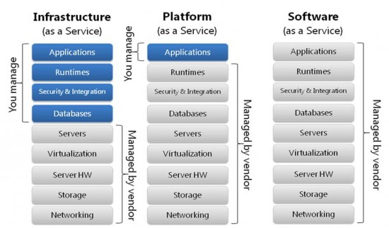

# 备忘学习文档study  

- [备忘学习文档study](#%e5%a4%87%e5%bf%98%e5%ad%a6%e4%b9%a0%e6%96%87%e6%a1%a3study)
  - [idea](#idea)
    - [maven 控制台中文乱码](#maven-%e6%8e%a7%e5%88%b6%e5%8f%b0%e4%b8%ad%e6%96%87%e4%b9%b1%e7%a0%81)
    - [正常启动控制台乱码](#%e6%ad%a3%e5%b8%b8%e5%90%af%e5%8a%a8%e6%8e%a7%e5%88%b6%e5%8f%b0%e4%b9%b1%e7%a0%81)
    - [快捷键 shortcuts](#%e5%bf%ab%e6%8d%b7%e9%94%ae-shortcuts)
    - [自定义快捷键](#%e8%87%aa%e5%ae%9a%e4%b9%89%e5%bf%ab%e6%8d%b7%e9%94%ae)
    - [常用技巧](#%e5%b8%b8%e7%94%a8%e6%8a%80%e5%b7%a7)
    - [文件颜色](#%e6%96%87%e4%bb%b6%e9%a2%9c%e8%89%b2)
    - [idea build artifacts 二进制文件乱码](#idea-build-artifacts-%e4%ba%8c%e8%bf%9b%e5%88%b6%e6%96%87%e4%bb%b6%e4%b9%b1%e7%a0%81)
    - [idea 取消自动更新](#idea-%e5%8f%96%e6%b6%88%e8%87%aa%e5%8a%a8%e6%9b%b4%e6%96%b0)
    - [编码快捷](#%e7%bc%96%e7%a0%81%e5%bf%ab%e6%8d%b7)
    - [发布模式区别](#%e5%8f%91%e5%b8%83%e6%a8%a1%e5%bc%8f%e5%8c%ba%e5%88%ab)
    - [在intellij idea中打jar包, 运行提示没有主清单属性](#%e5%9c%a8intellij-idea%e4%b8%ad%e6%89%93jar%e5%8c%85-%e8%bf%90%e8%a1%8c%e6%8f%90%e7%a4%ba%e6%b2%a1%e6%9c%89%e4%b8%bb%e6%b8%85%e5%8d%95%e5%b1%9e%e6%80%a7)
    - [Cannot resolve symbol 'SpringApplication'](#cannot-resolve-symbol-springapplication)
    - [Git Pull Failed](#git-pull-failed)
    - [maven设置](#maven%e8%ae%be%e7%bd%ae)
      - [配置aliyun仓库地址](#%e9%85%8d%e7%bd%aealiyun%e4%bb%93%e5%ba%93%e5%9c%b0%e5%9d%80)
      - [maven乱码](#maven%e4%b9%b1%e7%a0%81)
      - [maven 测试 OutOfMemoryError](#maven-%e6%b5%8b%e8%af%95-outofmemoryerror)
      - [maven 无法下载源码 cannot download sources](#maven-%e6%97%a0%e6%b3%95%e4%b8%8b%e8%bd%bd%e6%ba%90%e7%a0%81-cannot-download-sources)
      - [maven 测试单个类](#maven-%e6%b5%8b%e8%af%95%e5%8d%95%e4%b8%aa%e7%b1%bb)
    - [intellij 出现"Usage of API documented as @since 1.6+"的解决办法](#intellij-%e5%87%ba%e7%8e%b0%22usage-of-api-documented-as-since-16%22%e7%9a%84%e8%a7%a3%e5%86%b3%e5%8a%9e%e6%b3%95)
    - [ctrl+space冲突问题](#ctrlspace%e5%86%b2%e7%aa%81%e9%97%ae%e9%a2%98)
    - [修改提示首字母区分大小写的问题](#%e4%bf%ae%e6%94%b9%e6%8f%90%e7%a4%ba%e9%a6%96%e5%ad%97%e6%af%8d%e5%8c%ba%e5%88%86%e5%a4%a7%e5%b0%8f%e5%86%99%e7%9a%84%e9%97%ae%e9%a2%98)
    - [日志](#%e6%97%a5%e5%bf%97)
    - [Intellij IDEA 自动生成 serialVersionUID](#intellij-idea-%e8%87%aa%e5%8a%a8%e7%94%9f%e6%88%90-serialversionuid)
    - [查看javadoc](#%e6%9f%a5%e7%9c%8bjavadoc)
    - [忽略git提交文件](#%e5%bf%bd%e7%95%a5git%e6%8f%90%e4%ba%a4%e6%96%87%e4%bb%b6)
    - [SVN版本管理](#svn%e7%89%88%e6%9c%ac%e7%ae%a1%e7%90%86)
    - [lombok 找不到符号](#lombok-%e6%89%be%e4%b8%8d%e5%88%b0%e7%ac%a6%e5%8f%b7)
    - [最大化控制台 maximize console window](#%e6%9c%80%e5%a4%a7%e5%8c%96%e6%8e%a7%e5%88%b6%e5%8f%b0-maximize-console-window)
    - [临时作为文本编辑器 scratch file](#%e4%b8%b4%e6%97%b6%e4%bd%9c%e4%b8%ba%e6%96%87%e6%9c%ac%e7%bc%96%e8%be%91%e5%99%a8-scratch-file)
    - [找回spring boot `run dashboard` 面板](#%e6%89%be%e5%9b%9espring-boot-run-dashboard-%e9%9d%a2%e6%9d%bf)
  - [tomcat乱码](#tomcat%e4%b9%b1%e7%a0%81)
  - [chrome浏览器](#chrome%e6%b5%8f%e8%a7%88%e5%99%a8)
    - [常用快捷键hotkey](#%e5%b8%b8%e7%94%a8%e5%bf%ab%e6%8d%b7%e9%94%aehotkey)
    - [插件离线下载地址](#%e6%8f%92%e4%bb%b6%e7%a6%bb%e7%ba%bf%e4%b8%8b%e8%bd%bd%e5%9c%b0%e5%9d%80)
    - [ajax访问file协议跨域](#ajax%e8%ae%bf%e9%97%aefile%e5%8d%8f%e8%ae%ae%e8%b7%a8%e5%9f%9f)
    - [查看事件监听listener](#%e6%9f%a5%e7%9c%8b%e4%ba%8b%e4%bb%b6%e7%9b%91%e5%90%aclistener)
    - [调试模式找不到ajax请求的js](#%e8%b0%83%e8%af%95%e6%a8%a1%e5%bc%8f%e6%89%be%e4%b8%8d%e5%88%b0ajax%e8%af%b7%e6%b1%82%e7%9a%84js)
    - [模拟网速慢的情况low net speed](#%e6%a8%a1%e6%8b%9f%e7%bd%91%e9%80%9f%e6%85%a2%e7%9a%84%e6%83%85%e5%86%b5low-net-speed)
    - [小于12px的字体不渲染的解决方案](#%e5%b0%8f%e4%ba%8e12px%e7%9a%84%e5%ad%97%e4%bd%93%e4%b8%8d%e6%b8%b2%e6%9f%93%e7%9a%84%e8%a7%a3%e5%86%b3%e6%96%b9%e6%a1%88)
    - [添加受信任的https网站](#%e6%b7%bb%e5%8a%a0%e5%8f%97%e4%bf%a1%e4%bb%bb%e7%9a%84https%e7%bd%91%e7%ab%99)
    - [ajax loading图](#ajax-loading%e5%9b%be)
    - [ajax 序列化数组参数](#ajax-%e5%ba%8f%e5%88%97%e5%8c%96%e6%95%b0%e7%bb%84%e5%8f%82%e6%95%b0)
    - [关闭download bar](#%e5%85%b3%e9%97%addownload-bar)
    - [google搜索技巧](#google%e6%90%9c%e7%b4%a2%e6%8a%80%e5%b7%a7)
  - [http](#http)
    - [跨域 CORS](#%e8%b7%a8%e5%9f%9f-cors)
    - [浏览器缓存机制cache](#%e6%b5%8f%e8%a7%88%e5%99%a8%e7%bc%93%e5%ad%98%e6%9c%ba%e5%88%b6cache)
    - [postman 请求问题](#postman-%e8%af%b7%e6%b1%82%e9%97%ae%e9%a2%98)
    - [XSS 和 CSRF](#xss-%e5%92%8c-csrf)
      - [XSS](#xss)
      - [CSRF](#csrf)
  - [html](#html)
    - [a标签click不触发转跳](#a%e6%a0%87%e7%ad%beclick%e4%b8%8d%e8%a7%a6%e5%8f%91%e8%bd%ac%e8%b7%b3)
    - [a标签热键](#a%e6%a0%87%e7%ad%be%e7%83%ad%e9%94%ae)
    - [事件阶段event](#%e4%ba%8b%e4%bb%b6%e9%98%b6%e6%ae%b5event)
  - [javascript](#javascript)
    - [三种声明方式的区别decare](#%e4%b8%89%e7%a7%8d%e5%a3%b0%e6%98%8e%e6%96%b9%e5%bc%8f%e7%9a%84%e5%8c%ba%e5%88%abdecare)
    - [undefinded](#undefinded)
    - [js中的this](#js%e4%b8%ad%e7%9a%84this)
    - [jquery动态事件绑定](#jquery%e5%8a%a8%e6%80%81%e4%ba%8b%e4%bb%b6%e7%bb%91%e5%ae%9a)
    - [JS打开新窗口的2种方式](#js%e6%89%93%e5%bc%80%e6%96%b0%e7%aa%97%e5%8f%a3%e7%9a%842%e7%a7%8d%e6%96%b9%e5%bc%8f)
    - [javascript 函数call apply区别](#javascript-%e5%87%bd%e6%95%b0call-apply%e5%8c%ba%e5%88%ab)
    - [javascript 正则表达式可视化](#javascript-%e6%ad%a3%e5%88%99%e8%a1%a8%e8%be%be%e5%bc%8f%e5%8f%af%e8%a7%86%e5%8c%96)
      - [正则表达式 regex (regular expressions)](#%e6%ad%a3%e5%88%99%e8%a1%a8%e8%be%be%e5%bc%8f-regex-regular-expressions)
    - [bootstrap modal 窗口闪现消失的问题](#bootstrap-modal-%e7%aa%97%e5%8f%a3%e9%97%aa%e7%8e%b0%e6%b6%88%e5%a4%b1%e7%9a%84%e9%97%ae%e9%a2%98)
    - [javascript const用法](#javascript-const%e7%94%a8%e6%b3%95)
    - [tampermonkey 引用本地编辑器的方法](#tampermonkey-%e5%bc%95%e7%94%a8%e6%9c%ac%e5%9c%b0%e7%bc%96%e8%be%91%e5%99%a8%e7%9a%84%e6%96%b9%e6%b3%95)
    - [字节序-大小端 endian](#%e5%ad%97%e8%8a%82%e5%ba%8f-%e5%a4%a7%e5%b0%8f%e7%ab%af-endian)
    - [字符串转unicode码](#%e5%ad%97%e7%ac%a6%e4%b8%b2%e8%bd%acunicode%e7%a0%81)
      - [vue学习](#vue%e5%ad%a6%e4%b9%a0)
        - [v-if vs v-show](#v-if-vs-v-show)
  - [nodejs](#nodejs)
    - [淘宝源](#%e6%b7%98%e5%ae%9d%e6%ba%90)
    - [npm相关设置](#npm%e7%9b%b8%e5%85%b3%e8%ae%be%e7%bd%ae)
    - [npx 运行http-server](#npx-%e8%bf%90%e8%a1%8chttp-server)
    - [使用添加ssl证书](#%e4%bd%bf%e7%94%a8%e6%b7%bb%e5%8a%a0ssl%e8%af%81%e4%b9%a6)
      - [证书格式](#%e8%af%81%e4%b9%a6%e6%a0%bc%e5%bc%8f)
    - [vscode 开发 typescript项目](#vscode-%e5%bc%80%e5%8f%91-typescript%e9%a1%b9%e7%9b%ae)
    - [异步函数执行顺序](#%e5%bc%82%e6%ad%a5%e5%87%bd%e6%95%b0%e6%89%a7%e8%a1%8c%e9%a1%ba%e5%ba%8f)
    - [npm install](#npm-install)
  - [mongo](#mongo)
    - [CAP理论](#cap%e7%90%86%e8%ae%ba)
    - [安装步骤install](#%e5%ae%89%e8%a3%85%e6%ad%a5%e9%aa%a4install)
    - [备份与恢复 backup and restore](#%e5%a4%87%e4%bb%bd%e4%b8%8e%e6%81%a2%e5%a4%8d-backup-and-restore)
  - [freemarker 语法](#freemarker-%e8%af%ad%e6%b3%95)
  - [专业名词](#%e4%b8%93%e4%b8%9a%e5%90%8d%e8%af%8d)
    - [IaaS PaaS Saas 区别](#iaas-paas-saas-%e5%8c%ba%e5%88%ab)
  - [JAVA](#java)
    - [API/SPI区别](#apispi%e5%8c%ba%e5%88%ab)
    - [枚举类通过值获取对象](#%e6%9e%9a%e4%b8%be%e7%b1%bb%e9%80%9a%e8%bf%87%e5%80%bc%e8%8e%b7%e5%8f%96%e5%af%b9%e8%b1%a1)
    - [logback配置文件中additivity的作用](#logback%e9%85%8d%e7%bd%ae%e6%96%87%e4%bb%b6%e4%b8%adadditivity%e7%9a%84%e4%bd%9c%e7%94%a8)
    - [ocr识别(图片转文字)](#ocr%e8%af%86%e5%88%ab%e5%9b%be%e7%89%87%e8%bd%ac%e6%96%87%e5%ad%97)
    - [线程 thread](#%e7%ba%bf%e7%a8%8b-thread)
    - [io 操作](#io-%e6%93%8d%e4%bd%9c)
      - [bio nio aio区别](#bio-nio-aio%e5%8c%ba%e5%88%ab)
      - [io操作分类](#io%e6%93%8d%e4%bd%9c%e5%88%86%e7%b1%bb)
    - [引用 reference](#%e5%bc%95%e7%94%a8-reference)
    - [finally和return执行顺序](#finally%e5%92%8creturn%e6%89%a7%e8%a1%8c%e9%a1%ba%e5%ba%8f)
    - [java中的常见错误](#java%e4%b8%ad%e7%9a%84%e5%b8%b8%e8%a7%81%e9%94%99%e8%af%af)
    - [登录权限spring security](#%e7%99%bb%e5%bd%95%e6%9d%83%e9%99%90spring-security)
    - [POI (Poor Obfuscation Implementation) 可怜的模糊实现](#poi-poor-obfuscation-implementation-%e5%8f%af%e6%80%9c%e7%9a%84%e6%a8%a1%e7%b3%8a%e5%ae%9e%e7%8e%b0)
    - [jackson 时间序列化问题](#jackson-%e6%97%b6%e9%97%b4%e5%ba%8f%e5%88%97%e5%8c%96%e9%97%ae%e9%a2%98)
    - [单元测试](#%e5%8d%95%e5%85%83%e6%b5%8b%e8%af%95)
      - [JMockit 在IDEA中的用法](#jmockit-%e5%9c%a8idea%e4%b8%ad%e7%9a%84%e7%94%a8%e6%b3%95)
    - [代码片段](#%e4%bb%a3%e7%a0%81%e7%89%87%e6%ae%b5)
      - [array转字符串拼接](#array%e8%bd%ac%e5%ad%97%e7%ac%a6%e4%b8%b2%e6%8b%bc%e6%8e%a5)
    - [框架设计](#%e6%a1%86%e6%9e%b6%e8%ae%be%e8%ae%a1)
      - [GSON](#gson)
    - [gradle](#gradle)
      - [gradle 仓库使用代理](#gradle-%e4%bb%93%e5%ba%93%e4%bd%bf%e7%94%a8%e4%bb%a3%e7%90%86)
  - [git命令](#git%e5%91%bd%e4%bb%a4)
    - [解决git pull push每次都需要输入密码问题](#%e8%a7%a3%e5%86%b3git-pull-push%e6%af%8f%e6%ac%a1%e9%83%bd%e9%9c%80%e8%a6%81%e8%be%93%e5%85%a5%e5%af%86%e7%a0%81%e9%97%ae%e9%a2%98)
    - [git使用ssh方式连接github](#git%e4%bd%bf%e7%94%a8ssh%e6%96%b9%e5%bc%8f%e8%bf%9e%e6%8e%a5github)
    - [gitignore文件用法](#gitignore%e6%96%87%e4%bb%b6%e7%94%a8%e6%b3%95)
    - [查看命令语法 git help](#%e6%9f%a5%e7%9c%8b%e5%91%bd%e4%bb%a4%e8%af%ad%e6%b3%95-git-help)
    - [日志命令 git log](#%e6%97%a5%e5%bf%97%e5%91%bd%e4%bb%a4-git-log)
    - [git remote 由于远程分支删除导致本地与远程不一致问题error: cannot lock ref](#git-remote-%e7%94%b1%e4%ba%8e%e8%bf%9c%e7%a8%8b%e5%88%86%e6%94%af%e5%88%a0%e9%99%a4%e5%af%bc%e8%87%b4%e6%9c%ac%e5%9c%b0%e4%b8%8e%e8%bf%9c%e7%a8%8b%e4%b8%8d%e4%b8%80%e8%87%b4%e9%97%ae%e9%a2%98error-cannot-lock-ref)
    - [git 设置代理](#git-%e8%ae%be%e7%bd%ae%e4%bb%a3%e7%90%86)
    - [git windows乱码](#git-windows%e4%b9%b1%e7%a0%81)
    - [git 关联远程(裸仓库)](#git-%e5%85%b3%e8%81%94%e8%bf%9c%e7%a8%8b%e8%a3%b8%e4%bb%93%e5%ba%93)
  - [markdown](#markdown)
    - [code 语法](#code-%e8%af%ad%e6%b3%95)
    - [转ppt方案](#%e8%bd%acppt%e6%96%b9%e6%a1%88)
    - [在线转表格 Tables](#%e5%9c%a8%e7%ba%bf%e8%bd%ac%e8%a1%a8%e6%a0%bc-tables)
    - [vscode markdownlint error settings](#vscode-markdownlint-error-settings)
  - [mysql](#mysql)
    - [windows 绿色安装](#windows-%e7%bb%bf%e8%89%b2%e5%ae%89%e8%a3%85)
    - [window开启mysql服务](#window%e5%bc%80%e5%90%afmysql%e6%9c%8d%e5%8a%a1)
    - [mysql常用命令](#mysql%e5%b8%b8%e7%94%a8%e5%91%bd%e4%bb%a4)
    - [mysql 复制表结构](#mysql-%e5%a4%8d%e5%88%b6%e8%a1%a8%e7%bb%93%e6%9e%84)
    - [mysql 主从复制](#mysql-%e4%b8%bb%e4%bb%8e%e5%a4%8d%e5%88%b6)
    - [mysql 创建用户与授权](#mysql-%e5%88%9b%e5%bb%ba%e7%94%a8%e6%88%b7%e4%b8%8e%e6%8e%88%e6%9d%83)
    - [mysql优化](#mysql%e4%bc%98%e5%8c%96)
    - [字符串拼接与截取](#%e5%ad%97%e7%ac%a6%e4%b8%b2%e6%8b%bc%e6%8e%a5%e4%b8%8e%e6%88%aa%e5%8f%96)
    - [emoji插入失败](#emoji%e6%8f%92%e5%85%a5%e5%a4%b1%e8%b4%a5)
    - [动态拼接表名](#%e5%8a%a8%e6%80%81%e6%8b%bc%e6%8e%a5%e8%a1%a8%e5%90%8d)
  - [oracle](#oracle)
    - [oracle存储过程 procedure =>](#oracle%e5%ad%98%e5%82%a8%e8%bf%87%e7%a8%8b-procedure)
  - [lucene](#lucene)
  - [maven](#maven)
    - [查询plugin命令](#%e6%9f%a5%e8%af%a2plugin%e5%91%bd%e4%bb%a4)
    - [跳过单元测试](#%e8%b7%b3%e8%bf%87%e5%8d%95%e5%85%83%e6%b5%8b%e8%af%95)
  - [xshell](#xshell)
    - [xshell 乱码问题](#xshell-%e4%b9%b1%e7%a0%81%e9%97%ae%e9%a2%98)
    - [shell 脚本](#shell-%e8%84%9a%e6%9c%ac)
      - [shell 语法](#shell-%e8%af%ad%e6%b3%95)
      - [vim命令](#vim%e5%91%bd%e4%bb%a4)
  - [jenkins](#jenkins)
    - [ant启动报错 'ant.bat' 不是内部或外部命令, 也不是可运行的程序](#ant%e5%90%af%e5%8a%a8%e6%8a%a5%e9%94%99-antbat-%e4%b8%8d%e6%98%af%e5%86%85%e9%83%a8%e6%88%96%e5%a4%96%e9%83%a8%e5%91%bd%e4%bb%a4-%e4%b9%9f%e4%b8%8d%e6%98%af%e5%8f%af%e8%bf%90%e8%a1%8c%e7%9a%84%e7%a8%8b%e5%ba%8f)
  - [sonar](#sonar)
    - [sonar各级别代表的意思](#sonar%e5%90%84%e7%ba%a7%e5%88%ab%e4%bb%a3%e8%a1%a8%e7%9a%84%e6%84%8f%e6%80%9d)
  - [SpringMVC](#springmvc)
  - [Spring](#spring)
    - [validate校验](#validate%e6%a0%a1%e9%aa%8c)
    - [源码分析](#%e6%ba%90%e7%a0%81%e5%88%86%e6%9e%90)
      - [IoC](#ioc)
      - [AOP](#aop)
    - [spring-boot](#spring-boot)
      - [spring boot starter 和 spring boot auto-configuration 原理](#spring-boot-starter-%e5%92%8c-spring-boot-auto-configuration-%e5%8e%9f%e7%90%86)
      - [spring-boot 启动方式](#spring-boot-%e5%90%af%e5%8a%a8%e6%96%b9%e5%bc%8f)
      - [spring start initializr 本地搭建](#spring-start-initializr-%e6%9c%ac%e5%9c%b0%e6%90%ad%e5%bb%ba)
  - [autohotkey](#autohotkey)
    - [变量](#%e5%8f%98%e9%87%8f)
    - [autohotkey自启动](#autohotkey%e8%87%aa%e5%90%af%e5%8a%a8)
    - [Win10操作系统找不到已输入的环境选项解决方案](#win10%e6%93%8d%e4%bd%9c%e7%b3%bb%e7%bb%9f%e6%89%be%e4%b8%8d%e5%88%b0%e5%b7%b2%e8%be%93%e5%85%a5%e7%9a%84%e7%8e%af%e5%a2%83%e9%80%89%e9%a1%b9%e8%a7%a3%e5%86%b3%e6%96%b9%e6%a1%88)
  - [Total Commander](#total-commander)
    - [设置关闭按钮最小化tc minimize](#%e8%ae%be%e7%bd%ae%e5%85%b3%e9%97%ad%e6%8c%89%e9%92%ae%e6%9c%80%e5%b0%8f%e5%8c%96tc-minimize)
    - [快捷键 tc shortcuts](#%e5%bf%ab%e6%8d%b7%e9%94%ae-tc-shortcuts)
  - [nginx](#nginx)
    - [413 Request Entity Too Large的解决方法](#413-request-entity-too-large%e7%9a%84%e8%a7%a3%e5%86%b3%e6%96%b9%e6%b3%95)
  - [运维相关](#%e8%bf%90%e7%bb%b4%e7%9b%b8%e5%85%b3)
    - [docker](#docker)
      - [windows 安装](#windows-%e5%ae%89%e8%a3%85)
      - [docker toolbox 使用宿主主机代理](#docker-toolbox-%e4%bd%bf%e7%94%a8%e5%ae%bf%e4%b8%bb%e4%b8%bb%e6%9c%ba%e4%bb%a3%e7%90%86)
      - [docker 配置国内镜像地址](#docker-%e9%85%8d%e7%bd%ae%e5%9b%bd%e5%86%85%e9%95%9c%e5%83%8f%e5%9c%b0%e5%9d%80)
    - [k8s](#k8s)
    - [rancher](#rancher)
  - [office](#office)
    - [VBA数组下标可以是负数](#vba%e6%95%b0%e7%bb%84%e4%b8%8b%e6%a0%87%e5%8f%af%e4%bb%a5%e6%98%af%e8%b4%9f%e6%95%b0)
    - [excel中vlookup函数](#excel%e4%b8%advlookup%e5%87%bd%e6%95%b0)
  - [window](#window)
    - [path环境变量命令](#path%e7%8e%af%e5%a2%83%e5%8f%98%e9%87%8f%e5%91%bd%e4%bb%a4)
    - [bat 用法](#bat-%e7%94%a8%e6%b3%95)
      - [getDesktopPath bat](#getdesktoppath-bat)
      - [bat changePath](#bat-changepath)
      - [cmd中复制粘贴](#cmd%e4%b8%ad%e5%a4%8d%e5%88%b6%e7%b2%98%e8%b4%b4)
      - [bat更换壁纸](#bat%e6%9b%b4%e6%8d%a2%e5%a3%81%e7%ba%b8)
      - [bat 不显示小黑框](#bat-%e4%b8%8d%e6%98%be%e7%a4%ba%e5%b0%8f%e9%bb%91%e6%a1%86)
      - [bat 中的路径](#bat-%e4%b8%ad%e7%9a%84%e8%b7%af%e5%be%84)
      - [bat vbs其他技巧](#bat-vbs%e5%85%b6%e4%bb%96%e6%8a%80%e5%b7%a7)
      - [telnet 退出命令](#telnet-%e9%80%80%e5%87%ba%e5%91%bd%e4%bb%a4)
      - [bat打包制定文件到jar包中](#bat%e6%89%93%e5%8c%85%e5%88%b6%e5%ae%9a%e6%96%87%e4%bb%b6%e5%88%b0jar%e5%8c%85%e4%b8%ad)
      - [重新获取ip地址](#%e9%87%8d%e6%96%b0%e8%8e%b7%e5%8f%96ip%e5%9c%b0%e5%9d%80)
      - [cmd没有颜色,重置cmd设置](#cmd%e6%b2%a1%e6%9c%89%e9%a2%9c%e8%89%b2%e9%87%8d%e7%bd%aecmd%e8%ae%be%e7%bd%ae)
      - [cmd别名doskey, 如定义别名返回上级目录](#cmd%e5%88%ab%e5%90%8ddoskey-%e5%a6%82%e5%ae%9a%e4%b9%89%e5%88%ab%e5%90%8d%e8%bf%94%e5%9b%9e%e4%b8%8a%e7%ba%a7%e7%9b%ae%e5%bd%95)
    - [Win7不按Shift, 直接右键显示"在此处打开命令窗口(W)"](#win7%e4%b8%8d%e6%8c%89shift-%e7%9b%b4%e6%8e%a5%e5%8f%b3%e9%94%ae%e6%98%be%e7%a4%ba%22%e5%9c%a8%e6%ad%a4%e5%a4%84%e6%89%93%e5%bc%80%e5%91%bd%e4%bb%a4%e7%aa%97%e5%8f%a3w%22)
    - [win10 multi desktop多桌面快捷键](#win10-multi-desktop%e5%a4%9a%e6%a1%8c%e9%9d%a2%e5%bf%ab%e6%8d%b7%e9%94%ae)
    - [windows service 查找服务名](#windows-service-%e6%9f%a5%e6%89%be%e6%9c%8d%e5%8a%a1%e5%90%8d)
    - [windows win+r cmd 常用命令](#windows-winr-cmd-%e5%b8%b8%e7%94%a8%e5%91%bd%e4%bb%a4)
    - [windows清除网上邻居帐号](#windows%e6%b8%85%e9%99%a4%e7%bd%91%e4%b8%8a%e9%82%bb%e5%b1%85%e5%b8%90%e5%8f%b7)
    - [windows kill 进程命令](#windows-kill-%e8%bf%9b%e7%a8%8b%e5%91%bd%e4%bb%a4)
    - [windows 隐藏盘符](#windows-%e9%9a%90%e8%97%8f%e7%9b%98%e7%ac%a6)
    - [windows添加管理单元 如管理受信证书](#windows%e6%b7%bb%e5%8a%a0%e7%ae%a1%e7%90%86%e5%8d%95%e5%85%83-%e5%a6%82%e7%ae%a1%e7%90%86%e5%8f%97%e4%bf%a1%e8%af%81%e4%b9%a6)
    - [真正的管理员 administrator](#%e7%9c%9f%e6%ad%a3%e7%9a%84%e7%ae%a1%e7%90%86%e5%91%98-administrator)
    - [vscode用法](#vscode%e7%94%a8%e6%b3%95)
      - [离线安装插件脚本](#%e7%a6%bb%e7%ba%bf%e5%ae%89%e8%a3%85%e6%8f%92%e4%bb%b6%e8%84%9a%e6%9c%ac)
    - [图片与压缩包合并](#%e5%9b%be%e7%89%87%e4%b8%8e%e5%8e%8b%e7%bc%a9%e5%8c%85%e5%90%88%e5%b9%b6)
    - [系统变量 environment](#%e7%b3%bb%e7%bb%9f%e5%8f%98%e9%87%8f-environment)
    - [windows right click 修改右键位置](#windows-right-click-%e4%bf%ae%e6%94%b9%e5%8f%b3%e9%94%ae%e4%bd%8d%e7%bd%ae)
    - [windows 几种链接机制](#windows-%e5%87%a0%e7%a7%8d%e9%93%be%e6%8e%a5%e6%9c%ba%e5%88%b6)
    - [windows 查看开关机时间与重启原因](#windows-%e6%9f%a5%e7%9c%8b%e5%bc%80%e5%85%b3%e6%9c%ba%e6%97%b6%e9%97%b4%e4%b8%8e%e9%87%8d%e5%90%af%e5%8e%9f%e5%9b%a0)
    - [vscode 快捷操作](#vscode-%e5%bf%ab%e6%8d%b7%e6%93%8d%e4%bd%9c)
    - [cmder 用法](#cmder-%e7%94%a8%e6%b3%95)
      - [cmder问题](#cmder%e9%97%ae%e9%a2%98)
      - [cmder 修改命令提示符](#cmder-%e4%bf%ae%e6%94%b9%e5%91%bd%e4%bb%a4%e6%8f%90%e7%a4%ba%e7%ac%a6)
      - [cmder 整合进vscode](#cmder-%e6%95%b4%e5%90%88%e8%bf%9bvscode)
    - [代理问题](#%e4%bb%a3%e7%90%86%e9%97%ae%e9%a2%98)
      - [socks5转http代理](#socks5%e8%bd%achttp%e4%bb%a3%e7%90%86)

## idea  

### maven 控制台中文乱码  

> Settings->Build,Execution,Deployment->build tools->maven->runner   设置VMoptions: -Dfile.encoding=GB2312  

### 正常启动控制台乱码  

> Settings->Build,Execution,Deployment->Complier->Java Compiler->Javac Options->Addtional command line parameters 中添加 -encoding utf-8  

### 快捷键 shortcuts  

- outline 视图 查看定位方法 `ctrl+F12`  
- 导入包,自动修正,字符串内编辑 `Alt+Enter`  
- 查找类 `Ctrl+N`  
- 查找文件 `Ctrl+Shift+N`  
- 格式化代码 `Ctrl+Alt+L`  
- 优化导入的类和包 `Ctrl+Alt+O`  
- 生成代码(如get,set方法,构造函数等) `Alt+Insert`  
- 最近更改的代码 `Ctrl+E或者Alt+Shift+C`  
- 替换文本 `Ctrl+R`  
- 查找文本 `Ctrl+F`  
- 自动补全代码 `Ctrl+Shift+Space`  
- 代码提示 `Ctrl+空格`  
- 类名或接口名提示 `Ctrl+Alt+Space`  
- 方法参数提示 `Ctrl+P`  
- 查找类中的方法或变量 `Ctrl+Shift+Alt+N`  
- 对比最近修改的代码 `Alt+Shift+C`  
- 重构-重命名 `Shift+F6`  
- 移动行 `Ctrl+Shift+向上键`  
- 删除行 `Ctrl+X``Ctrl+Y`  
- 复制行 `Ctrl+D`  
- 注释(//或者/*...*/)`Ctrl+/` `Ctrl+Shift+/`  
- 自动代码 `Ctrl+J`  
- 最近打开的文件 `Ctrl+E`  
- 显示类结构图 `Ctrl+H`  
- 显示注释文档 `Ctrl+Q`  
- 查找代码所在位置 `Alt+F1`  
- 快速打开或隐藏工程面板 `Alt+1`  
- 返回至上次浏览的位置 `Ctrl+Alt+left/right`  
- 切换代码视图 `Alt+left/right`  
- 在方法间快速移动定位 `Alt+Up/Down`  
- 代码向上/下移动. `Ctrl+Shift+Up/Down`  
- 高亮错误或警告快速定位 `F2或Shift+F2`  
- 代码标签输入完成后, 按Tab, 生成代码. `tab`  
- 选中文本, 高亮显示所有该文本, 按Esc高亮消失. `Ctrl+Shift+F7`  
- 选中代码, 连续按会有其他效果 `Ctrl+W`  
- 选中文本, 逐个往下查找相同文本, 并高亮显示. `按Alt+F3`  
- 光标跳转到第一行或最后一行下 `Ctrl+Up/Down`  
- 快速打开光标处的类或方法 `Ctrl+B`  
- 大小写 `ctrl+shift+U`  
- 选定代码块(trycatch if for) `Ctrl+Alt+T`  
- 折叠打开(所有)注释 `Ctrl+(Shift+)Num+/Num-`  
- 同步文件 `ctrl+alt+y`  
- 最大化编辑窗口, 隐藏工具窗口 `ctrl+shift+f12`  

### 自定义快捷键  

- 左右分屏 `alt+]`  
- 上下分屏 `alt+[`  
- 复制整行 `ctrl+win`  

### 常用技巧  

- 演出模式  

> `Alt+V` > 选择 `Enter Presentation Mode`  全屏  变大  
退出 `Alt+V` > 选择 `Exit Presentation Mode`  
查找 `CTRL+N`  `CTRL+SHIFT+N` 最近文件 `CTRL+E`  

- Inject language  

> 字符串内 `Alt+Enter`  选择`Inject language or reference`> `JSON` > `alt+enter` 插入//language=JSON > `alt+enter` > `Edit JSON Fragment`  
`ctrl+F4` 可关闭  

- 移动分割线  

> `alt+1`定位到`project`视图, 然后`ctrl+shift+left/right`调整大小  

- 完善结尾  

> `ctrl+shift+enter` 为您收尾, 加分号, 加括号, 等  

- 批量修改  

> `ctrl+r` 替换  
`shift+F6` 重构  
`ctrl+w` 选中文本 > `alt+j` 向后选择相同文本  

- 去掉导航栏  

> `alt+v`去掉`Navigation bar` `alt+home`可临时呼出导航栏  

- 定位到project视图  

> `alt+F1`呼出`select in`, 选择`Project View`中的`Project` 即可. 如果要退出`project`, 用`esc` 或`F4`  

- symbol全局查找  

> `ctrl+shift+alt+n` 可模糊查找比`ctrl+shift+f`好用  

- 查找目录  

> `ctrl+shift+n` 输入`/`结尾  

- 判断空  

> 输入`变量.notnull`  

- 模版查找  

> `ctrl+shift+a` 中 `Search Structually`  

- 不轻易自定义快捷键, 如果不方便用的命令用action, 快捷键`ctrl+shift+A`  

- 查找方法调用  

> `ctrl+alt+h`, 如果要知道多次调用的方法, 可以用`alt+f7`, `f4`进入源码, `alt+8`返回方法调用  

- 根据请求路径, 快速找到controller方法  

> `ctrl+alt+shift+n`直接输入`/请求路径`  

- bookmark 方法  

> `ctrl+F12`列出所有方法, 定位到方法名, `F11`加入bookmark, `shift+F11`列出所有的bookmark, `ctrl+enter`修改bookmark名字  

- 只保留一个标签, 用`ctrl+e`查找最近打开的文件  

> `ctrl+shift+A`搜索`editor tabs`, 进入settings, 查找`placement`, 修改为`none`  

- 阅读长代码  

> `ctrl+.` 折叠选择区域内的代码, `ctrl+shift+.`折叠代码块中的代码, `ctrl+shift+=`即`ctrl++`展开代码  

- 转跳到大括号匹配位置 `ctrl+]`结尾 和 `ctrl+[`开头  

- 高亮变量 `ctrl+shift+F7`, `F3`定位到下一个变量位置  

- 查看某个类或某个方法的声明 `ctrl+shift+I`  

- 将一个方法的返回值作为另一个方法的入参, 在方法或参数结尾输入`.arg` 即可;  

- 项目过多, 打开过慢, 可以使用`Load/Unload Modules`, 通过右键项目打开此对话框, 或者`ctrl+sift`, 卸载部分暂时不用的模块  

- 查看上下文`Alt+Q`  

- 打开其他终端, terminal `File | Settings | Tools | Terminal` 下 `shell path` 输入其他terminal的路径, 如 cmder `"cmd.exe" /k "C:\LS\cmder\vendor\init.bat"` , git `"C:\Program Files\Git\bin\sh.exe" --login -i`  

### 文件颜色  

> 绿色: 已经加入版本控制暂未提交;  
> 红色: 未加入版本控制;  
> 蓝色: 加入版本控制, 已提交, 有改动;  
> 白色: 加入版本控制, 已提交, 无改动;  
> 灰色: 版本控制已忽略文件.  

### idea build artifacts 二进制文件乱码  

> settings -> editor -> file encodings , 将project设置为了utf8编码, 而二进制文件不应该是utf8编码, 设置为`ISO-8859-1`  

### idea 取消自动更新  

> settings -> Appearance & Behavior -> System Settings -> Updates 取消 automatically check updates for stable releases 的设置  

### 编码快捷  

- 100.fori list.for 快速for循环  
- "string".sout sout 快速打印(System.out.println("string"));  

### 发布模式区别  

war模式: 将WEB工程以包的形式上传到服务器;  
war exploded模式: 将WEB工程以当前文件夹的位置关系上传到服务器; 这种方式支持热部署, 一般在开发的时候也是用这种方式.  

### 在intellij idea中打jar包, 运行提示没有主清单属性  

> 可能是 IntelliJ 的问题.  
> 在 Project Structure - Artifacts 里面选好 Main Class 之后, IntelliJ 会自动在下边的 Directory for META-INF/MANIFEST.MF 里填上 `/$PROJECT_DIR/src/main/java`  
把这行里边的 `main/java` 删掉, 变成 `/$PROJECT_DIR/src/` 试试  

### Cannot resolve symbol 'SpringApplication'  

解决方法: 在Intellij idea下 file—>Invalidate Caches/Restart 清除缓存重启即可.  

### Git Pull Failed  

error: You have not concluded your merge (MERGE_HEAD exists).  
fatal: Exiting because of unfinished merge.  
Git Merge Failed  
fatal: You have not concluded your merge (MERGE_HEAD exists).  

1. 直接commit. 在Android studio的VCS--- Commit Changes 或者terminal 输入下面的指令: git commit -m "commit info". 之后再pull或merge就可以顺利进行  
2. 放弃本地修改, 直接覆盖之 git reset --hardgit pull  

### maven设置  

#### 配置aliyun仓库地址  

修改`maven/conf/settings.xml`中的内容  

```xml  
<mirror>  
  <id>alimaven</id>  
  <name>aliyun maven</name>  
  <url>http://maven.aliyun.com/nexus/content/repositories/central</url>  
  <mirrorOf>central</mirrorOf>  
</mirror>  
```  

通过mirror标签修改配置文件的远程仓库地址, IDEA中不会更改中央仓库的URL, 但下载的地址已经更改, 而通过profile标签修改的配置不会这样  
如果远程仓库下载不下来索引, 可现在中央仓库下载下来文件, 然后本地搭建httpserver, 通过修改hosts文件来进行maven索引的更新  

1. 下载`http://repo.maven.apache.org/maven2/.index/`中的`nexus-maven-repository-index.gz`和`nexus-maven-repository-index.properties` 文件  
1. 修改`C:\Windows\System32\drivers\etc\hosts` 中 添加`127.0.0.1 repo.maven.apache.org`  
1. `mkdir httpserver & cd httpserver & mkdir maven2\.index`  
1. 将下载的文件复制到`.index`文件夹, 并在`httpserver`文件夹执行`npx httpserver -p 80`  
1. 更新IDEA中`File | Settings | Build, Execution, Deployment | Build Tools | Maven | Repositories`远程仓库  

#### maven乱码  

> windows环境下, Intellij idea12中maven操作时, 控制台中文乱码问题(编译报错或者clean install时出现的其他错误描述乱码)  
> 在cmd中mvn中文正常显示,log4j打印日志也是ok的.  
> 解决方法:  
> Setting->maven->runner  VMoptions: -Dfile.encoding=GB2312  

#### maven 测试 OutOfMemoryError  

> 增加参数 mvn test -DargLine="-XX:MaxPermSize=1024m -Xmx768m"  
> 具体 Setting->maven->runner  VMoptions: -DargLine="-XX:MaxPermSize=1024m -Xmx768m"  

#### maven 无法下载源码 cannot download sources  

在terminal窗口中, 项目根目录输入`mvn dependency:resolve -Dclassifier=sources`  
也有可能是maven版本的问题, 3.6.0 配合idea会出现这种问题, 可以通过`idea.log`,文件查看具体的原因, 程序中通过`Help | show log in explorer`中查看出错原因  

#### maven 测试单个类  

`mvn test -Dtest=com.test.ClassTest`  
`mvn test -Dtest=com.test.ClassTest#methodName`  
`mvn test -Dtest=com.test.ClassTest#methodName1,com.test.ClassTest#methodName2,Random*Test`  

### intellij 出现"Usage of API documented as @since 1.6+"的解决办法  

> File ->Project Structure->Project Settings -> Modules -> 你的Module名字 -> Sources -> Language Level->选个默认的就行.  

### ctrl+space冲突问题  

> 修改注册表 HKEY_CURRENT_USER/Control Panel/Input Method/Hot Keys  
00000070 for the Chinese (Traditional) IME - Ime/NonIme Toggle hotkey  
00000010 for the Chinese (Simplified) IME - Ime/NonIme Toggle hotkey  
把Key Modifiers开头的02改成00  
把Virtual Key开头的20改成FF  
> autohotkey 脚本  `^space::return`  

### 修改提示首字母区分大小写的问题  

> 在IDEA中进行代码提示时, 原来在ECLIPSE中输入syso,然后"Alt+/"就可以完成System.out.println("")的输入, 但是在IDEA中默认的配置首字母必须输入"S"大小写一致才能匹配到System, 如果要输入小写"s"都可以匹配, 需要在  
> Editor=>Code Completion里把Case sensitive completion设置为None就可以了  
> 其中2018以上版本为 Editor=>Code Completion=>match case  

### 日志  

> edit configurations > "your server" > logs > add > alias and log file location  
> 5:debug > log > all  

### Intellij IDEA 自动生成 serialVersionUID  

Setting->Inspections->Serialization issues->Serializable class without 'serialVersionUID'  
选上以后, 在你的class中: Alt+Enter就会提示自动创建serialVersionUID了.  

### 查看javadoc  

settings -> editor -> general 中 other->show quick documentation on mouse move  
快捷键 `ctrl+q`  

### 忽略git提交文件  

1. 利用git的.ignore文件(针对未纳入版本管理的文件有效)  
2. 利用idea version control 中的 changeList  

### SVN版本管理  

can't use subversion command line svn  
TortoiseSVN 未安装命令行模式, 需要重新点下安装包, 修改安装选项, 添加命令行模式即可  

忽略提交的文件, version control -> ignored files 中的文件设置是针对未被版本管理追踪的文件, 如果该文件已经被版本管理追踪, 则没有效果  

### lombok 找不到符号  

settings -> Build, Execution, Deployment -> Complier -> Annotation Processors  -> Maven Default  
设置Enable annotation processing 和 Obtain processors from project classpath  

### 最大化控制台 maximize console window  

快捷键F12定位到工具窗口, `ctrl+shift+引号` 最大化窗口  

### 临时作为文本编辑器 scratch file  

`ctrl+shfit+alt+insert` 新建一个`scratchfile`, 存在一个独立的位置, 不在项目中, 可用作临时测试, 文本处理等功能  

### 找回spring boot `run dashboard` 面板  

springboot 启动面板有时会丢失  
方式一, 在 `workspace.xml`中查找`RunDashboard`  

```xml  
<component name="RunDashboard">  
  <option name="ruleStates">  
    <list>  
      <RuleState>  
        <option name="name" value="ConfigurationTypeDashboardGroupingRule" />  
      </RuleState>  
      <RuleState>  
        <option name="name" value="StatusDashboardGroupingRule" />  
      </RuleState>  
    </list>  
  </option>  
</component>  
```  

插入如下内容就可以了  

```xml  
<option name="configurationTypes">  
  <set>  
    <option value="SpringBootApplicationConfigurationType" />  
  </set>  
</option>  
```  

方式二, 在 `edit configuration`中`templates`选项, `configurations avaliable in run dashboard`中添加`spring boot`  

## tomcat乱码  

> tomcat7默认编码iso8859-1, tomcat8默认编码utf8  

## chrome浏览器  

### 常用快捷键hotkey  

| 按键           | 功能               |  
| -------------- | ------------------ |  
| `Ctrl+Shift+C` | 定位元素(+)        |  
| `Ctrl+Shift+D` | 切换开发工具位置   |  
| `Ctrl+Shift+F` | 全局搜索           |  
| `F1`           | 打开设置           |  
| `Esc`          | 打开/隐藏底部      |  
| `Ctrl+Shift+J` | 打开/关闭控制台(+) |  
| `Ctrl+L`       | 控制台清空         |  
|                |                    |  

备注: (+)不用打开控制台  

### 插件离线下载地址  

[chrome插件下载地地址](https://chrome-extension-downloader.com/)  

### ajax访问file协议跨域  

在Chrome快捷方式的目标最后添加`--allow-file-access-from-files`, 以允许访问本地资源文件  

### 查看事件监听listener  

在Elements标签下, 找到dom元素, 打开EventListeners,取消Ancestors['ænsɛstɚ]的勾选(祖先)  

### 调试模式找不到ajax请求的js  

> 搜不到ajax请求的js文件, 可以设置settings--preferences--sources--search in anonymous and conten script 勾选,用ctrl+shift+f进行搜索  

### 模拟网速慢的情况low net speed  

> 按F12, 打开Chrome调试工具 setting>Throttlting>add customer profile  
> 在network标签下选择 no throttling-->add, 再输入相应的限速即可  

### 小于12px的字体不渲染的解决方案  

> 不要设置小于12px的, 因为小于12px中文的渲染效果不好  
> 设置chrome的外观最小字体  
> 通过设置css属性  

```css  
    .chrome_adjust {  
        font-size: 12px;  
        /* -webkit-text-size-adjust:none; 已失效*/  
        display: inline-block;  
        -webkit-transform-origin-x:left; /*左侧*/  
        -webkit-transform-origin-y:top; /*上侧*/  
        width:60px;height:20px;  
        -webkit-transform: scale(0.5);  
        transform: scale(0.5);  
    }  
    /*缩放的元素会占用原始的大小, 通过定位的方式解决*/  
    /*css暂时没有父元素选择器*/  
    .chrome_adjust_parent {  
        position: relative;  
    }  
    .chrome_adjust {  
        position: absolute;"  
    }  
```  

### 添加受信任的https网站  

在地址栏输入`chrome://net-internals/#hsts` 将受信任的地址添加进入domain中  
`chrome://flags/#enable-quic`设为disable  

### ajax loading图  

ajax的async属性默认为true  

1. async:true,这种情况为异步方式, 当ajax发送请求前, 会先执行ajax块中beforeSend里面的代码, 如果beforeSend里面有DOM操作, 就可以立即对DOM进行渲染, 当ajax发送请求后, 在等待server端返回的数据的过程中, 程序会继续执行ajax块外面的代码, 直到服务器返回正确的结果才会去执行success的方法. 因此, 在执行success前DOM隐藏且obj=0.  

2. async:false,这时ajax的请求是同步的. 这样的话, 当ajax发送请求前, 会先执行ajax块中beforeSend里面的代码, 如果beforeSend里面有DOM操作, 不会立即对DOM进行渲染, 而是等到complete执行完之后, 才会渲染DOM, 当ajax发送请求后只有ajax请求成功之后, 才会执行ajax块外面的js代码. 因此, 在执行完complete之后DOM才隐藏且obj=result.  

### ajax 序列化数组参数  

ajax 序列化数组参数时, `{arr:['1','2']}`, 默认为`arr[]=1&arr[]=2`, 如果需要传递的为`arr=1&arr=2`, 请在ajax中设置traditional为true. traditional为false时, jquery会深度序列化参数对象  
设置jquery的默认参数  
jQuery.ajaxSettings.traditional = true;  

### 关闭download bar  

`ctrl+j` and `ctrl+w`  

### google搜索技巧  

1. 逻辑与 `+` 或者空格  
1. 逻辑非 `-`  
1. 逻辑或 `OR`  
1. 不切分单词, 用引号 `""`, 引号中可使用*作为通配符  
1. 10..20 10到20中的数字  
1. site:站内搜索, filetype:文件类型, link:查询和某个url相关, inurl:url包含, intitle:标题包含, intext:正文包含,related:和某网站类似的网站  

## http  

### 跨域 CORS  

"跨域资源共享"(Cross-origin resource sharing)  
参考[跨域资源共享 CORS 详解](http://www.ruanyifeng.com/blog/2016/04/cors.html)  

图片跨域  
> 错误 Uncaught DOMException: Failed to execute 'toDataURL' on 'HTMLCanvasElement': Tainted canvases may not be exported.  
> 由于canvas受限于 CORS 策略  
> 解决方法: img.setAttribute("crossOrigin",'Anonymous'), 同时服务器端设置Access-Control-Allow-Origin: * 和 Access-Control-Allow-Methods: GET, POST, PUT就可以了  

跨域后ajax获取不到自定义header,只能获取到Content-Type  
需要在服务端设置Access-Control-Expose-Headers, 响应头增加自定义的, 或者允许访问的头信息  
res.setHeader("Access-Control-Expose-Headers", TOKEN_NAME);  

jsonp跨域 参考 [浏览器同源政策及其规避方法](http://www.ruanyifeng.com/blog/2016/04/same-origin-policy.html)  
> JSONP是服务器与客户端跨源通信的常用方法. 最大特点就是简单适用, 老式浏览器全部支持, 服务器改造非常小.  
> 它的基本思想是, 网页通过添加一个`<script>`元素, 向服务器请求JSON数据, 这种做法不受同源政策限制; 服务器收到请求后, 将数据放在一个指定名字的回调函数里传回来.  
> 首先, 网页动态插入`<script>`元素, 由它向跨源网址发出请求.  

```javascript  
    function addScriptTag(src) {  
        var script = document.createElement('script');  
        script.setAttribute("type","text/javascript");  
        script.src = src;  
        document.body.appendChild(script);  
    }  

    window.onload = function () {  
        addScriptTag('http://example.com/ip?callback=foo');  
    }  

    function foo(data) {  
        console.log('Your public IP address is: ' + data.ip);  
    };  
```  

> 上面代码通过动态添加`<script>`元素, 向服务器example.com发出请求. 注意, 该请求的查询字符串有一个callback参数, 用来指定回调函数的名字, 这对于JSONP是必需的.  
> 服务器收到这个请求以后, 会将数据放在回调函数的参数位置返回.  

```javascript  
foo({  
  "ip": "8.8.8.8"  
});  
```  

> 由于`<script>`元素请求的脚本, 直接作为代码运行. 这时, 只要浏览器定义了foo函数, 该函数就会立即调用. 作为参数的JSON数据被视为JavaScript对象, 而不是字符串, 因此避免了使用JSON.parse的步骤.  

### 浏览器缓存机制cache  

协商缓存  

- `If-Modified-Since/Last-modified`: 服务器程序检查请求头(`request header`)里面的(`If-modified-Since`), 如果最后修改时间相同(例如静态文件的Modified time 通过shell `ls -l`可以查看)则返回304, 否则给返回头(`response header`)添加`last-Modified`并且返回数据(response body).  
- `If-None-Match/Etag`: 服务器程序检查检查请求头(`request header`)里面的`if-none-match`的值与当前文件的内容通过hash算法(`例如 nodejs: cryto.createHash('sha1')`)生成的内容摘要字符对比, 相同则直接返回`304`, 否则给返回头(`response header`)添加`etag`属性为当前的内容摘要字符, 并且返回内容.  

强缓存(from cache)  

- 如果设置了`Expires`(XX时间过期)或者`Cache-Control(http1.0不支持)`(经历XX时间后过期)且没有过期, 命中`cache`的情况下, `from cache`不去发出请求. 如果强刷(如ctrl+r)会发起请求, 但是如果没有修改会返回`304`内容未修改, 如果已经改变则返回新内容.  
- expires/cache-control 虽然是强缓存, 但用户主动触发的刷新行为, 还是会采用缓存协商的策略, 主动触发的刷新行为包括点击刷新按钮、右键刷新、f5刷新、ctrl+f5刷新等.  
- 当然如果在控制台里面选中了`disable cahce`则无论如何都会请求最新内容(304协商缓存、强缓存都无效), 因为  

1. 不会检查本地是否有缓存.  
2. 请求头信息(request header)既没有If-Modified-Since也没有If-None-Match来让服务端判断.  

地址栏输入的地址按下回车键, 该地址页面请求(仅仅是该url)的`request header`都会带上`cache-contro:max-age=0`, 所以不会命中强缓存(参考: How do I stop Chrome sending Cache-control: max-age=0 when I hit enter?), 但是通过链接点击的地址会命中缓存.  
chrome下查看所有的from cache文件: [chrome://view-http-cache/](chrome://view-http-cache/)  

### postman 请求问题  

unexpected 'c'  可能错误消息是common/error/500 更改解析格式  
unexpected '<'  接受格式可能是xml  

### XSS 和 CSRF  

#### XSS  

XSS(Cross Site Scripting, 跨站脚本攻击), 是注入攻击的一种, 特点是不对服务器端造成任何伤害, 而是通过一些正常的站内交互途径  
例如: 发布评论, 提交含有 JavaScript 的内容文本, 如果服务器端没有过滤或转义掉这些脚本, 作为内容发布到了页面上, 其他用户访问这个页面的时候就会运行这些脚本, 或者是一些未授权的操作  

```js  
while (true) { alert("你关不掉我~"); }  
```  

在输入框中输入document.cookie, 可以直接获得cookie中的内容, 所以, 在重要的cookie参数中加入httpOnly属性  
可分为存储型, 反射型, MXSS(DOM)  

`防范 XSS 攻击`  
理论上, 所有可输入的地方没有对输入数据进行处理的话, 都会存在XSS漏洞, 防御 XSS 攻击最简单直接的方法, 就是过滤用户的输入  
可以直接对用户的输入进行 HTML escape  

#### CSRF  

CSRF(Cross-site request forgery, 跨站请求伪造), 是通过伪造请求, 冒充用户在站内进行操作  

比如, 点击发帖后会进行如下GET请求  

```html  
http://example.com/bbs/create_post.php?title=标题&content=内容  
```  

那么, 如果我们模拟了请求的链接, 那么只要有用户点击了这个链接, 他就会在不知情的情况下发布了这一帖子, 那么删贴, 发邮件等等都可以进行伪造  

`防范 CSRF 攻击`  

- CSRF 攻击之所以能够成功: 是因为黑客可以完全伪造用户的请求, 该请求中所有的用户验证信息都是存在于 cookie 中, 因此黑客可以在不知道这些验证信息的情况下直接利用用户自己的 cookie 来通过安全验证. 所以解决办法是: 在请求中放入黑客所不能伪造的信息, 并且该信息不存在于 cookie 之中  
- 验证 HTTP Referer 字段  
- 关键操作只接受POST请求, 因为GET请求的参数携带在URL中, 很容易进行模拟, 而POST请求的参数在http body中  
- 验证码, 每次操作都需要用户进行互动, 从而简单有效的防御了CSRF攻击, 但是验证码太多, 也会影响用户体验  
- 可以在 HTTP 请求中以参数的形式加入一个随机产生的 token, 并在服务器端来验证这个 token  
- 可以在 HTTP 头中自定义的属性里加入一个随机产生的 token, 通过XMLHttpRequest, 可以给所有请求加上这个token, 通过XMLHttpRequest 请求的地址不会被记录到浏览器的地址栏, 也不用担心 token 会透过 Referer 泄露到其他网站中  

注意: 过滤用户输入的内容不能阻挡 CSRF, 我们需要做的是过滤请求的来源  

## html  

### a标签click不触发转跳  

```html  
<a id="alink" href="abc.aspx" style="visibility: hidden;">下一步</a>  
<script>  
    $("#alink").click(); // 触发了a标签的点击事件, 但是没有触发页面跳转  
    document.getElementById("alink").click(); //既触发了a标签的点击事件, 又触发了页面跳转  
    $("#alink")[0].click(); // 可将jquery对象转为dom对象从而触发页面转跳  
</script>  
```  

### a标签热键  

```html  
<a accesskey="n" href="ch06s05.html">下一页</a>  
<!-- 表示n是快捷键 其中在chrome/ie下是alt+n,firefox是alt+shift+n  -->  
```  

### 事件阶段event  

DOM2级事件规定的时间流包括 三个阶段:  

1. 事件捕获阶段  
1. 处于目标阶段  
1. 事件冒泡阶段  

注意: 在DOM事件流中, 实际的目标在捕获阶段不会接收到事件, 下一个阶段是处于目标阶段, 这时事件被触发, 最后进入事件冒泡阶段. 我们认为处于目标阶段是事件冒泡阶段的一部分.  

button <- div <- body <- html <- window ----事件捕获  
  |  
  ∨  
button <- div -> body -> html -> window ----事件冒泡  
注: 如在div上先绑定冒泡事件A后绑定捕获事件B, 则触发button时会先触发B后触发A;如果只通过div触发事件则先A后B  

阻止事件  

> - stopImmediatePropagation() 和 stopPropagation()  
> 后者只会阻止冒泡或者是捕获. 但是前者除此之外还会阻止该元素的其他事件发生, 但是后者就不会阻止其他事件的发生.  
> - stopPropagation() / preventDefault() / return false 三者区别  
> stopPropagation 阻止时间冒泡  
preventDefault 阻止默认事件 如 a标签转跳  
return false 相当于两者同时调用  

```html  
<!-- demo -->  
<!DOCTYPE html>  
<html>  
    <head>  
        <title>demo</title>  
        <style>  
            *{  
                margin-top:20px;  
            }  
        </style>  
    </head>  
    <body>  
        <div id="bubble" style='height:100px'>  
            <div>bubble-div1</div>  
            <div>bubble-div2</div>  
        </div>  
        <div id="capture">  
            <div>capture-div1</div>  
            <div>capture-div2</div>  
        </div>  
        <div>  
            <a id="A">元素A</a>  
        <div>  
        <div id='B'>  
            <a>元素b</a>  
        </div>  
    </body>  
    <script type="text/javascript">  
        //dom.addEventListener('click',handler,boolean);最后一个参数是false为冒泡阶段, 最后一个是true为捕获阶段, 默认冒泡  
        //冒泡  
        document.getElementsByTagName('body')[0].addEventListener('click', function(e) {  
            alert('body-bubble');  
        }, false);  
        document.getElementById('bubble').addEventListener('click', function(e) {  
            alert('bubble-bubble');  
        }, false);  
        document.getElementById('bubble').addEventListener('click', function(e) {  
            alert('bubble-capture');  
        }, true);  
        //捕获  
        document.getElementsByTagName('body')[0].addEventListener('click', function(e) {  
            alert('body-capture');  
        }, true);  
        document.getElementById('capture').addEventListener('click', function(e) {  
            alert('capture');  
            e.stopPropagation();  
        }, true);  

        //同一元素  
        var domA = document.getElementById('A');  
        //冒泡  
        domA.addEventListener('click',function () {  
            alert('A-bubble')  
        },false)  
        //捕获  
        domA.addEventListener('click',function () {  
            alert('A-capture')  
        },true)  

        //同一元素  
        var domB = document.getElementById('B');  
        domB.addEventListener('click',function(){  
            alert('B-bubble');  
        },false)  
        domB.addEventListener('click',function(){  
            alert('B-capture');  
        },true)  
    </script>  
</html>  

```  

## javascript  

### 三种声明方式的区别decare  

> 使用`var`声明的变量, 其作用域为该语句所在的函数内, 且存在变量提升现象;  
使用`let`声明的变量, 其作用域为该语句所在的代码块内, 不存在变量提升;  
使用`const`声明的是常量, 在后面出现的代码中不能再修改该常量的值.  
> 常用的变量名 foobar foo bar fubar 和张三李四差不多.  

### undefinded  

undefinded 可被重新赋值  

在被重新赋值后,使用undefined指令将不能正确的检测一个变量是否被赋值.  
不过, 这个行为在2009年的ECMAScript 5被修复了.  

> 15.1.1.3 undefined  
The value of undefined is undefined (see 8.1). This property has the attributes { [[Writable]]: false, [[Enumerable]]: false, [[Configurable]]: false }.  

### js中的this  

> 情况1: 如果一个函数中有this, 但是它没有被上一级的对象所调用, 那么this指向的就是window(严格undifinded).  
情况2: 如果一个函数中有this, 这个函数有被上一级的对象所调用, 那么this指向的就是上一级的对象.  

```js  
var a = {  
    user: "in a",  
    fn: function () {  
        console.log("fna", this.user);  
    },  
    b: {  
        user: "in b",  
        fn: function () {  
            console.log("fnb", this.user);  
        }  
    }  
};  

var c = a.fn;  
var d = a.b.fn;  
a.fn();             //  fna in a  
a.b.fn();           //  fnb in b  
c();                //  fna undefined  
d();                //  fnb undefined  
var user = "in window";  
c();                //  fna in window  
d();                //  fnb in window  
```  

new关键字会改变this的指向, 指向当前对象, 而return会改变new关键字的返回对象, 如果return对象则是对象, 如果没有return则是当前函数对象  

### jquery动态事件绑定  

```javascript  

// jquery on() bind()绑定的点击事件在js动态新添加的元素生效  
// 方法一:  
$('.class').on("click",function(){……});  //相当于  $('.class').bind("click",function(){……});  
$(document).on("click",'.class',function(){……});  //相当于  $('.class').live("click",function(){……});  
// js生成的元素绑定事件必须使用live, 但新版的jq, 已经淘汰了live, 可以用on方法代替, 但必须注意写法.  


// 方法二:  
// js动态生产元素的时候, 再进行事件绑定一次  

```  

### JS打开新窗口的2种方式  

```javascript  

// 1. 超链接  
<a href="http://www.100sucai.com/" title="100素材网">Welcome</a>  

// 等效于js代码  
window.location.href="http://www.100sucai.com/";     //在同当前窗口中打开窗口  

// 2.超链接  
<a href="http://www.100sucai.com/" title="100素材网" target="_blank">Welcome</a>  

// 等效于js代码  
window.open("http://www.100sucai.com/");                 //在另外新建窗口中打开窗口  

```  

### javascript 函数call apply区别  

```javascript  

obj.call(thisObj, arg1, arg2, ...);  
obj.apply(thisObj, [arg1, arg2, ...]);  
//两者作用一致, 都是把obj(即this)绑定到thisObj, 这时候thisObj具备了obj的属性和方法. 或者说thisObj『继承』了obj的属性和方法. 唯一区别是apply接受的是数组参数, call接受的是连续参数.  

function add(j, k){  
    return j+k;  
}  

function sub(j, k){  
    return j-k;  
}  

// 我们在控制台运行:  
add(5,3); //8  
add.call(sub, 5, 3); //8  
add.apply(sub, [5, 3]); //8  

sub(5, 3); //2  
sub.call(add, 5, 3); //2  
sub.apply(add, [5, 3]); //2  

// 通过call和apply, 我们可以实现对象继承. 示例:  
var Parent = function(){  
    this.name = "yjc";  
    this.age = 22;  
}  

var child = {};  

console.log(child);//Object {} ,空对象  

Parent.call(child);  

console.log(child); //Object {name: "yjc", age: 22}  
// 以上实现了对象的继承.  

```  

### javascript 正则表达式可视化  

[debuggex](https://www.debuggex.com/)  
[regexper](https://regexper.com)  

#### 正则表达式  regex (regular expressions)  

- 提取匹配的文字  

```xml  
<FieldNo>9</FieldNo>  
<FieldName>Setup_Time_Max</FieldName>  
<FieldType>SQL_FLOAT</FieldType>  
```  

> 需要提取 `<FieldName>(\w+)</FieldName>` 中的内容  
> 使用 `^((?!<FieldName>(\w+)</FieldName>).)*$` 提取`<FieldName>`中的内容, 然后`<FieldName>(\w+)</FieldName>`替换为`$1`将内容提取出来  
> 更通用的`^(?!.*?yourwords).*$`, 匹配没有`yourwords`的一整行  

- 技巧  

> `([A-Za-z]+) +\1` 匹配重复单词  
> `/(?<=\d)(?=(\d\d\d)+\b)/g` 替换为 `,` 将数字`1234567`替换为`1,234,567`  

### bootstrap modal 窗口闪现消失的问题  

本质是事件的重复触发  

1. 重复引用 bootstrap.js bootstrap.min.js modal.js 重复注册可能会导致重复触发  
2. 将事件注册在label上, label 触发单选按钮, 导致的重复触发问题  

modal 窗口js触发显示隐藏  

```js  
$('#myModal').modal('show') // 显示  
$('#myModal').modal('hide') // 隐藏  
$('#myModal').modal('toggle') //重复点击的隐藏显示有一个很更方便的写法  
```  

### javascript const用法  

```js  
var obj = {};  
obj.a = 1;  
obj.b = 2;  

//等价于  
var obj = {  
    a: 1,  
    b: 2  
}  

//等价于  
var obj = {};  
Object.defineProperty(obj, "a", {  
    value: 1,              //初始值  
    writable: true,        //可写  
    configurable: true,    //可配置  
    enumerable: true       //可枚举  
});  
Object.defineProperty(obj, "b", {  
    value: 2,              //初始值  
    writable: true,        //可写  
    configurable: true,    //可配置  
    enumerable: true       //可枚举  
});  

```  

- 数据描述符  

1. configurable    当且仅当该属性的 configurable 为 true 时, 该属性描述符才能够被改变, 也能够被删除. 默认为 false.  
1. enumerable      当且仅当该属性的 enumerable 为 true 时, 该属性才能够出现在对象的枚举属性中. 默认为 false.  
1. value           该属性对应的值. 可以是任何有效的 JavaScript 值(数值, 对象, 函数等). 默认为 undefined.  
1. writable        当且仅当该属性的 writable 为 true 时, 该属性才能被赋值运算符改变. 默认为 false.  

```js  
// 1 preventExtensions  
var obj = {name: 'John'}  
// 阻止对象扩展  
Object.preventExtensions(obj)  

// 添加新属性  
obj.age = 30  
console.log(obj.age) // undefined  

// 2 seal  
var obj = {name: 'John'}  
// 密封  
Object.seal(obj)  

// 不能添加新属性  
obj.age = 30  
console.log(obj.age) // undefined  

// 不能删除已有属性  
delete obj.name // false  
console.log(obj.name) // 'John', 依然存在  

// 可以修改已有属性的值  
obj.name = 'Backus'  
console.log(obj.name) // 'Backus'  

// 3 freeze  
var obj = {name: 'John'}  
// 冻结  
Object.freeze(obj)  
obj.age = 30  
console.log(obj.age) // undefined  

obj.name = 'Backus'  
console.log(obj.name) // 'John'  

delete obj.name  
console.log(obj.name) // 'John'  

```  

- 三种限制对象扩展方式  

1. 扩展对象 不能添加属性  
    Object.preventExtensions  
    Object.isExtensible  
1. 密封对象 不能添加/删除 属性  
    Object.seal  
    Object.isSealed  
1. 冻结对象 不能添加/删除/修改 属性  
    Object.freeze  
    Object.isFrozen  

- 定义常量  

```js  
//第一种方法: 属性层面,对象可扩展  
var CONST = {};  
Object.defineProperty(CONST, "A", {  
    value: 1,  
    enumerable: true  
});  

//第二种方法: 对象层面, 对象不可扩展  
var CONST = {};  
CONST.A = 1;  
Object.freeze(CONST);  
```  

### tampermonkey 引用本地编辑器的方法  

- 引入本地文件  

设置Chrome插件为"允许访问文件网址", 然后加上@require 标签, 内容格式为file:///yourlocalfilepath  

### 字节序-大小端 endian  

大端序 big-endian 高尾序  
小端序 little-endian 低尾序  

多个字节表示一个字符或整型时有区别  
如表示`0x12345678`和`0x11223344`这两个整数  
两者的共识是先存`0x12345678`后存`0x11223344`  

1. 大端序: (--->内存地址增长方向--->)  
    `0x12|0x34|0x56|0x78|  0x11|0x22|0x33|0x44`  
1. 小端序: (--->内存地址增长方向--->)  
    `0x78|0x56|0x34|0x12|  0x44|0x33|0x22|0x11`  

由此也引发了计算机界的大端与小端之争, 不同的CPU厂商并没有达成一致:  

> x86, MOS Technology 6502, Z80, VAX, PDP-11等处理器为Little endian.  
Motorola 6800, Motorola 68000, PowerPC 970, System/370, SPARC(除V9外)等处理器为Big endian.  
ARM, PowerPC (除PowerPC 970外), DEC Alpha, SPARC V9, MIPS, PA-RISC and IA64的字节序是可配置的.  

网络传输中要统一, TCP/IP协议隆重出场, RFC1700规定使用"大端"字节序为网络字节序, 其他不使用大端的计算机要注意了, 发送数据的时候必须要将自己的主机字节序转换为网络字节序(即"大端"字节序), 接收到的数据再转换为自己的主机字节序. 这样就与CPU、操作系统无关了, 实现了网络通信的标准化.  

BOM 字节顺序标记(英语: byte-order mark, BOM)  
utf-8在windows下记事本默认添加bom, 可能会导致unix系统下文件不识别  

| 编码             | 表示(十六进制)| 表示(十进制)|  
| ---------------- | ---------------- | -------------- |  
| UTF-8            | EF BB BF         | 239 187 191    |  
| UTF-16(大端序)| FE FF            | 254 255        |  
| UTF-16(小端序)| FF FE            | 255 254        |  
| UTF-32(大端序)| 00 00 FE FF      | 0 0 254 255    |  
| UTF-32(小端序)| FF FE 00 00      | 255 254 0 0    |  

js检测字节序  

```javascript  
    //如果整数0x00000001在内存中表示成: 01 00 00 00,  
    //则说明当前系统是低位优先系统  
    //相反, 在高位优先系统中, 它会表示成: 00 00 00 01  
    var little_endian = new Int8Array(new Int32Array([1]).buffer)[0]===1  
```  

java字节序  
Java 中由于 JVM 的存在,因此Java中的字节序是大端(Big-Endian).  

```java  
import java.nio.ByteBuffer;  
import java.nio.ByteOrder;  
import java.util.Arrays;  

public class JVMEndianTest {  

    public static void main(String[] args) {  

        int x = 0x01020304;  

        ByteBuffer bb = ByteBuffer.wrap(new byte[4]);  
        bb.asIntBuffer().put(x);  
        String ss_before = Arrays.toString(bb.array());  

        System.out.println("默认字节序 " +  bb.order().toString() +  ","  +  " 内存数据 " +  ss_before);  

        bb.order(ByteOrder.LITTLE_ENDIAN);  
        bb.asIntBuffer().put(x);  
        String ss_after = Arrays.toString(bb.array());  

        System.out.println("修改字节序 " + bb.order().toString() +  ","  +  " 内存数据 " +  ss_after);  

        System.out.println("系统字节序 "+ByteOrder.nativeOrder());  
    }  
}  
```  

### 字符串转unicode码  

```js  
// 转unicode  
function toUnicodeFun(data){  
  if(data == '' || typeof data == 'undefined') return '请输入汉字';  
   var str ='';  
   for(var i=0;i<data.length;i++){  
      str+="\\u"+data.charCodeAt(i).toString(16);  
   }  
   return str;  
}  

var resultUnicode = toUnicodeFun('中国'); // \u4e2d\u56fd  
console.log(resultUnicode);  

// 转汉字  
function toChineseWords(data){  
    if(data == '' || typeof data == 'undefined') return '请输入十六进制unicode';  
    data = data.split("\\u");  
    var str ='';  
    for(var i=0;i<data.length;i++){  
        str+=String.fromCharCode(parseInt(data[i],16).toString(10));  
    }  
    return str;  
}  

var resultChineseWords = toChineseWords("\u4e2d\u56fd");  
console.log(resultChineseWords);//中国  
```  

#### vue学习  

##### v-if vs v-show  

v-if 不会渲染在dom中  
v-show 只是简单切换元素的display属性, 不能和template标签同时使用  

## nodejs  

### 淘宝源  

```js  
// npm 是 Node Package Manager, 即 "node包管理器" , 国外源经常访问不到, 一般用淘宝的国内镜像  
//使用淘宝定制的 cnpm (gzip 压缩支持) 命令行工具代替默认的 npm:  
npm install -g cnpm --registry=https://registry.npm.taobao.org  
//这样就可以使用 cnpm 命令来安装模块了:  
$ cnpm install [name]  
//更多信息可以查阅: http://npm.taob ao.org/.  
```  

### npm相关设置  

```bat  

rem 设置代理  
npm config set proxy=http://127.0.0.1:6010  

rem 删除代理  
npm config delete proxy  

rem 设置npm为淘宝源  
npm config set registry=https://registry.npm.taobao.org  

```  

### npx 运行http-server  

启动http服务器  

```shell  

npm install http-server  
# 直接启动  
npx http-server  

# 启动参数 -p 端口 -S https协议  
npx http-sever -p 80  

# 添加https 证书  
openssl req -newkey rsa:2048 -new -nodes -x509 -days 3650 -keyout key.pem -out cert.pem  
http-server -S -C cert.pem -o  
```  

### 使用添加ssl证书  

1. 交互式生成自签名证书  
    `"C:\Program Files\Git\usr\bin\openssl.exe" req -newkey rsa:2048 -new -nodes -x509 -days 3650 -keyout key.pem -out cert.pem`  
2. 命令行生成自签名证书  

    ```cmd  
    "C:\Program Files\Git\usr\bin\openssl.exe" req ^
      -new -x509 -days 3650 -newkey rsa:2048 -nodes ^
      -subj "/CN=localhost/O=Test, Inc./C=CN/ST=Beijing/L=Haidian" ^
      -addext "subjectAltName = DNS:localhost,IP:127.0.0.1" ^
      -keyout example_key.pem -out example_csr.pem  
    ```  

3. 配置文件生成自签名证书  

    新建`fd.conf`文件, 运行命令`openssl req -new -newkey rsa:2048 -config fd.conf -keyout example_key.pem -out example_crt.pem -x509 -extensions ext`  

    ```conf  
        [req]  
        prompt = no  
        distinguished_name = dn  
        encrypt_key = no  
        default_md = sha512  

        [dn]  
        CN = www.example.com # your website domain name  
        emailAddress = webmaster@feistyduck.com  
        O = Feisty Duck Ltd  
        L = BeiJing  
        C = CN  

        [ext]  
        subjectAltName = DNS:www.example.com,IP:127.0.0.1  
    ```  
  
4. 使用自签发的CA证书  

[How to setup your own CA with OpenSSL](https://gist.github.com/soarez/9688998)  

#### 证书格式  

编码格式  
PEM(Privacy Enhanced Mail),打开看文本格式,以"-----BEGIN..."开头, "-----END..."结尾,内容是BASE64编码.  
  查看信息`openssl x509 -in certificate.pem -text -noout`, Apache和*NIX服务器偏向于使用这种编码格式.  
DER - Distinguished Encoding Rules,打开看是二进制格式,不可读.  
  查看信息`openssl x509 -in certificate.der -inform der -text -noout`, Java和Windows服务器偏向于使用这种编码格式.  

相关扩展名  
虽然我们已经知道有PEM和DER这两种编码格式,但文件扩展名并不一定就叫"PEM"或者"DER",常见的扩展名除了PEM和DER还有以下这些,它们除了编码格式可能不同之外,内容也有差别,但大多数都能相互转换编码格式.  

- CERT certificate  
- CRT - certificate的三个字母,其实还是证书的意思,常见于*NIX系统,有可能是PEM编码,也有可能是DER编码,大多数应该是PEM编码,相信你已经知道怎么辨别.  
- CER - certificate,还是证书,常见于Windows系统,同样的,可能是PEM编码,也可能是DER编码,大多数应该是DER编码.  
- KEY - 通常用来存放一个公钥或者私钥,并非X.509证书,编码同样的,可能是PEM,也可能是DER.  
  查看KEY的办法:`openssl rsa -in mykey.key -text -noout`  
  如果是DER格式的话:`openssl rsa -in mykey.key -text -noout -inform der`  
- CSR - Certificate Signing Request,即证书签名请求,这个并不是证书,而是向权威证书颁发机构获得签名证书的申请,其核心内容是一个公钥(当然还附带了一些别的信息),在生成这个申请的时候,同时也会生成一个私钥,私钥要自己保管好.  
  查看的办法:`openssl req -noout -text -in my.csr`  
  如果是DER格式的话:`openssl req -noout -text -in my.csr -inform der`  
PFX/P12 - predecessor of PKCS#12,对*nix服务器来说,一般CRT和KEY是分开存放在不同文件中的,但Windows的IIS则将它们存在一个PFX文件中,(因此这个文件包含了证书及私钥)这样会不会不安全？应该不会,PFX通常会有一个"提取密码",你想把里面的东西读取出来的话,它就要求你提供提取密码,PFX使用的时DER编码,如何把PFX转换为PEM编码？`openssl pkcs12 -in for-iis.pfx -out for-iis.pem -nodes`  
  这个时候会提示你输入提取代码. for-iis.pem就是可读的文本.  
  生成pfx的命令类似这样:`openssl pkcs12 -export -in certificate.crt -inkey privateKey.key -out certificate.pfx -certfile CACert.crt`  
  其中CACert.crt是CA(权威证书颁发机构)的根证书,有的话也通过-certfile参数一起带进去.这么看来,PFX其实是个证书密钥库.  
- JKS - 即Java Key Storage,这是Java的专利,跟OpenSSL关系不大,利用Java的一个叫"keytool"的工具,可以将PFX转为JKS,当然了,keytool也能直接生成JKS.  

### vscode 开发 typescript项目  

- 安装typescript  

> `npm install -g typescript` 或者 `cnpm install -g typescript`  
确认是否安装成功 `tsc -v`  

- 新建项目文件夹, 并进入, 初始化  

```shell  
mkdir typeScriptTest  
cd typeScriptTest  
tsc --init  
```  

会创建`tsconfig.json`, 可以参考以下配置  

```json  
{  
  "compilerOptions": {  
    "target": "es5",  
    "module": "commonjs",  
    "outDir": "./js/",  
    "rootDir": "./tscript/",  
    "removeComments": true,  
    "esModuleInterop": true  
  },  
  "include": ["ts"],  
  "exclude": ["js"]  
}  
```  

- 运行编译文件任务  

> 在`vscode`中运行任务 `run task` 中的`tsc:监视`任务, 监听更改进行编译  
或者在`launch.json`中配置`"preLaunchTask": "taskname"`进行启动前的编译  

- 配置`launch.json`, 进行`debug`, 运行  

> 配置program 参数为编译生成的js文件, 即可运行  
如果需要debug ts文件, 请在`tsconfig.json`参数中添加 `"sourceMap": true`, 选项  
`F5`即可运行debug程序  

- typescript 的好处  

> 1. 并非全新的语言, 会编译为js  
> 1. 模块管理更佳  
> 1. 类型检查更严格, 项目管理方便, 防止误用  
> 1. 开发严谨而自由  

### 异步函数执行顺序  

```js  
async function async1(){  
    console.log('async1 start')  
    await async2()  
    console.log('async1 end')  
}  
async function async2(){  
    console.log('async2')  
}  
console.log('script start')  
setTimeout(function(){  
    console.log('setTimeout')  
},0)  
async1();  
new Promise(function(resolve){  
    console.log('promise1')  
    resolve();  
}).then(function(){  
    console.log('promise2')  
})  
console.log('script end')  

// console  

/*  
script start  
async1 start  
async2  
promise1  
script end  
promise2  
async1 end  
setTimeout  
*/  

```  

> `Promise`优先于`setTimeout`宏任务. 所以, `setTimeout`回调会在最后执行.  
> `Promise`一旦被定义, 就会立即执行.  
>`Promise`的`reject`和`resolve`是异步执行的回调. 所以, `resolve()`会被放到回调队列中, 在主函数执行完和`setTimeout`前调用.  
> `await`执行完后, 会让出线程. async标记的函数会返回一个`Promise`对象  

```js  
async function async1(){  
  console.log('async1 start')  
  // await async2() 可以写成  
  async2().then( _ => {  
    console.log( 'async1 end ')  
  })  
}  
```  

### npm install  

- `npm install X`  

> 会把X包安装到node_modules目录中  
不会修改package.json  
之后运行npm install命令时, 不会自动安装X  

- `npm install X –save`  

> 会把X包安装到node_modules目录中  
会在package.json的dependencies属性下添加X  
之后运行npm install命令时, 会自动安装X到node_modules目录中  
之后运行npm install –production或者注明NODE_ENV变量值为production时, 会自动安装msbuild到node_modules目录中  

- `npm install X –save-dev`  

> 会把X包安装到node_modules目录中  
会在package.json的devDependencies属性下添加X  
之后运行npm install命令时, 会自动安装X到node_modules目录中  
之后运行npm install –production或者注明NODE_ENV变量值为production时, 不会自动安装X到node_modules目录中  

- 使用原则  

> 运行时需要用到的包使用–save, 否则使用–save-dev.  

## mongo  

### CAP理论  

> 一致性(Consistency) (所有节点在同一时间具有相同的数据)  
> 可用性(Availability) (保证每个请求不管成功或者失败都有响应)  
> 分隔容忍(Partition tolerance) (系统中任意信息的丢失或失败不会影响系统的继续运作)  
> 理解CAP理论的最简单方式是想象两个节点分处分区两侧. 允许至少一个节点更新状态会导致数据不一致, 即丧失了C性质. 如果为了保证数据一致性, 将分区一侧的节点设置为不可用, 那么又丧失了A性质. 除非两个节点可以互相通信, 才能既保证C又保证A, 这又会导致丧失P性质. 一般来说跨区域的系统, 设计师无法舍弃P性质, 那么就只能在数据一致性和可用性上做一个艰难选择. 不确切地说, NoSQL运动的主题其实是创造各种可用性优先、数据一致性其次的方案; 而传统数据库坚守ACID特性(原子性、一致性、隔离性、持久性), 做的是相反的事情.  

分布式系统: 在互相隔离的空间中, 提供数据服务的系统.  
CAP抽象: 不同空间的数据, 在同一时间, 状态一致.  

> C: 代表状态一致  
A: 代表同一时间  
P: 代表不同空间  
CP:不同空间中的数据, 如果要求他们所有状态一致, 则必然不在同一时间.  
AP:不同空间中, 如果要求同一时间都可以从任意的空间拿到数据, 则必然数据的状态不一致.  
CA:不同空间的数据, 如果要求任意时间都可以从任意空间拿到状态一致的数据, 则空间数必然为1.  

**C和A之间选择不是0和1的选择, 而是一种连续式选择**  
好像选择C就必须放弃A, 反之亦然. 但是其实所有这些都有中间方案. C和A的定义也有各种灰度定义.  
比如C的定义, 最严格的定义就是一个分布式事务结束后, 所有的副本在任何时刻都是一致的. 但是这个定义可以放宽. 时间不在是同时, 而是一段时间, 给一个时间窗口. 或者一阶段内可以不一致, 但最终变成一致的. 比如上面的例子中, 在发生分区的时候, 可以暂时不一致, 等到通信问题解决了, 开始恢复一致性.  
而对于A的定义来说, 也是有各种层次, 在发生分区的时候, 可以选择限制部分操作, 同时提供一个些事后比较好恢复的操作.  

参考[CAP理论十二年回顾: "规则"变了](http://www.infoq.com/cn/articles/cap-twelve-years-later-how-the-rules-have-changed/)  

### 安装步骤install  

一、下载mongodb压缩包: mongodb-win32-i386-2.6.9.zip()[下载地址](https://www.mongodb.org/dl/win32/x86_64-2008plus-ssl)  
二、在D盘新建文件夹mongodb, 将压缩我的解压文件放进去(有一个bin文件夹和另外三个文件)  
三、创建数据库文件存放位置: D: /mongodb/data/db  
四、打开cmd进入bin目录, 输入命令 mongod --dbpath D:\mongodb\data\db, 启动服务, mongodb默认连接端口为27017, 可以使用浏览器打开 `http://localhost:27017`查看, 如果看到 it looks like you are .....说明启动成功  
五、可以将mongodb设置成windows服务, 这样就不用使用命令启动了, 设置方法如下:  
    1、在data文件夹下新建一个log文件夹, 用于存放日志文件, 在log文件夹下新建文件mongodb.log  
    2、在 D:\mongodb文件夹下新建文件mongo.config, 并用记事本打开mongo.config输入以下内容:  
    dbpath=D:\mongodb\data\db  
    logpath=D:\mongodb\data\log\mongodb.log  
    3、以管理员身份打开cmd命令框(开始——输入cmd找到cmd.exe——右键——以管理员身份运行)  
    4、进入bin文件夹输入以下命令`mongod --config D:\mongodb\mongo.config --install --serviceName   "MongoDB" --journal`  
    5、右键计算机——系统服务, 打开win7服务框, 本地服务服务列表中会看到MongoDB, 表示已经成功将mongodb加入到了系统服务, 但是此时服务还没有开启！  
    6、在cmd中输入 `net start mongoDB`  开启服务, 重新查看win7服务显示窗口, 发现mongodb的状态栏显示"已启动", 表示启动成功.  
    7、cmd中在bin目录下输入`mongo`, 就连接了mongodb服务了, 可以玩mongodb啦！！！  

### 备份与恢复 backup and restore  

```javascript  
//备份  
mongodump -h 'host:port' -d 'database' -u 'user' -p 'password' --authenticationMechanism SCRAM-SHA-1 --authenticationDatabase 'database' --excludeCollectionsWithPrefix=system -o 'outputpath'  

//恢复  
mongorestore -h 'host:port' 'inputpath'  

//帮助  
mongodump --help  
mongorestore --help  

```  

查询  

```javascript  
db.col.find({key1:value1, key2:value2}).pretty()  
```  

插入  

```javascript  
document=({  
    title: 'MongoDB 教程',  
    description: 'MongoDB 是一个 Nosql 数据库'  
});  
db.COLLECTION_NAME.insert(document)  
```  

## freemarker 语法  

三目运算符  

```java  
<#if (applyBaseinfoEntity.applyException)??>  
      ${(applyBaseinfoEntity.applyException == '0')?string('否','是')?html}  
</#if>  
```  

## 专业名词  

> TDD 测试驱动开发(Test Driven Development)  

### IaaS PaaS Saas 区别  

IaaS: 基础设施服务, Infrastructure-as-a-service  
PaaS: 平台服务, Platform-as-a-service  
SaaS: 软件服务, Software-as-a-service  

披萨模型  
请设想你是一个餐饮业者, 打算做披萨生意.  

1. 方案一: IaaS  
    他人提供厨房、炉子、煤气, 你使用这些基础设施, 来烤你的披萨.  
2. 方案二: PaaS  
    除了基础设施, 他人还提供披萨饼皮.  
    你只要把自己的配料洒在饼皮上, 让他帮你烤出来就行了. 也就是说, 你要做的就是设计披萨的味道(海鲜披萨或者鸡肉披萨), 他人提供平台服务, 让你把自己的设计实现.  
3. 方案三: SaaS  
    他人直接做好了披萨, 不用你的介入, 到手的就是一个成品. 你要做的就是把它卖出去, 最多再包装一下, 印上你自己的 Logo.  

上面的三种方案, 可以总结成下面这张图.  
  
从左到右, 自己承担的工作量(上图蓝色部分)越来越少, IaaS > PaaS > SaaS.  

对应软件开发, 则是下面这张图.  
  

- SaaS 是软件的开发、管理、部署都交给第三方, 不需要关心技术问题, 可以拿来即用. 普通用户接触到的互联网服务, 几乎都是 SaaS, 下面是一些例子.  

> 客户管理服务 Salesforce  
团队协同服务 Google Apps  
储存服务 Box  
储存服务 Dropbox  
社交服务 Facebook / Twitter / Instagram  

- PaaS 提供软件部署平台(runtime), 抽象掉了硬件和操作系统细节, 可以无缝地扩展(scaling). 开发者只需要关注自己的业务逻辑, 不需要关注底层. 下面这些都属于 PaaS.  

> Heroku  
Google App Engine  
OpenShift  

- IaaS 是云服务的最底层, 主要提供一些基础资源. 它与 PaaS 的区别是, 用户需要自己控制底层, 实现基础设施的使用逻辑. 下面这些都属于 IaaS.  

> Amazon EC2  
Digital Ocean  
RackSpace Cloud  

## JAVA  

### API/SPI区别  

> - API(Application Programming Interface)  
  API是你可以调用或者使用类/接口/方法等去完成某个目标的意思. API由开发人员调用.  
> - SPI(Service Provider Interface)  
  SPI是你需要继承或实现某些类/接口/方法等去完成某个目标的意思. SPI是框架接口规范, 需要框架开发人员实现.  

### 枚举类通过值获取对象  

```java  
public static TradeStatus getByValue(int value) {  
    for (TradeStatus tradeStatus : values()) {  
        if (tradeStatus.getValue() == value) {  
            return tradeStatus;  
        }  
    }  
    return null;  
}  
```  

### logback配置文件中additivity的作用  

是否继续向上传递, 默认向上传递, 如果不想向上传递, 可设置为false  

### ocr识别(图片转文字)  

[Tesseract-OCR的简单使用与训练](https://www.cnblogs.com/cnlian/p/5765871.html)  
[利用jTessBoxEditor工具进行Tesseract3.02.02样本训练, 提高验证码识别率](https://www.cnblogs.com/zhongtang/p/5555950.html)  
[Java OCR tesseract 图像智能字符识别技术 Java代码实现](http://blog.csdn.net/lmj623565791/article/details/23960391)  

### 线程 thread  

自旋锁: 保护共享资源的一种锁机制, 不引起睡眠, 循环判断是否引起睡眠. 先获取锁, 使用资源, 释放锁. 容易引起死锁  
互斥锁: 引起睡眠等待.  

### io 操作  

#### bio nio aio区别  

> BIO里用户最关心"我要读", NIO里用户最关心"我可以读了", 在AIO模型里用户更需要关注的是"读完了".  

#### io操作分类  

> 按照《Unix网络编程》的划分, IO模型可以分为: 阻塞IO、非阻塞IO、IO复用、信号驱动IO和异步IO  
按照POSIX标准来划分只分为两类: 同步IO和异步IO.  
如何区分呢？首先一个IO操作其实分成了两个步骤: 发起IO请求和实际的IO操作, 同步IO和异步IO的区别就在于第二个步骤是否阻塞, 如果实际的IO读写阻塞请求进程, 那么就是同步IO, 因此阻塞IO、非阻塞IO、IO复用、信号驱动IO都是同步IO, 如果不阻塞, 而是操作系统帮你做完IO操作再将结果返回给你, 那么就是异步IO. 阻塞IO和非阻塞IO的区别在于第一步, 发起IO请求是否会被阻塞, 如果阻塞直到完成那么就是传统的阻塞IO, 如果不阻塞, 那么就是非阻塞IO.  

### 引用 reference  

一堆坑, 不推荐使用  
强引用 不会GC 对象的一般状态 JVM停止运行时  
软引用 softReference 内存不足时GC 对象缓存 内存不足时  
弱引用 weakReference 下次GC时 对象缓存 GC后  
虚引用 phantomReference  

### finally和return执行顺序  

try如果没执行到就return那finally不会执行  
如果try中有System.exit(0); 那么finally也不会执行  
finally中的语句如果也有return会覆盖try中的return  
finally中的语句是在try的return语句执行之后, return返回之前执行  

### java中的常见错误  

实现Comparable接口的compareTo()方法时, 不要用return i-j; 因为i可能是很大的整数, j是很大的负数, 这样可能由于溢出产生负数  
应该return (j < i ? -1 : (j == i ? 0 : 1))  

### 登录权限spring security  

Authentication 认证(校验用户名密码)  
Authorization authority 授权(校验是否有权限)  
principal 主要的  大部分是userDetails接口的实现类  
credential 凭据  

### POI (Poor Obfuscation Implementation) 可怜的模糊实现  

HSSF (Horrible SpreadSheet Format)  xls 格式  
XSSF (XML SpreadSheet Format) xlsx格式  
SXSSF (streaming extension of XSSF) 低内存写xlsx格式  

### jackson 时间序列化问题  

```java  
    @JsonFormat(pattern="yyyy-MM-dd HH:mm:ss",timezone="GMT+8")  
    private Date updateTime;  
```  

### 单元测试  

> 测试代码仅限于我们内部使用. 产品代码最后将撇下测试代码独自闯入一个寒冷的世界.  

测试代码必须做:  

- 准备测试所需要的各种条件  
- 调用要测试的方法  
- 验证被测试的行为和期望的是否一致  
- 完成后清理各种资源  

对于一个系统, 你需要提问的第一个问题就是: 谁负责检查输入数据的有效性  

#### JMockit 在IDEA中的用法  

4.12以后需要在启动参数中添加-javaagent:jmockit-1.xy.jar的包  
或者在maven中添加启动插件, 配置如下(其中jmockit.version需要制定为具体的参数)  

```xml  
<plugins>  
   <plugin>  
      <artifactId>maven-surefire-plugin</artifactId>  
      <version>2.22.2</version> <!-- or some other version -->  
      <configuration>  
         <argLine>  
            -javaagent:${settings.localRepository}/org/jmockit/jmockit/${jmockit.version}/jmockit-${jmockit.version}.jar  
         </argLine>  
      </configuration>  
   </plugin>  
</plugins>  
```  

### 代码片段  

#### array转字符串拼接  

```java  
// list or array to String  
// this is from jdk Arrays.toString ()  
    public static String toString(Object[] a) {  
        if (a == null)  
            return "null";  

        int iMax = a.length - 1;  
        if (iMax == -1)  
            return "[]";  

        StringBuilder b = new StringBuilder();  
        b.append('[');  
        for (int i = 0; ; i++) {  
            b.append(String.valueOf(a[i]));  
            if (i == iMax)  
                return b.append(']').toString();  
            b.append(", ");  
        }  
    }  

```  

### 框架设计  

#### GSON  

1. 抽象 集合 委托 实现 注册 遍历  

### gradle  

#### gradle 仓库使用代理  

`gradle <taskname> -Dhttp.proxyHost=127.0.0.1 -Dhttp.proxyPort=1080 -Dhttps.proxyHost=127.0.0.1 -Dhttps.proxyPort=1080`使用代理  
配置所有文件使用阿里云仓库地址, `set GRADLE_USER_HOME=custom_path`, 在custom_path文件夹中新建`init.gradle`文件, 添加以下内容::  

```groovy  
allprojects {  
    repositories {  
        def ALIYUN_REPOSITORY_URL = 'https://maven.aliyun.com/nexus/content/groups/public'  
        def ALIYUN_JCENTER_URL = 'https://maven.aliyun.com/nexus/content/repositories/jcenter'  
        all {  
            ArtifactRepository repo ->  
                if (repo instanceof MavenArtifactRepository) {  
                    def url = repo.url.toString()  
                    if (url.startsWith('https://repo1.maven.org/maven2')) {  
                        project.logger.lifecycle "Repository ${repo.url} replaced by $ALIYUN_REPOSITORY_URL."  
                        remove repo  
                    }  
                    if (url.startsWith('https://jcenter.bintray.com/')) {  
                        project.logger.lifecycle "Repository ${repo.url} replaced by $ALIYUN_JCENTER_URL."  
                        remove repo  
                    }  
                    if (url.startsWith('https://repo.maven.apache.org/maven2')) {  
                        project.logger.lifecycle "Repository ${repo.url} replaced by $ALIYUN_REPOSITORY_URL."  
                        remove repo  
                    }  
                }  
        }  
        maven {  
            url ALIYUN_REPOSITORY_URL  
            url ALIYUN_JCENTER_URL  
        }  
    }  
}  
```  

## git命令  

1. 安装原生git、安装一个git客户端(sourceTree/小乌龟git)  
2. 新建一个本地仓库: 新建文件夹, 进入 git bash  

    ```shell  
    $ mkdir learngit  
    (no output)
    $ cd learngit  
    (no output)
    $ pwd  
    /Users/michael/learngit  
    # 这就创建了一个仓库  
    $ git init  
    Initialized empty Git repository in /Users/michael/learngit/.git/  
    # 这就初始化了一个仓库  
    ```  

3. 然后在这个仓库文件夹中新建一个文件, 在git bash中就可以add commit了  
4. 从远程获取  

    ```shell  
    git clone http样式的仓库地址, 输入用户名密码克隆下来(使用ssh样式需要配置ssh密钥)  
    ```  

5. 获取分支  

    ```shell  
    # 进入到克隆下来的文件夹中:  
    cd 文件夹  
    git branch  
    git branch -a  
    git checkout -b 分支名称 origin/分支名称  
    # 然后就把分支获取了  
    ```  

6. 合并分支(记得push到远端):先在本地合并, 然后再push到远端.  
(1)假如说要将dev分支合并到master分支上  
首先, 从服务器拉取master代码, 并且创建本地分支: `git checkout -b 分支名称 origin/分支名称`  
然后, 切换到master分支上: `git checkout master`  
然后, 将dev合并到master上: `git merge`  
然后检查代码  
然后将合并好的master分支push到远端: `git push`(就可以使用命令git push origin master推送最新修改; )  
(2)给当前分支添加标签tag  
一般都是将分支合并到master之后, 在该处的master打一个tag作为标记.  
首先, 切换到要打tag的分支, 比如master, git checkout master  
然后, git tag 标签的名字, 这样就给本地的develop分支打了一个标签;  
然后将标签推到远端: git push origin 标签的名字, 或者使用git push origin --tags 将全部未推送过的本地标签推送到远端.  
另外, git tag 查看所以标签; git tag -d 标签名称 删除一个本地标签; git push origin :refs/tags/标签名称  这样删除一个远程标签, 注意origin后面的空.  
(3)在master上拉取一个新的远端分支, 并跟本地分支关联.  
因为用命令行是没有办法直接创建新的远端分支的(除非在gitlab上手动创建), 做法是先在本地拉取一个新分支, 然后推到远端, 然后关联  
首先, 切换到master分支, `git checkout master`  
然后, 在本地拉取一个新的分支, `git checkout -b b5`(自己取的分支名称, 这里就当是b5吧);  
然后, 将本地分支推送到远端, `git push origin b5:b5`(第一个b5是本地分支名称, 第二个b5是对应远端分支名称);  
然后, 将两个分支关联起来, `git checkout b5`切换到b5分支, 然后 `git branch -u origin/b5 b5` 这就将两个分支关联起来了.  
可以使用命令 `git branch -vv` 查看关联关系  

### 解决git pull push每次都需要输入密码问题  

如果我们git clone的下载代码的时候是连接的`https://`而不是`git@git` (ssh)的形式, 当我们操作git pull/push到远程的时候, 总是提示我们输入账号和密码才能操作成功, 频繁的输入账号和密码会很麻烦.  
解决办法:  
git bash进入你的项目目录, 输入:  
git config --global credential.helper store  
然后你会在你本地生成一个文本, 上边记录你的账号和密码. 当然这些你可以不用关心.  
然后你使用上述的命令配置好之后, 再操作一次git pull, 然后它会提示你输入账号密码, 这一次之后就不需要再次输入密码了.  

### git使用ssh方式连接github  

使用ssh方式, 即git协议方式可以不必每次都输入密码  

1. 复制SSH链接, 在git bash输入: `git clone git://project`, 如果现实没有公钥, 则继续生成  

2. 命令行中输入`ssh-keygen -t rsa`, 可直接输入三次回车, 不输入内容  

3. `cat id_ras.pub`或者windows下`type .ssh\id_ras.pub`, 复制其中的内容  

4. 在github中settings中找到`SSH and GPG keys` -> `Add SSH key`, 输入title 和粘贴复制的密码  

5. 在命令行中输入`ssh -vT git@github.com`  

6. 再次`git clone git://project`  

### gitignore文件用法  

在git中如果想忽略掉某个文件, 不让这个文件提交到版本库中, 可以使用修改根目录中 .gitignore 文件的方法(如无, 则需自己手工建立此文件). 这个文件每一行保存了一个匹配的规则例如:  

```shell  
# 此为注释 – 将被 Git 忽略  
*.a       # 忽略所有 .a 结尾的文件  
!lib.a    # 但 lib.a 除外  
/TODO     # 仅仅忽略项目根目录下的 TODO 文件, 不包括 subdir/TODO  
build/    # 忽略 build/ 目录下的所有文件  
doc/*.txt # 会忽略 doc/notes.txt 但不包括 doc/server/arch.txt  
```  

规则很简单, 不做过多解释, 但是有时候在项目开发过程中, 突然心血来潮想把某些目录或文件加入忽略规则, 按照上述方法定义后发现并未生效, 原因是.gitignore只能忽略那些原来没有被track的文件, 如果某些文件已经被纳入了版本管理中, 则修改.gitignore是无效的. 那么解决方法就是先把本地缓存删除(改变成未track状态), 然后再提交:  

```shell  
git rm -r --cached .  
git add .  
git commit -m 'update .gitignore'  
```  

### 查看命令语法 git help  

```shell  
git help commit # 在浏览器查看commit命令  
git commit -help # 在当前窗口查看commit命令  
git commit --help # 在浏览器查看commit命令  
```  

### 日志命令 git log  

```shell  
git log --stat # 想看到每次提交的简略的统计信息  
git log --pretty=oneline # 美化一行  
git log --pretty=format:"%h - %an, %ar : %s" # 格式化日志  
git log --pretty=format:"%h %s" --graph # ASCII字符 展示你的分支、合并历史  
```  

### git remote 由于远程分支删除导致本地与远程不一致问题error: cannot lock ref  

1. 运行`git remote show origin`, 会展示出所有的信息, 包括了远端删除, 但是本地保留的分支.  
2. 在运行 `git remote prune origin` 即可删除本地分支`release`  
3. 运行 `git fetch` 获取新分支release/sprint12  

### git 设置代理  

```shell  
git config http.proxy http://127.0.0.1:6010  
git config --global http.proxy http://127.0.0.1:6010  

git config https.proxy http://127.0.0.1:6010  
git config --global https.proxy http://127.0.0.1:6010  

# 删除  
git config --global --unset http.proxy  
git config --global --unset https.proxy  

## socks5协议  
git config http.proxy socks5://127.0.0.1:3658  
```  

### git windows乱码  

```shell  
# 提交路径时的乱码  如 "\346\226\260\345\273\272 Microsoft Word \346\226\207\346\241\243.doc"  
git config --global core.quotepath false  

# 进入你的项目根目录  
# 1.设置git gui的界面编码  
git config --global gui.encoding utf-8  
# 2.设置 commit log 提交时使用 utf-8 编码, 可避免服务器上乱码, 同时与linux上的提交保持一致！  
git config --global i18n.commitencoding utf-8  
git config --global i18n.logoutputencoding utf-8  
# 注:  
# windows系统默认编码为gbk, 可改成gbk  
# 如果系统设置了:  
export LANG=zh_CN.UTF-8  
# 则日志输出编码设置为utf-8  
git config --global i18n.logoutputencoding utf-8  
# 3.在 /etc/profile 中添加:  
export LESSCHARSET=utf-8  
# 在试一下问题解决了！  
```  

### git 关联远程(裸仓库)  

```shell  
# 0.初始化本机git bare裸仓库  
git init --bare D:/bare.git  

# 1.本地初始化git目录  
git init  

# 2.新建文件并且写入内容  
touch a.txt  
echo "new data" >> a.txt  

# 3.添加到暂存区  
git add .  
git commit -m "a.txt"  

# 4.添加远程仓库  
git remote add origin D:/bare.git  

# 5.本地仓库也远程仓库关联  
git branch --set-upstream-to=origin/master master  
# 或者  
git push --set-upstream origin master  

# 6.拉取远程仓库内容到本地  
# 这时候用git pull会提示(毕竟本地和远程仓库没啥关系指针连接不起来的缘故吧):  
# fatal: refusing to merge unrelated histories  
# 因此命令应该改为:  
git pull origin master --allow-unrelated-histories  

# 7.将最新的内容推送到远程仓库  
git push  

```  

## markdown  

### code 语法  

| 名称             | 关键字                      |  
| ---------------- | --------------------------- |  
| AppleScript      | applescript                 |  
| ActionScript 3.0 | actionscript3   , as3       |  
| Shell            | bash   , shell              |  
| ColdFusion       | coldfusion   , cf           |  
| C                | cpp   , c                   |  
| C#               | c#   , c-sharp , csharp     |  
| CSS              | css                         |  
| Delphi           | delphi   , pascal , pas     |  
| diff&patch       | diff   patch                |  
| Erlang           | erl   , erlang              |  
| Groovy           | groovy                      |  
| Java             | java                        |  
| JavaFX           | jfx   , javafx              |  
| JavaScript       | js   , jscript , javascript |  
| Perl             | perl   , pl , Perl          |  
| PHP              | php                         |  
| text             | text   , plain              |  
| Python           | py   , python               |  
| Ruby             | ruby   , rails , ror , rb   |  
| SASS&SCSS        | sass   , scss               |  
| Scala            | scala                       |  
| SQL              | sql                         |  
| Visual Basic     | vb   , vbnet                |  
| XML              | xml   , xhtml , xslt , html |  
| Objective C      | objc   , obj-c              |  
| F#               | f#   f-sharp , fsharp       |  
|                  | xpp   , dynamics-xpp        |  
| R                | r   , s , splus             |  
| matlab           | matlab                      |  
| swift            | swift                       |  
| GO               | go   , golang               |  

### 转ppt方案  

> [nodeppt  nodejs](https://github.com/ksky521/nodePPT)  
> [知乎--使用markdown制作的html幻灯片有哪些？](https://www.zhihu.com/question/35164931)  
> [Markdown转PPT的方法 pandoc reveal.js](http://blog.csdn.net/yyw794/article/details/73697810)  
> [landslide 用Markdown写一个极客范儿的PPT - 简书  python](https://www.jianshu.com/p/e063303317cb)  

### 在线转表格 Tables  

[Tables Generator](http://www.tablesgenerator.com/markdown_tables)  

### vscode markdownlint error settings  

修改用户配置,可在[test](https://github.com/DavidAnson/markdownlint/tree/master/test)中查找  

## mysql  

### windows 绿色安装  

1. 下载绿色安装包 [mysql download](https://dev.mysql.com/downloads/mysql/)  

1. 解压zip文件, 修改`my-default.ini`, 改为`my.ini`  

    ```ini  
    basedir = C:\LS\mysql-5.6.41-winx64  
    datadir = C:\LS\mysql-5.6.41-winx64\data  
    port = 3306  
    character-set-server = utf8  
    default-storage-engine = INNODB  
    ```  

1. 进入bin文件夹, 安装mysql服务 `mysqld --install servername --defaults-file='path\my.ini'`, 默认服务名为MySQL, 默认文件为`my.ini`  

1. `net start servername` 根据创建的服务名, 启动服务  

1. `mysql -uroot -p` 登录, `set password=password('123456');` 修改密码  

1. 如有错误, 像1067, 请打开事件查看器, 查看失败的具体原因 `eventvwr.msc`, 也可以通过直接运行`mysqld --console`, 查看启动失败的原因, 然后解决. `sc delete servername` 删除服务  

1. 如何解决"指定的服务已被标记为删除"错误？ `taskkill /F /IM mmc.exe`  

1. 如果用相同的程序, 别忘了修改 basedir为程序目录  

### window开启mysql服务  

> net start mysql  

### mysql常用命令  

命令行连接命令  

```bat  

mysql.exe  -P 端口号  -h  mysql主机名\ip -u root(用户)-p  

```  

linux 下区分表名大小写  

修改`my.cnf`文件`lower_case_table_names=1`, 不区分  

```sql  

-- 查询当前数据库  
select database();  
show tables;  
status;  

create database databasename; -- 创建数据库  
use databasename; -- 选择数据库  
drop database databasename; -- 删除数据库 无提示  
show tables; -- 显示表格  
describe tablename; -- 表的描述信息  
desc tablename; -- 表的描述信息  
-- mysqladmin drop database databasename; -- 删除数据库有提示  
select version(), current_date; -- 查询  

show variables like '%server_id%'; -- 查询server_id  

show create table tablename ; --  显示建表DDL  

truncate table tablename; -- 删除表, 但不删除表结构  
drop table tablename; -- 删除表, 会删除表结构  
delete from tablename; -- 删除表中的数据, 没有truncate 快  

```  

### mysql 复制表结构  

```sql  
-- 仅复制表结构  
CREATE TABLE 新表 SELECT * FROM 旧表 WHERE 1=2; --没有索引  
CREATE TABLE 新表 AS SELECT * FROM 旧表 WHERE 1=2;  
CREATE TABLE 新表 LIKE 旧表 ; -- 有索引  
-- 复制数据  
CREATE TABLE 新表 SELECT * FROM 旧表  
-- 表结构一样插入数据  
INSERT INTO 新表 SELECT * FROM 旧表  
-- 表结构不一样插入数据  
INSERT INTO 新表(字段1,字段2,.......) SELECT 字段1,字段2,...... FROM 旧表  

```  

### mysql 主从复制  

主数据库修改  

1. 设置`my.ini`或`my.cnf`  

    ```ini  
    [mysqld]  
    log-bin=mysql-bin #开启二进制日志  
    server-id=1 #设置server-id  

    # 可以不设置  
    # 不同步哪些数据库  
    binlog-ignore-db = mysql  
    binlog-ignore-db = test  
    binlog-ignore-db = information_schema  

    # 只同步哪些数据库, 除此之外, 其他不同步  
    binlog-do-db = game  

    binlog_format=mixed # 二进制日志的格式, 有三种: statement/row/mixed  
    ```  

1. 重启mysql创建用于同步的用户账号  

    ```sql  
    CREATE USER 'repl'@'localhost' IDENTIFIED BY 'slavepass'; -- 创建用户  
    GRANT REPLICATION SLAVE ON *.* TO 'repl'@'localhost'; -- 分配权限  
    flush privileges;   -- 刷新权限  
    ```  

1. 重看master状态, 记录二进制文件名和位置  

    ```sql  
    show master status  
    ```  

从数据修改  

1. 设置`my.ini`或`my.cnf`  

    ```ini  
    [mysqld]  
    server-id=2 #设置server-id, 必须唯一  
    ```  

1. 重启mysql, 打开mysql会话, 执行同步sql语句  

    ```sql  
    CHANGE MASTER TO  
      MASTER_HOST='182.92.172.80',  
      MASTER_USER='repl',  
      MASTER_PASSWORD='slavepass',  
      MASTER_LOG_FILE='mysql-bin.000003',  
      MASTER_LOG_POS=73;  
    ```  

1. 启动slave同步进程  

    ```sql  
    start slave;  
    ```  

1. 查看sql状态  

    ```sql  
    show slave status\G;  
    ```  

    ```sql  
    -- 查看master日志位置  
    show master logs;  
    -- 删除master logs  
    purge master logs to 'mysql-bin.000009'; -- 我们可以在 master 中执行这条指令 , 将 binlog 文件删除至 mysql-bin.000009 前  
    purge master logs before '2014-11-18 00:00:00'; -- 将 binlog 文件删除至此日期前  
    ```  

### mysql 创建用户与授权  

1. 创建用户  

    ```sql  
    CREATE USER 'username'@'host' IDENTIFIED BY 'password';  
    -- username: 你将创建的用户名  
    -- host: 指定该用户在哪个主机上可以登陆, 如果是本地用户可用localhost, 如果想让该用户可以从任意远程主机登陆, 可以使用通配符%  
    -- password: 该用户的登陆密码, 密码可以为空, 如果为空则该用户可以不需要密码登陆服务器  

    -- samples  
    CREATE USER 'dog'@'localhost' IDENTIFIED BY '123456';  
    CREATE USER 'pig'@'192.168.1.101_' IDENDIFIED BY '123456';  
    CREATE USER 'pig'@'%' IDENTIFIED BY '123456';  
    CREATE USER 'pig'@'%' IDENTIFIED BY '';  
    CREATE USER 'pig'@'%';  
    ```  

1. 授权  

    ```sql  
    GRANT privileges ON databasename.tablename TO 'username'@'host'  

    -- privileges: 用户的操作权限, 如SELECT, INSERT, UPDATE等, 如果要授予所的权限则使用ALL  
    -- databasename: 数据库名  
    -- tablename: 表名, 如果要授予该用户对所有数据库和表的相应操作权限则可用*表示, 如*.*  

    -- samples  
    GRANT SELECT, INSERT ON test.user TO 'pig'@'%';  
    GRANT ALL ON *.* TO 'pig'@'%';  
    GRANT ALL ON maindataplus.* TO 'pig'@'%';  
    -- 用以上命令授权的用户不能给其它用户授权, 如果想让该用户可以授权, 用以下命令:  
    GRANT privileges ON databasename.tablename TO 'username'@'host' WITH GRANT OPTION;  
    ```  

1. 设置与更改用户密码  

    ```sql  
    SET PASSWORD FOR 'username'@'host' = PASSWORD('newpassword');  

    -- 如果是当前登陆用户用  
    SET PASSWORD = PASSWORD("newpassword");  
    -- 例子:  
    SET PASSWORD FOR 'pig'@'%' = PASSWORD("123456");  
    ```  

1. 撤销用户权限  

    ```sql  
    REVOKE privilege ON databasename.tablename FROM 'username'@'host';  
    -- privilege, databasename, tablename: 同授权部分  

    REVOKE SELECT ON *.* FROM 'pig'@'%';  
    -- 假如你在给用户'pig'@'%'授权的时候是这样的(或类似的): GRANT SELECT ON test.user TO 'pig'@'%', 则在使用REVOKE SELECT ON *.* FROM 'pig'@'%';命令并不能撤销该用户对test数据库中user表的SELECT 操作. 相反, 如果授权使用的是GRANT SELECT ON *.* TO 'pig'@'%';则REVOKE SELECT ON test.user FROM 'pig'@'%';命令也不能撤销该用户对test数据库中user表的Select权限.  

    -- 具体信息可以用以下命令查看  
    SHOW GRANTS FOR 'pig'@'%';  
    ```  

1. 删除用户  

    ```sql  
    DROP USER 'username'@'host';  
    ```  

### mysql优化  

表连接算法  
NLJ(Nested Loop Join) 嵌套循环算法  

```js  
// 伪代码  
for each row in t1 matching range {  
  for each row in t2 matching reference key {  
    for each row in t3 {  
      if row satisfies join conditions,  
      send to client  
    }  
  }  
}  
```  

BNLJ(Block Nested Loop Join) 块嵌套循环算法  

```js  
// 伪代码  
for each row in t1 matching range {  
  for each row in t2 matching reference key {  
    store used columns from t1, t2 in join buffer  
    if buffer is full {  
      for each row in t3 {  
        for each t1, t2 combination in join buffer {  
          if row satisfies join conditions,  
          send to client  
        }  
      }  
      empty buffer  
    }  
  }  
}  

if buffer is not empty {  
  for each row in t3 {  
    for each t1, t2 combination in join buffer {  
      if row satisfies join conditions,  
      send to client  
    }  
  }  
}  
```  

影响性能次数  
1 内循环次数 t1 100 t2 10000 总次数都是 100*10000 但内表加载次数不一样, 如果是小表驱动大表, 明显减少内循环次数  
2 快速匹配, 被驱动表建立索引  
3 排序, 优先选择驱动表的属性进行排序能够提高连接效率, 先排序后连接, 比先连接后排序块, 因为使用的索引  

``` sql  
-- 查询数据库所有表的总条数  
-- mysql 5.0 以上  
-- InnoDB表, table_rows行计数仅是大概估计值.  
use information_schema;  

select table_name,table_rows from tables  
where TABLE_SCHEMA = 'testdb'  
order by table_rows desc;  
```  

### 字符串拼接与截取  

substring_index(str,delim,count) str为原始字符串, delim分隔符, count为出现次数, 负数为从右向左  
concat(str1,str2,...) 字符串拼接  

### emoji插入失败  

emoji编码是4字节, 而mysql默认的utf8是3字节, 如要改成编码集为utf8mb4即可, mb4 是 most bytes 4  

1、修改mysql配置文件my.cnf  
my.cnf一般在/etc/mysql/my.cnf位置. 找到后请在以下三部分里添加如下内容:  

```conf  
[client]  
default-character-set = utf8mb4  
[mysql]  
default-character-set = utf8mb4  
[mysqld]  
character-set-client-handshake = FALSE  
character-set-server = utf8mb4  
collation-server = utf8mb4_unicode_ci  
init_connect='SET NAMES utf8mb4'  
```  

2、修改database、table字符集. 参考以下语句:  

```sql  
ALTER DATABASE database_name CHARACTER SET = utf8mb4 COLLATE = utf8mb4_unicode_ci;  
ALTER TABLE table_name CONVERT TO CHARACTER SET utf8mb4 COLLATE utf8mb4_unicode_ci;  
```  

3、重启mysql  

4、检查字符集  

```sql  
show variables like '%character%';  
```  

### 动态拼接表名  

```sql  
SET @tb='表名';  
SET @sql = CONCAT('SELECT * FROM ', @tb);  
PREPARE st FROM @sql;  
EXECUTE st;  
DEALLOCATE PREPARE st;  
```  

## oracle  

### oracle存储过程 procedure =>  

oracle中=> 是调用存储过程时的 赋值方式  

在存储过程(PROCEDURE)和函数(FUNCTION)中没有区别  
在视图(VIEW)中只能用AS不能用IS  
在游标(CURSOR)中只能用IS不能用AS  

排序控制空值顺序  nulls first  或者 nulls last  

```sql  
-- oracle 日期格式转换  
select to_char(sysdate,'yyyy-mm-dd hh24:mi:ss')  strDateTime from dual;  

-- ORACLE查找所有函数  
select * from user_objects where object_type='FUNCTION';  
```  

## lucene  

倒排索引  
> 文档是有许多的单词组成的, 其中每个单词也可以在同一个文档中重复出现很多次, 当然, 同一个单词也可以出现在不同的文档中.  
> 正排索引(forward index): 从文档角度看其中的单词, 表示每个文档(用文档ID标识)都含有哪些单词, 以及每个单词出现了多少次(词频)及其出现位置(相对于文档首部的偏移量).  
> 倒排索引(inverted index, 或inverted files): 从单词角度看文档, 标识每个单词分别在那些文档中出现(文档ID), 以及在各自的文档中每个单词分别出现了多少次(词频)及其出现位置(相对于该文档首部的偏移量).  
> **简单记为:**  
> 正排索引: 文档 ---> 单词  
> 倒排索引: 单词 ---> 文档  

## maven  

本地jar文件安装本地仓库  

```shell  
mvn install:install-file -Dfile=IKAnalyzer6.5.0.jar -DgroupId=org.wltea.analyzer -DartifactId=IKAnalyzer -Dversion=6.5.0 -Dpackaging=jar  
```  

### 查询plugin命令  

`mvn help:describe -Dplugin=groupId:artifactId<:version>`  

### 跳过单元测试  

`-Dmaven.test.skip` 不编译, 不测试  
`-DskipTests` 编译, 不测试  

## xshell  

### xshell 乱码问题  

file ->properties -> terminal -> encoding  

### shell 脚本  

#### shell 语法  

> 开头添加 `#!/bin/sh`  

#### vim命令  

> 清空所有内容`ggdG`, 其中gg 是到文件头, d是删除, G是文件尾部  

## jenkins  

### ant启动报错 'ant.bat' 不是内部或外部命令, 也不是可运行的程序  

ant的path配置成系统变量, 不要配置成当前用户, 否则获取不到变量值  

## sonar  

### sonar各级别代表的意思  

Blocker: 阻断块. 最严重的错误类型  
Critical: 严重的错误类型  
Major: 重要的错误类  
Minor: 次要的错误类型  
Info: 一般信息  

## SpringMVC  

restful最后一个参数是点无法获取  

```java  
    /**使用以下的 @PathVariable, 当 key 值为 abc 或 123 时都没有问题. */  
    @RequestMapping(value = "/release/{key}", method = RequestMethod.GET)  
    @ResponseBody  
    public String release(@PathVariable String key) {  
        log.debug("取得key值 {}", key);  
        return release;  
    }  

    /**但是当 key 值有「.」时就会出错, 比如说「/release/a.b.c」, 到了 @PathVariable 就只剩下「a.b」, 「.c」不见了, 原因出现 Spring MVC 预设会切掉最后一个点以后的字符串, 应该是在处理「*.do」这样的 Url pattern 的关系.  
    解决方式: 在 @PathVariable 里使用 Regular Expression 来配置 key 值的长相.  
    */  
    @RequestMapping(value = "/release/{key:[a-zA-Z0-9\\.]+}", method = RequestMethod.GET)  
    @ResponseBody  
    public String release(@PathVariable String key) {  
        log.debug("取得key值 {}", key);  
        return release;  
    }  
```  

字节流上传  

参考  

[How to Implement HTTP byte-range requests in Spring MVC](https://stackoverflow.com/questions/28427339/how-to-implement-http-byte-range-requests-in-spring-mvc)  
[davinkevin/MultipartFileSender gist](https://gist.github.com/davinkevin/b97e39d7ce89198774b4)  
[Implementing HTTP byte-range requests in Spring MVC](http://datum-bits.blogspot.com/2013/01/implementing-http-byte-range-requests_30.html)  
[Spring MVC大文件的断点续传(File Transfer Resume)](http://rensanning.iteye.com/blog/2248760)  
[How do I return a video with Spring MVC so that it can be navigated using the html5 \<video\> tag?](https://stackoverflow.com/questions/20634603/how-do-i-return-a-video-with-spring-mvc-so-that-it-can-be-navigated-using-the-ht)  
[FileServlet supporting resume and caching and GZIP](http://balusc.omnifaces.org/2009/02/fileservlet-supporting-resume-and.html)  

videojs  

[videojs 使用教程](https://www.cnblogs.com/alicePanZ/articles/5676915.html)  
[一款开源免费跨浏览器的视频播放器--videojs使用介绍](https://www.cnblogs.com/afrog/p/4115377.html)  
[免费视频播放器videojs中文教程6.0.0更新之后](http://www.cnblogs.com/afrog/p/6689179.html)  
[用video.js开发HTML5播放视频](http://tanglilidegh.github.io/geekSalon/videojs-HTML5.html)  
[videojs--跨浏览器的HTML视频播放器(可自定义样式)](https://segmentfault.com/a/1190000006151693)  
[videojs github](https://github.com/videojs/video.js)  
[videojs-errors github](https://github.com/brightcove/videojs-errors)  

文件上传  
[SSM框架+Plupload实现断点续传(Spring+SpringMVC+MyBatis+Plupload)](https://www.cnblogs.com/yiye/p/5798521.html)  

视频直播  
[编译Nginx-RTMP-Module搭建VR视频直播服务器](https://www.jianshu.com/p/7ef1b06f6c1b)  
[nginx视频直播/点播服务干货分享](https://segmentfault.com/a/1190000009124451)  
[H5视频直播扫盲](https://www.nihaoshijie.com.cn/index.php/archives/615/)  
[在Windows下搭建基于nginx的视频直播和点播系统](https://my.oschina.net/gaga/blog/478480)  

## Spring  

### validate校验  

String 校验  
1.@NotNull: 只能识别null  
2.@NotEmpty: 只能识别null, 空字符串  
3.@NotBlank: 能识别null, 空字符串、空格  

### 源码分析  

#### IoC  

核心功能有四个组件:Core Beans Context SpEL  

#### AOP  

jdk代理 和 cglib代理  

### spring-boot  

#### spring boot starter 和 spring boot auto-configuration 原理  

`starter`是一个pom工程, 声明必须的依赖, 和BOM(dependencyManagement), 其中依赖包括`autoconfigure`工程  
`autoconfigure`工程中通过`@Configuration`声明此类为注解配置类, 并在`META-INF/spring.factories`中配置为`org.springframework.boot.autoconfigure.EnableAutoConfiguration=yourclassname`, 通过此方式配置为自定义配置文件, 并且此包不要进行自动扫描, 因为需要通过`ASM`方式进行java字节码的读取, 否则会报类找不到, 通过`@ConditionalOnClass`, `@ConditionalOnMissingClass`, `@ConditionalOnBean`,`@ConditionalOnMissingBean`, `@ConditionalOnProperty` 等注解, 进行自定义的校验配置, 可以通过依赖`spring-boot-autoconfigure-processor`, 在生成得jar包中添加`META-INF/spring-autoconfigure-metadata.properties`, 即对编译的注解写入元数据文件, 加快项目启动  

#### spring-boot 启动方式  

`java -jar spring-boot-demo.jar --server.port=9000`  
`spring run hello.groovy -- --server.port=9000`  
spring 1.x `mvn spring-boot:run -Drun.arguments=--customArgument=custom`  
spring 2.x `mvn spring-boot:run -Dspring-boot.run.arguments=--spring.main.banner-mode=off,--customArgument=custom`  
gradle `./gradlew bootRun -Pargs=--spring.main.banner-mode=off,--customArgument=custom`  

#### spring start initializr 本地搭建  

1. 下载`start.spring.io`项目, `git clone https://github.com/spring-io/start.spring.io.git`  
2. `mvn clean install`安装项目, 如果遇到node, yarn需要代理的情况, 设置环境变量`set http_proxy=http://127.0.0.1:1080`  
3. `cd start-site`, 执行`mvn spring-boot:run -Dspring-boot.run.arguments=--server.port=9999`, 启动项目  
4. `intellij IDEA`中可配置成本地端口  

## autohotkey  

### 变量  

变量赋值有两种方式, 一种是传统方式, 一种是表达式方式. 其中指令用的是传统方式, 函数用的表达式方式  

```autohotkey  
; 传统方式  
MyNumber = 123  
MyString = This is a literal string.  
CopyOfVar = %Var%  ; 和 = 运算符一起使用时, 需要使用百分号来获取变量的内容.  

; 表达式方式  
MyNumber := 123  
MyString := "This is a literal string."  
CopyOfVar := Var  ; 和前面段落中与其作用相同的语句不同, 百分号不和 := 运算符一起使用.  

; 清空变量内容  
MyVar =  
MyVar := ""  

; msgbox 两种方式  

MsgBox The value in the variable named Var is %Var%.  
CopyOfVar = %Var%  

MsgBox % "The value in the variable named Var is " . Var . "."  ; 使用句点连接(join 拼接) 两个字符串.  
CopyOfVar := Var  
```  

### autohotkey自启动  

两种方式  

第一种方式是加入启动文件夹.  
> 将脚本的快捷方式放入`%appdata%\Microsoft\Windows\Start Menu\Programs\Startup` 文件夹(为当前用户) 或者 `%programdata%\Microsoft\Windows\Start Menu\Programs\Startup`文件夹(为所有用户), 但此时不能设置为管理员权限运行(win10限制), 如果设为管理员权限程序无法自动运行, 如果不设置为管理员权限则在win10下有一些兼容性问题  

第二种方式是设置为计划任务, `win+r` 中输入`taskschd.msc`打开计划任务  

> 1. 新建任务  
> 1. `常规`中设置`名称`, 勾选`使用最高权限运行`  
> 1. `触发器`中`新建`, `开始任务`选择`登录时`  
> 1. `操作`中新建启动程序, `程序或脚本`选择具体的文件路径  

### Win10操作系统找不到已输入的环境选项解决方案  

此时是误删了操作系统的环境变量, 系统环境变量中的两项可能有问题变量"windir"和"Path", 尤其可能已经误删除了或全部删除了.  

用户变量  

| 变量 | 值                                                 |  
| ---- | -------------------------------------------------- |  
| Path | %USERPROFILE%\AppData\Local\Microsoft\WindowsApps; |  
| TEMP | %USERPROFILE%\AppData\Local\Temp                   |  
| TMP  | %USERPROFILE%\AppData\Local\Temp                   |  

系统变量  

| 变量                   | 值                                                                                                          |  
| ---------------------- | ----------------------------------------------------------------------------------------------------------- |  
| ComSpec                | %SystemRoot%\system32\cmd.exe                                                                               |  
| NUMBER_OF_PROCESSORS   | 2                                                                                                           |  
| OS                     | Windows_NT                                                                                                  |  
| PATH                   | %SystemRoot%;%SystemRoot%\system32;%SystemRoot%\System32\wbem;%SYSTEMROOT%\System32\WindowsPowerShell\v1.0\ |  
| PATHEXT                | .COM;.EXE;.BAT;.CMD;.VBS;.VBE;.JS;.JSE;.WSF;.WSH;.MSC                                                       |  
| PROCESSOR_ARCHITECTURE | AMD64                                                                                                       |  
| PROCESSOR_IDENTIFIER   | Intel64 Family 6 Model 58 Stepping 9, GenuineIntel                                                          |  
| PROCESSOR_LEVEL        | 6                                                                                                           |  
| PROCESSOR_REVISION     | 3a09                                                                                                        |  
| PSModulePath           | %ProgramFiles%\WindowsPowerShell\Modules;%SystemRoot%\system32\WindowsPowerShell\v1.0\Modules               |  
| TEMP                   | %SystemRoot%\TEMP                                                                                           |  
| TMP                    | %SystemRoot%\TEMP                                                                                           |  
| USERNAME               | SYSTEM                                                                                                      |  
| windir                 | %SystemRoot%                                                                                                |  

具体步骤:  

1. 双击运行`C:\Windows\System32\SystemPropertiesAdvanced.exe`  
2. 点击`环境变量`按钮进入环境变量界面  
3. 在`用户变量`和`系统变量`中将上表缺少的默认变量和值输进去  
4. 完成编辑后点击"确认"保存  

如果无法编辑, 不显示图标, 则无管理员权限, 需要在安全模式中修改  

安全模式  

一、通过"设置"  

> 1. 按键盘上的 `Win+I` 可打开`设置`. 如果不起作用, 请选择屏幕左下角的`开始`按钮, 然后选择`设置`.  
> 2. 依次选择`更新和安全`>`恢复`.  
> 3. 在`高级启动`下, 选择`立即重启`.  
> 4. 在电脑重启到`选择一个选项`屏幕后, 依次选择`疑难解答`>`高级选项`>`启动设置`>`重> 新启动`.  
> 5. 在电脑重新启动后, 你将看到一列选项. 选择 `4` 或 `F4` 以在`安全模式`下启动电脑. 或者, 如果你需要使用 Internet, 请选择`5`或`F5`进入`网络安全模式`.  

二、通过登录屏幕  

> 1. 重新启动你的电脑. 当你进入到登录屏幕后, 在按住 Shift 键的同时依次选择`电源`>`重新启动`.  
> 2. 在电脑重启到`选择一个选项`屏幕后, 依次选择`疑难解答`>`高级选项`>`启动设置`>`重新启动`.  
> 3. 在电脑重新启动后, 你将看到一列选项. 选择`4`或`F4`以在`安全模式`下启动电脑. 或者, 如果你需要使用 Internet, 请选择`5`或`F5`进入`网络安全模式`.  

三、通过重启  

> 1. 重新启动你的电脑, 狂按`F8`, 选择`安全模式`进入  

## Total Commander  

### 设置关闭按钮最小化tc minimize  

在wincmd.ini配置文件中[Configuration]中添加`MinimizeOnClose=1`即可  
wincmd.ini中的注释是;  
新建空白文件不打开编辑器, 可新建命令, 其中命令行Command: `cmd /c copy nul` 参数行Parameters:`?`, 可自定义快捷方式或图标  
复制选中的目录, 不复制目录中的其他内容, 新建命令, 其中命令行Command: `cmd /c` 参数行Parameters:`for %%a in (%S) do md %T%%a`, 可自定义快捷方式或图标  
设置`cmder`启动, 新建命令`cmder.exe`, 参数`/single`, 唯一窗口打开  

### 快捷键 tc shortcuts  

**Ultra TC Editors** 查看total commander配置和快捷键的神器  
`Alt+F1` 左侧切换驱动器 `Alt+F2` 右侧切换驱动器 建议设置 `配置→选项→操作→主程序→选中"更改驱动器时转到根文件夹"`  
`insert` 选择文件  
更改的快捷键 `ctrl+l`定位到命令行, 原来是计算空间大小  
`alt+shift+enter` 文件夹大小  
`ctrl+d` 打开常用文件夹  
`ctrl+m` 批量重命名  
`F7` 新建文件夹 `1|2|3`并列创建, `1\2\3`层级创建, `a\b\c|1\2\3`并列加层级, 并列优先  
`SHIFT+F10` 右键菜单  
`Alt+F5` 压缩到对面目录, `ctrl+alt+F5`压缩到本目录, `alt+F6` 解压, `alt+F6` >> `del` >> `enter`解压到本目录  
`F5` 复制到对面目录, `shift+F5` 复制到本目录  
`alt+↓` 历史记录  
`ctrl+→` 右侧窗口打开, `ctrl+←` 左侧窗口打开  
`ctrl+0`目标=来源  
`CTRL+B`->`F5` 只拷贝文件不拷贝目录结构  
`f5` 然后只拷贝`*.abc`文件, 则只拷贝目录结构; `|` 排除node_modules和target子目录, 使用`*.* | node_modules\ target\ dist\`  
`Shift+F4`  新建文件  
`ctrl+w` 关闭当前标签  
`ctrl+t` 新建标签  
`ctrl+\` 根目录  
`wincmd.ini`文件中在`[shortcut]`插入以下内容`CA+F5=cm_PackFiles` 可将`ctrl+alt+F5`设置为压缩到本目录  
`ctrl+shift+f5`或`ctrl+i`创建快捷方式  

## nginx  

### 413 Request Entity Too Large的解决方法  

client_max_body_size 50m;  

## 运维相关  

### docker  

#### windows 安装  

> 1. window10家庭版及以下, 需要安装`docker toolbox`  
> 2. 如果启动的时候安装`boot2docker`特别慢, 或者安装不了, 修改 `boot2docker.isodocker-machine.exe create --driver virtualbox --virtualbox-boot2docker-url=boot2docker.iso default` 改成本机的`boot2docker.iso`跳过检查最新版的过程  

#### docker toolbox 使用宿主主机代理  

1. 宿主机下`docker-machine ssh default`连接docker-machine  

2. 修改profile, `sudo vi /var/lib/boot2docker/profile`  

    ```sh  
    # replace with your office's proxy environment  
    export "HTTP_PROXY=http://192.168.99.1:1080"  
    export "HTTPS_PROXY=http://192.168.99.1:1080"  
    # you can add more no_proxy with your environment.  
    export "NO_PROXY=192.168.99.*,*.local,169.254/16,*.example.com,192.168.59.*"  

    ```  

3. 重启`sudo /etc/init.d/docker restart`  

4. `exit`  

#### docker 配置国内镜像地址  

daocloud [加速地址](https://www.daocloud.io/mirror#accelerator-doc)  
daocloud [配置方法](http://guide.daocloud.io/dcs/daocloud-9153151.html#docker-toolbox)  
docker toolbox  

```sh  
docker-machine ssh default  
sudo sed -i "s|EXTRA_ARGS='|EXTRA_ARGS='--registry-mirror=加速地址 |g" /var/lib/boot2docker/profile  
exit  
docker-machine restart default  
```  

### k8s  

### rancher  

## office  

### VBA数组下标可以是负数  

Dim myArray(-10 To 10) As Integer  
默认起始下标是0, 可通过Option base 1 设置默认起始下标为1  

### excel中vlookup函数  

VLOOKUP(要查找的值、要在其中查找值的区域、区域中包含返回值的列号、精确匹配或近似匹配 – 指定为 0/FALSE 或 1/TRUE)  
其中指定区域要是升序排序, 否则, 需要指定精确匹配, 0/false为精确匹配  
升序, 或0精确匹配  

## window  

### path环境变量命令  

Windows命令行设置永久环境变量  

```bat  

    REM 获取所有的环境变量, 不只path  
    set  

    REM 在cmd窗口中set设置的环境变量为临时变量, 如:  
    set PATH=%PATH%;D:\Program Files\  

    REM 使用setx设置为永久环境变量,适用于bat中:(当前用户)--有问题%path%会是当前用户和系统汇总之后的  
    setx PATH "%PATH%;D:\Program Files\"  

    REM 使用setx设置为永久环境变量,适用于bat中:(系统)  
    setx PATH "%PATH%;D:\Program Files\" \M  

```  

### bat 用法  

#### getDesktopPath bat  

```bat  

rem 获取桌面bat  
for /f "tokens=2,*" %%i in ('reg query "HKCU\Software\Microsoft\Windows\CurrentVersion\Explorer\Shell Folders" /v "Desktop"') do (  
set desk=%%j  
)  
echo 桌面路径是%desk%  

```  

#### bat changePath  

```bat  
rem 切换盘符, 带上/d 参数  
cd /d d:\test  
```  

#### cmd中复制粘贴  

> `alt + Space, e, k` <-- for copy  
> `alt + Space, e, p` <-- for paste.  

#### bat更换壁纸  

```bat  
@echo off  
reg add "hkcu\control panel\desktop" /v wallpaper /d "C:\Users\yourname\Pictures\ae51f3deb48f8c5471a15c2e38292df5e0fe7f45.jpg" /f  
RunDll32.exe USER32.DLL,UpdatePerUserSystemParameters  
pause  
```  

可以有时候不生效, 系统刷新桌面成功才能生效, 刷新10次可能会好  

```bat  
@echo off  
reg add "hkcu\control panel\desktop" /v wallpaper /d "C:\Users\yourname\Pictures\ae51f3deb48f8c5471a15c2e38292df5e0fe7f45.jpg" /f  
set n=10  
:end  
set /a n-=1  
RunDll32.exe USER32.DLL,UpdatePerUserSystemParameters  
if "%n%" NEQ "0" goto end  
pause  
```  

#### bat 不显示小黑框  

```vb  
' 新建vbs文件 运行bat文件, 即可不产生小黑框  
DIM objShell  
set objShell=wscript.createObject("wscript.shell")  
iReturn=objShell.Run("cmd.exe /C c:\move.bat", 0, TRUE)  
```  

#### bat 中的路径  

```bat  
@echo off  
echo 当前盘符: %~d0  
echo 当前盘符和路径: %~dp0  
echo 当前盘符和路径的短文件名格式: %~sdp0  
echo 当前批处理全路径: %~f0  
echo 当前CMD默认目录: %cd%  
pause  
```  

#### bat vbs其他技巧  

释放内存, 新建`freememory.vbs`文件, 输入以下命令, 并运行  

```vb  
FreeMem = Space(1024000000)  
```  

#### telnet 退出命令  

`ctrl+]`, 然后输入`quit`  

#### bat打包制定文件到jar包中  

其中`filelist.txt`存放需要打包的文件的路径  

```bat  
if "%time:~0,2%" lss "10" (set hh=0%time:~1,1%) else (set hh=%time:~0,2%)  
jar -cvf targetfile_%date:~0,4%%date:~5,2%%date:~8,2%%hh%%time:~3,2%%time:~6,2%.jar @filelist.txt  
```  

#### 重新获取ip地址  

```bat  
rem 获取ip所有信息  
ipconfig /all  

rem 释放  
ipconfig /release  

rem 更新  
ipconfig /renew  
```  

#### cmd没有颜色,重置cmd设置  

删除注册表下的设置`HKEY_CURRENT_USER\Console\%SystemRoot%__system32_cmd.exe`  
cmd显示ansi颜色`REG ADD HKCU\CONSOLE /f /v VirtualTerminalLevel /t REG_DWORD /d 1`  
管理员权限运行cmd 在`win+r`中输入`cmd`, 并按`ctrl+shift+enter`运行  

#### cmd别名doskey, 如定义别名返回上级目录  

`doskey ..=(if "$1"=="" ( @cd ..\ ) else (for /l %x in (1 1 $1) do @cd ..\))`, 定义完, 此次可使用`..`和`.. 1`返回上级目录, `.. 4`返回四次目录  
cmder中将`..=(if "$1"=="" ( @cd ..\ ) else (for /l %x in (1 1 $1) do @cd ..\))`添加进`user_alias.cmd`文件中  
也可将此命令`doskey ..=(if "$1"=="" ( @cd ..\ ) else (for /l %%x in (1 1 $1) do @cd ..\))`, 其中`%`转移符为`%%`, 添加进`%USERPROFILE%\alias.cmd`文件, 然后在注册表中, 自动运行, `HKEY_CURRENT_USER\Software\Microsoft\Command Processor`, 添加`AutoRun`, 指定`%USERPROFILE%\\alias.cmd`, 或者使用命令`reg add "HKCU\Software\Microsoft\Command Processor" /v "AutoRun" /t REG_SZ /d "%USERPROFILE%\alias.cmd" /f`, 添加命令  

### Win7不按Shift, 直接右键显示"在此处打开命令窗口(W)"  

普通文件夹右键  
> 将注册表HKEY_CLASSES_ROOT\Directory\Background\shell\cmd下的键Extended改名或者删除  

磁盘分区右键  
> 将注册表HKEY_CLASSES_ROOT\Drive\shell\cmd下的键Extended改名或者删除  

everything  
> 搜索快捷方式 et -s keyword  
> 用totalcommander打开文件夹, 工具 -> 常规 -> 上下文菜单 -> 打开文件夹 命令`$exec("path/totalcmd.exe" "%1")`  
> 用totalcommander打开文件, 工具 -> 常规 -> 上下文菜单 -> 打开路径 命令`$exec("path/totalcmd.exe" "$parent(%1)")`  
>  
> 常用语法:  
>  
> - file: 仅匹配文件.  
> - folder: 仅匹配文件夹.  
> - wfn: 匹配完整文件名.  
> - empty: 搜索空文件夹.  
> - path: 匹配路径和文件名.  
> - type:`<type>` 搜索指定的文件类型的文件和文件夹.  
> - case: 区分大小写.  

- 添加F4通过其他命令打开, 如通过vscode打开  

1. 添加以下自定义命令openwithcode  

    ```bat  
    @Echo Off  
    set codepath=%LocalAppData%\Programs\Microsoft VS Code\Code.exe  
    cd %systemroot%\system32  
    call :IsAdmin  

    Reg.exe add "HKCR\*\shell\openwithcode" /v "ProgrammaticAccessOnly" /t REG_SZ /d "Apartment" /f  
    Reg.exe add "HKCR\*\shell\openwithcode\command" /ve /t REG_SZ /d "%codepath% \"%%1\"" /f  
    Exit  

    :IsAdmin  
    Reg.exe query "HKU\S-1-5-19\Environment"  
    If Not %ERRORLEVEL% EQU 0 (  
    Cls & Echo You must have administrator rights to continue ...  
    Pause & Exit  
    )  
    Cls  
    goto:eof  
    ```  

2. `在everything.ini`中修改 `custom_verb01=openwithcode`, `file_custom_verb_1_keys=8307`  

### win10 multi desktop多桌面快捷键  

`ctrl+win+d` 新建桌面  
`ctrl+win+←/→` 切换桌面  

### windows service 查找服务名  

```cmd  

sc queryex type=service state=all | findstr /i "mysql"  

```  

### windows win+r cmd 常用命令  

```bat  

:: 查看文件  
type filename  
:: 新建文件  
echo abc > newfile.txt  
:: 删除文件  
del filename  
:: 删除文件夹  
rd directory  

:: 打开服务  
services.msc  

:: 控制面板  
control  
control panel  

:: 打开windows凭证  
control keymgr.dll  

:: 网络连接  
ncpa.cpl  

:: 注册表  
regedit  

:: 计算器  
calc  
:: 记事本  
notepad  
:: 画图板  
mspaint  

:: 资源管理器  
explorer  

:: 清空cmd  
cls  

:: 查询历史命令  
doskey /history  

:: 控制台  
mmc  

:: 设置时区  
tzutil /s "China Standard Time"  
:: 获取当前时区  
tzutil /g  

devmgmt.msc: 打开设备管理器控制单元命令.  
wf.msc: 打开高级安全Windows防火墙.  
diskmgmt.msc: 打开磁盘管理器.  
compmgmt.msc: 打开计算机管理.  
lussrmgr.msc: 打开用户管理程序.  
fsmgmt.msc: 打开共享文件夹管理程序.  
taskschd.msc: 打开任务计划程序.  
services.msc: 打开服务管理程序.  
perfmon.msc: 打开性能监视器程序.  
gpedit.msc: 本地组策略编辑器程序.  
certmgr.msc 打开证书管理器  

微软控制管理台程序命令的后缀都是.msc.  

```  

### windows清除网上邻居帐号  

输入命令`control keymgr.dll`, 在弹出的窗口中删除帐号.  
samba切换帐号, `net use`查看列表, `net use \\hostname\IPC$ /DELETE`删除信息, 如`net use \\192.168.0.1\IPC$ /DELETE`  

### windows kill 进程命令  

taskkill /F /IM explorer.exe  

查看端口占用  
netstat -ano  | findstr portname  
查看进程名  
tasklist | findstr pid  
结束进程  
taskkill /F /IM explorer.exe  

### windows 隐藏盘符  

修改注册表HKEY_LOCAL_MACHINE\SOFTWARE\Microsoft\Windows\CurrentVersion\Policies\Explorer,添加NoDrives 10进制对应的值A=1; B=2; C=4; D=8; E=16; F=32; G=64,重启即可  

### windows添加管理单元 如管理受信证书  

mmc命令呼出控制单元管理模块,文件>添加/删除管理单元,添加证书即可编辑删除  

### 真正的管理员 administrator  

需要将`HKEY_LOCAL_MACHINE\Software\Microsoft\Windows\CurrentVersion\Policies\System` 中的 `EnableLUA` 值改为0  

### vscode用法  

设置文字大小:首选项设置中打开用户设置 //以像素为单位控制字号 "editor.fontSize": 14, 修改14的值  

#### 离线安装插件脚本  

```powershell  
# 切换到离线插件的地址, 然后安装插件  
cd C:\PathToFolderWithManyDownloadedExtensionFiles  
Get-ChildItem . -Filter *.vsix | ForEach-Object { code --install-extension $_.FullName }  
```  

### 图片与压缩包合并  

```bat  

rem 将 image.jpg 和 compress.rar 合并为 newimage.jpg , 将newimage.jpg 重命名 为newimage.rar即可显示rar内容  
copy /b image.jpg+compress.rar newimage.jpg  

```  

### 系统变量 environment  

输入set即可查看  
输入set path 即可查看path的值  
输入set path='abc' 即可修改变量的值, 只更改当前窗口和由该窗口开启的窗口  
输入set path= 回车即可暂时清除内容  
输入set path=%path%;abc 即可追加  

> `%ALLUSERSPROFILE%` 局部 返回所有"用户配置文件"的位置.  
`%APPDATA%` 局部 返回默认情况下应用程序存储数据的位置.  
`%CD%` 局部 返回当前目录字符串.  
`%CMDCMDLINE%` 局部 返回用来启动当前的 Cmd.exe 的准确命令行.  
`%CMDEXTVERSION%` 系统 返回当前的"命令处理程序扩展"的版本号.  
`%COMPUTERNAME%` 系统 返回计算机的名称.  
`%COMSPEC%` 系统 返回命令行解释器可执行程序的准确路径.  
`%DATE%` 系统 返回当前日期. 使用与 date /t 命令相同的格式. 由 Cmd.exe 生成. 有关 date 命令的详细信息, 请参阅 Date.  
`%ERRORLEVEL%` 系统 返回最近使用过的命令的错误代码. 通常用非零值表示错误.  
`%HOMEDRIVE%` 系统 返回连接到用户主目录的本地工作站驱动器号. 基于主目录值的设置. 用户主目录是在"本地用户和组"中指定的.  
`%HOMEPATH%` 系统 返回用户主目录的完整路径. 基于主目录值的设置. 用户主目录是在"本地用户和组"中指定的.  
`%HOMESHARE%` 系统 返回用户的共享主目录的网络路径. 基于主目录值的设置. 用户主目录是在"本地用户和组"中指定的.  
`%LOGONSEVER%` 局部 返回验证当前登录会话的域控制器的名称.  
`%NUMBER_OF_PROCESSORS%` 系统 指定安装在计算机上的处理器的数目.  
`%OS%` 系统 返回操作系统的名称. Windows 2000 将操作系统显示为 Windows_NT.  
`%PATH%` 系统 指定可执行文件的搜索路径.  
`%PATHEXT%` 系统 返回操作系统认为可执行的文件扩展名的列表.  
`%PROCESSOR_ARCHITECTURE%` 系统 返回处理器的芯片体系结构. 值: x86, IA64.  
`%PROCESSOR_IDENTFIER%` 系统 返回处理器说明.  
`%PROCESSOR_LEVEL%` 系统 返回计算机上安装的处理器的型号.  
`%PROCESSOR_REVISION%` 系统 返回处理器修订号的系统变量.  
`%PROMPT%` 局部 返回当前解释程序的命令提示符设置. 由 Cmd.exe 生成.  
`%RANDOM%` 系统 返回 0 到 32767 之间的任意十进制数字. 由 Cmd.exe 生成.  
`%SYSTEMDRIVE%` 系统 返回包含 Windows XP 根目录(即系统根目录)的驱动器.  
`%SYSTEMROOT%` 系统 返回 Windows XP 根目录的位置.  
`%TEMP%` and %`TMP%` 系统和用户 返回对当前登录用户可用的应用程序所使用的默认临时目录. 有些应用程序需要 TEMP, 而其它应用程序则需要 TMP.  
`%TIME%` 系统 返回当前时间. 使用与 time /t 命令相同的格式. 由 Cmd.exe 生成. 有关 time 命令的详细信息, 请参阅 Time.  
`%USERDOMAIN%` 局部 返回包含用户帐户的域的名称.  
`%USERNAME%` 局部 返回当前登录的用户的名称.  
`%UserProfile%` 局部 返回当前用户的配置文件的位置.  
`%WINDIR%` 系统 返回操作系统目录的位置.  

### windows right click 修改右键位置  

如果在新建中添加文件类型, 如果想新建`.reg`文件, 需要在`HKEY_CLASSES_ROOT\.reg`中添加`ShellNew`选项, 如果想添加空文件需要添加`NullFile`项, 内容为空, 如果想添加模版,则`FileName`指定模版路径  
如果想修改右键的名字, 查看`HKEY_CLASSES_ROOT\.reg`对应的值, `regfile`, 则找`HKEY_CLASSES_ROOT\regfile`, 修改其`FriendlyTypeName`为想创建的名字  

如果想修改修改右键菜单栏, 参考 [将tc设为默认,并添加资源管理器到右键菜单](bats\regs\openWithTotalCommanderAdd.reg)  

`HKEY_CLASSES_ROOT`是`HKEY_LOCAL_MACHINE\Software\Classes`下的一个快捷方式  

### windows 几种链接机制  

1. shortcut/快捷方式  
    以.lnk文件方式存在, 适用于Explorer等应用程序.  
    非NTFS内置机制, 从Win95开始得到支持. FAT32支持.  
    同时适用于文件、目录.  
    只能使用绝对路径.  
    可以跨盘符, 可以跨主机, 可以使用UNC路径、网络驱动器.  
    删除shortcut, 不影响target.  

2. (file) hard link  

    假设本文读者具有*nix基础, 此处不做hard link的语义解释.  
    NTFS内置机制, 从Windows NT 4开始得到支持. FAT32不支持.  
    只适用于文件.  
    只能使用绝对路径.  
    hard link与target file必须位于同一volume, 可以简单理解成不能跨盘符.  
    在Explorer中删除hard link, 不影响target file.  
    删除target file, 不影响hard link. 事实上由于hard link的语义, 此时剩下的hard link就是原始数据的唯一访问点.  
    创建:  
        mklink /H "hard link name" "target file"  
        fsutil.exe hardlink create "hard link name" "target file"  
    查看:  
        fsutil.exe hardlink list "hard link name"  
        fsutil.exe hardlink list "target file"  
    二者效果一样, hard link的语义本就如此.  

3. (directory) junction point/soft link/reparse point  
    junction point也叫soft link, 这是微软官方文档里说的:[Hard Links and Junctions](https://msdn.microsoft.com/en-us/library/windows/desktop/aa365006)  
    junction point的底层机制是NTFS的reparse point:[Reparse Points](https://msdn.microsoft.com/en-us/library/windows/desktop/aa365503)  
      Junction v1.06  
      [sysinternals](http://www.sysinternals.com)  
      [sysinternals](http://technet.microsoft.com/en-us/sysinternals/default.aspx)  
      [sysinternals](https://technet.microsoft.com/en-us/sysinternals/bb896768)  
      [How to create and manipulate NTFS junction points](https://support.microsoft.com/en-us/kb/205524)  
    NTFS内置机制, 从Windows 2000/XP开始得到支持.  
    只适用于目录. Vista的"C:\Documents and Settings\"是指向"C:\Users\"的junction point, 这样一些使用了硬编码"C:\Documents and Settings\"的老程序可以在Vista上正常工作.  
    只能使用绝对路径. 即使创建junction point时使用了相对路径, 保存到NTFS中时将隐式转换成绝对路径.  
    junction point必须与target directory位于同一local computer, 可以简单理解成不能跨主机. 不能使用UNC路径; 假设Z是通过网络映射生成的盘符, 同样不适用于Z.  
    在local computer范围内, 可以跨盘符.  
    在Explorer中删除junction point, 有两种情况. 对于Windows 2000/XP/2003, 会同步删除target directory, 这真是一个奇葩的行为. 注意, 我们强调, 在Explorer中删除, 高版本的Total Commander没有这个奇葩行为. 对于Vista及之后版本, 不影响target directory, 这才是人类所能理解的行为.  
    删除target directory, junction point仍将存在, 但失效了, 变得不可用. 这个很好理解, 因为此时junction point指向不存在的目录.  
    diskmgmt.msc  
        右键选中某volume  
            更改驱动器号和路径  
                添加  
                    装入以下空白NTFS文件夹中  

    这个功能用的就是junction point机制, 还可以用mountvol.exe完成操作.  

    创建:  
      mklink /J "junction point name" "target directory"      // 生成的Reparse Data相比junction.exe要多  
      linkd.exe "junction point name" "target directory"      // Windows Resource Kits  
    查看:  
      dir /A:L /S "path"  
      fsutil.exe reparsepoint query "junction point name"     // 有Reparse Data的16进制转储  
      linkd.exe "junction point name"                         // 不能查看junction.exe生成的"junction point"  
    删除:  
      fsutil.exe reparsepoint delete "junction point name"    // 不建议使用  
      linkd.exe "junction point name" /D                      // 可以删除junction.exe生成的"junction point"  
    它这个行为不是我们期望的效果, 比如"target directory"下有普通文件, 上述命令会删除"junction point"下的普通文件, 但不会删除"junction point", 同时"target directory"下的普通文件仍然存在. 这个效果我不能理解. 在Explorer中操作无法达到这种效果.  

4. symbolic link  
    [Symbolic Links](https://msdn.microsoft.com/en-us/library/windows/desktop/aa365680)  
    symbolic link不是soft link, 不要跟着SB瞎起哄.  
    NTFS内置机制, 从Vista开始得到支持.  
    同时适用于文件、目录. 这是一种超级shortcut.  
    可以使用相对、绝对路径. 假设创建symbolic link时使用了相对路径, 保存到NTFS中的就是相对路径, 不会隐式转换成绝对路径.  
    可以跨盘符, 可以跨主机, 可以使用UNC路径、网络驱动器.  
    在Explorer中删除symbolic link, 不影响target.  
    删除target, symbolic link仍将存在, 但失效了, 变得不可用.  
    创建:  
      mklink "file symbolic link name" "target file"  
      mklink /D "directory symbolic link name" "target directory"  
    注意不指定/D时创建file symbolic link, 指定/D创建directory symbolic link.  

    /d /j 区别 /d权限高.  
    复制时一样,生成源文件副本. 剪切时, /d 保持原始的路径链接, 如果是相对路径创建的, 就指向相对路径, 绝对路径就绝对路径, 而/j是绝对路径.  
    远程连接时不一致, /d客户端解析, /j服务端解析  

### windows 查看开关机时间与重启原因  

通过事件管理器`eventvwr.msc`, `windows日志`->`系统`->右侧`筛选当前日志...`, 输入事件ID,`1074,6005,6006`, 其中`1074`是重启原因, `6005`是事件日志服务已启动, `6006`事件日志服务已停止.  

查看本次开机时间, 也可以用`systeminfo`命令  

更详细的请看,[win10系统日志开关机时间的代码是啥](https://www.zhihu.com/question/273395719/answer/368394912)  

### vscode 快捷操作  

`ctrl+shift+y` 打开debug控制台  

### cmder 用法  

#### cmder问题  

- 汉字重叠   `Setting->Main` 取消 `Compress long strings to fit space`的勾选  
- 当前路径新建窗口, 新建宏 `Shell("new_console:I")`快捷键 `ctrl+n`, `Shell("new_console:Is50")`快捷键 `ctrl+shift+n`, `Shell("new_console:aI")`快捷键`ctrl+alt+n`管理员权限  
- cat显示没有颜色, 安装python, 安装pip(python一般默认安装), 安装pygments, `pip install pygments`, 如果需要制定阿里云镜像, 可通过-i参数, `pip install pygments -i https://mirrors.aliyun.com/pypi/simple/`, 然后通过命令`pygmentize -g`查看文件, 可在`user_aliases.cmd`中添加`ccat=pygmentize -g -O style=colorful,linenos=1,bg=dark $*`通过`ccat`命令来运行显示文件  

#### cmder 修改命令提示符  

将`clink.lua`中`local lambda = "λ"`的`λ`替换为想用的字符即可, 参考[cmder自定义](https://github.com/cmderdev/cmder/wiki/Customization), 应该在新建`%cmder_root%\config\my_prompt.lua`, 以避免替换原文件, 因为原文件会在升级时覆盖, 复制需要修改的函数, `set_prompt_filter` , 改为 `my_prompt_filter`, 并替换其中的参数  

#### cmder 整合进vscode  

添加环境变量, settings.json中添加配置文件  

```bat  
setx cmder_root c:\ls\cmder  
```  

```json  
{  
  "terminal.integrated.shell.windows": "cmd.exe",  
  "terminal.integrated.shellArgs.windows": ["/k %cmder_root%\\vendor\\init.bat"],  
}  
```  

### 代理问题

#### socks5转http代理

1. 下载`privoxy`软件
2. 修改`config.txt`文件, 添加

```conf
# 修改privoxy监听的http代理地址
listen-address  127.0.0.1:1080
# 添加本地已有的sock5代理地址
forward-socks5 / 127.0.0.1:3658 .
```
